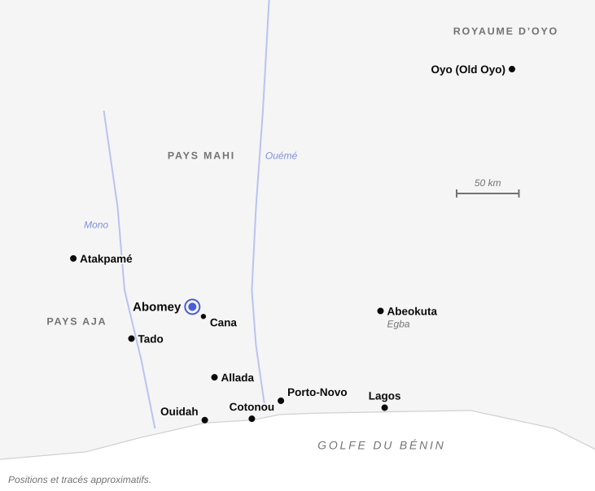
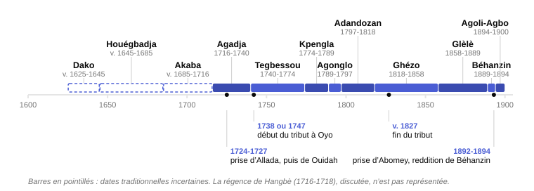
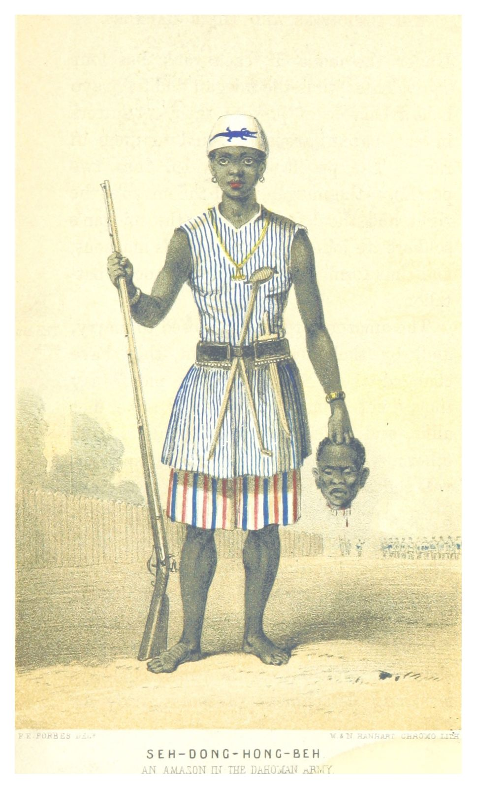
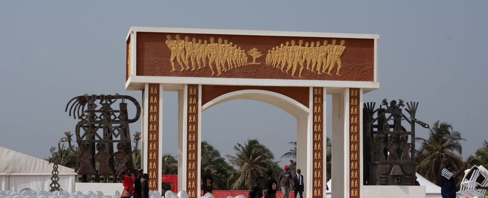
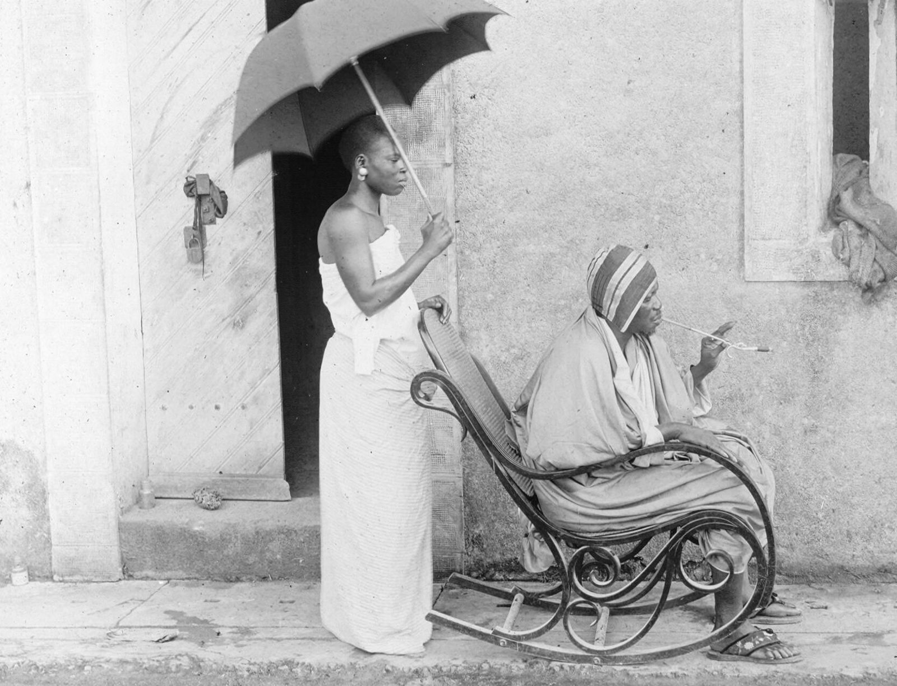

En Europe, le Dahomey a longtemps été un nom de légende. On y parlait de ses « Amazones », de ses « Coutumes » sanglantes, de la richesse et des caprices de ses rois. Dès 1864, l’explorateur Richard Burton se moquait d’un journal londonien qui annonçait gravement que le roi venait de sacrifier deux mille personnes « par égard pour un préjugé national »[^1]. Le paradoxe relevé par l’anthropologue Melville Herskovits dans les années 1930 reste vrai. Ce royaume, l’un des plus visités d’Afrique de l’Ouest par les Européens, passait pour l’un des moins connus.

Derrière la légende, il y a un État bien documenté. Fondé au XVIIe siècle par une dynastie venue d’Allada, installé sur le plateau d’Abomey, dans le sud de l’actuel Bénin, il a conquis la côte, vendu des captifs aux négriers pendant plus d’un siècle, organisé ses cultes autour de la royauté, puis résisté à la France jusqu’en 1894. Ses origines, le rôle de ses rois dans la traite, la place des femmes à la cour et l’ampleur des sacrifices humains restent discutés.

## Des origines racontées

L’histoire du Dahomey commence par un léopard. Les traditions de la dynastie, recueillies à Abomey par Melville et Frances Herskovits en 1931, en donnent plusieurs versions. Dans l’une, une femme de la ville d’Adja, ou Tado, conçoit un fils avec un léopard sorti d’un fleuve. Ses enfants, moqués comme « enfants d’une bête », fuient vers Allada. Dans une autre, Agassou (Agasu) est une léoparde changée en femme, épouse du roi d’Adja, dont le fils emporte les os à Allada pour en faire un vodun protecteur. Dans une troisième, trois frères se séparent après une querelle : l’un reste à Allada, Agassou part vers le nord et Te Agbanli gagne le sud-est, où ses descendants régneront sur la région de Porto-Novo[^2]. La famille royale se nomme Aladaxonu, « les anciens gens d’Allada ». Ses membres respectent l’interdit du léopard et des animaux tachetés.

Ces récits donnent à la dynastie une origine aja, un passage par Allada, une parenté avec les autres royaumes de la côte et une ascendance animale qui la distingue de ses sujets. Un conte publié par les Herskovits fait des [aziza](fiche:aziza), les « petites gens » de la forêt, les donateurs à un roi de plusieurs vodun, dont Agassou lui-même. À Porto-Novo, des récits locaux font de Te Agbanli, venu d’Allada après une querelle de succession, l’inventeur des masques de nuit du [Zangbeto](fiche:zangbeto).

Le nom du royaume a aussi son récit. En 1789, le négrier anglais Robert Norris rapporte que le fondateur, qu’il nomme Tacoodonou, aurait assiégé Da, roi d’Abomey, l’aurait éventré et aurait bâti son palais sur son corps : Dan-homè, « dans le ventre de Da ». Herskovits note que le récit varie peu entre la version de Norris, celle de Le Hérissé et celle qu’on lui raconte en 1931, avec une différence de taille. À Abomey, le meurtrier n’est plus le premier roi, Dako, mais son successeur Houégbadja (Hwegbadja, Wegbaja)[^3]. Ce glissement n’est pas anodin. L’historien béninois Anselme Guezo, résumant les travaux d’Edna Bay, rappelle que l’inscription de Dako en tête de la liste royale relève d’un « rafistolage » de la lignée par lequel les conquérants venus d’Allada cherchaient à se rattacher aux populations du plateau[^4].

Il faut donc distinguer deux registres. D’un côté, ce que datent des témoins extérieurs : un royaume puissant au nord de Ouidah et d’Allada, signalé à la fin du XVIIe siècle par les voyageurs Barbot et Bosman, puis la conquête d’Allada en 1724, connue par la lettre d’un agent anglais retenu à Abomey, Bulfinch Lambe. Robin Law situe la fondation du royaume dans la première moitié du XVIIe siècle, sans plus de précision[^5]. De l’autre, la mémoire dynastique : Agassou, Dako, l’éventration de Da et les exploits de Houégbadja, héros fondateur à qui une tradition attribue l’usage d’ensevelir les morts dans un linceul tissé. Law estime que l’interdit de décapiter les cadavres, attribué au même roi, correspond bien à une innovation dahoméenne, mais que son attribution à Houégbadja est douteuse[^6].

> [!NOTE]
> **Fon, Aja et gbe** : les Fon sont le peuple du plateau d’Abomey et le cœur du royaume ; leur langue, le fon (fɔngbe), était appelée « Fo » par Herskovits. Les Aja vivent au nord-ouest d’Abomey, où Burton les décrivait encore comme à demi indépendants. C’est de leur pays, Adja ou Tado, que les traditions royales font venir l’ancêtre de la dynastie.
> 
> Fon, Aja, Gun de Porto-Novo, Ewe du Togo et Mina parlent des langues apparentées que les linguistes regroupent sous le nom de gbe. Herskovits notait déjà que, dans l’ancien royaume, les différences de parler étaient « de l’ordre du dialecte ».

## Un royaume qui s’étend

Les dates des premiers règnes viennent des traditions de cour et ne deviennent sûres qu’avec les témoignages européens du XVIIIe siècle. Le tableau donne les dates courantes et leur source.

| Roi                | Règne (dates approximatives)                | Source des dates                        |
| ------------------ | ------------------------------------------- | --------------------------------------- |
| Dako (Dakodonou)   | vers 1625                                   | Le Hérissé, d’après Herskovits ; UNESCO |
| Houégbadja         | vers 1645-1685 (1650-1680 selon Le Hérissé) | Alpern 1998 ; Herskovits                |
| Akaba              | vers 1685-1716                              | déduit des dates voisines               |
| Hangbè (régente ?) | 1716-1718, discuté                          | Somda 2022                              |
| Agadja             | vers 1716-1740                              | Law 1988                                |
| Tegbessou          | 1740-1774                                   | Dalzel 1793 (mort le 17 mai 1774)       |
| Kpengla            | 1774-1789                                   | Dalzel 1793 (mort le 17 avril 1789)     |
| Agonglo            | 1789-1797                                   | Cavalcanti 2019                         |
| Adandozan          | 1797-1818, effacé des listes officielles    | Le Hérissé, d’après Herskovits          |
| Ghézo              | 1818-1858                                   | Cavalcanti 2019 ; Herskovits            |
| Glèlè              | 1858-1889                                   | Alpern 1998                             |
| Béhanzin           | 1889-1894                                   | voir la section sur la chute            |
| Agoli-Agbo         | 1894-1900, installé par la France           | Law 1988 ; Herskovits                   |

Les listes de Norris et Dalzel, de Burton et de Le Hérissé donnent parfois des noms différents pour les mêmes rois, qui avaient plusieurs « noms forts ». Burton omet Adandozan, dont nul n’osait prononcer le nom de son vivant[^7].

Le tournant est le règne d’Agadja (Agaja). En 1724, son armée prend Allada, berceau de la dynastie. En 1727, elle s’empare de Savi, capitale du royaume de Hueda, puis de Ouidah. Le Dahomey touche la mer et l’emblème d’Agadja, modelé sur les murs du palais d’Abomey, est un navire européen. Norris, qui interrogeait des témoins un demi-siècle plus tard, attribue la conquête au désir d’acheter directement aux Européens les marchandises que Hueda revendait, après le refus du roi de Hueda d’ouvrir un passage vers la côte[^8]. Nous verrons que le sens de cette conquête est l’un des grands débats de l’historiographie.

L’expansion se heurte à plus fort que soi. Au nord-est, l’empire yoruba d’Oyo, puissance de cavalerie dont [le dossier consacré à Shango](dossier:shango-d-oyo-aux-ameriques) retrace l’histoire, lance plusieurs invasions. Selon Herskovits, Abomey est prise en 1738, sous Tegbessou. Le royaume doit dès lors un tribut annuel à l’alaafin. La tradition parle de quarante et un jeunes hommes et quarante et une jeunes femmes envoyés chaque année à Oyo, en plus des biens et de l’argent. Burton date de 1747 le début de ce tribut. Le Dahomey reste tributaire jusqu’au règne de Ghézo, qui s’en libère, selon Herskovits, en 1827, alors qu’Oyo est entré en crise[^9].

Entre-temps, les règnes de Tegbessou (Tegbesu), de Kpengla et d’Agonglo sont ceux d’une consolidation difficile. La succession d’Agonglo ouvre une crise. Son fils Adandozan règne de 1797 à 1818 avant d’être renversé par son demi-frère Ghézo (Gezo, Guezo), avec l’appui d’un négrier brésilien installé sur la côte, Francisco Félix de Souza. Robin Law juge cette tradition, connue seulement par des récits de la fin du XIXe siècle, vraisemblable dans l’essentiel[^10].

Le règne de Ghézo marque l’apogée militaire. Ses armées poussent vers l’ouest jusqu’à Atakpamé, en 1840, puis ravagent le pays mahi au nord ainsi que le pays nago, c’est-à-dire yoruba, à l’est. Mais en mars 1851, il échoue devant Abeokuta, la ville des Egba. Son fils Glèlè (Gelele) veut venger cet échec. Une première expédition est abandonnée en 1861 à cause d’une épidémie de variole. Ensuite, l’attaque de 1864, racontée par Burton, se solde par une lourde défaite. Béhanzin, qui lui succède en 1889, hérite d’un royaume encore redouté, mais pris en tenaille entre ses voisins yoruba et l’expansion française partie de Porto-Novo et de Cotonou[^11].

## Le roi, la cour et les ancêtres

Herskovits remarque que les visiteurs européens, de Snelgrave à Skertchly, ont consacré l’essentiel de leurs livres au roi, à ses épouses, aux cérémonies royales, aux dignitaires et à l’armée, mais presque rien à la vie ordinaire[^12]. Ils permettent du moins de reconstituer l’appareil de l’État.

Au sommet, après le roi, viennent deux grands dignitaires :

- le *migan*, premier ministre, qui juge et fait exécuter les sentences ;
- puis le *mehu*, second personnage du royaume, qui reçoit notamment les visiteurs étrangers.

Burton les compte parmi les dignitaires qui commandent les quatre divisions de l’armée. Le *yovogan*, « chef des Blancs », représente le roi à Ouidah et y contrôle les commerçants européens. Forbes, reçu en audience privée par Ghézo en 1849, note la présence de « ministres femmes » assises au sol à côté des ministres hommes qui se prosternent[^13]. Edna Bay a fait de cette présence féminine le centre de son livre *Wives of the Leopard* (1998). La plupart des personnes vivant au palais étaient des femmes, comptées comme épouses du roi ; chaque charge masculine avait son double féminin à l’intérieur du palais. Herskovits décrivait déjà le rôle des épouses du roi dans la vérification des recettes de l’impôt. Au sommet de cet édifice, Bay place la *kpojito*, généralement traduite par « reine mère », qu’elle décrit comme la partenaire du roi dans un couple régnant. La figure exemplaire en serait Hwanjile, une femme d’origine servile venue du pays aja, qui aurait consolidé le règne de Tegbessou par des réformes religieuses, dont l’introduction à Abomey du culte de [Mawu-Lisa](fiche:mawu-lisa), le couple créateur.

Anselme Guezo, qui salue l’ouvrage, objecte que la *kpojito* comme partenaire politique du roi n’a laissé aucun souvenir dans les traditions d’Abomey. Selon des membres de la famille royale qu’il a interrogés, le titre désigne simplement la mère d’un roi. Seules Hwanjile et Adonon, mère d’Agadja, ont eu un rôle politique marqué. Le dédoublement de la royauté pourrait, selon lui, être une réalité tardive du XIXe siècle, ou une impression des visiteurs européens[^14]. Faute de sources du XVIIIe siècle produites dans le palais, le débat reste ouvert.

Le palais lui-même subsiste en partie. Selon l’UNESCO, douze rois se sont succédé à Abomey entre 1625 et 1900. Tous, sauf Akaba, ont bâti leur palais à l’intérieur d’une même enceinte de murs en terre, en reprenant des éléments des palais précédents. Le site a été inscrit au patrimoine mondial en 1985, et en même temps sur la liste du patrimoine en péril, dont il a été retiré en 2007[^15]. Ses murs portent des bas-reliefs en terre où figurent les emblèmes des rois, comme le navire d’Agadja. Il y a aussi [Dan Aïdo-Hwedo](fiche:dan-aido-hwedo), le serpent qui se mord la queue. Des motifs semblables ornent les tentures en tissu appliqué. Le frontispice du livre de Herskovits en reproduit une, consacrée au serpent arc-en-ciel. Le roi se faisait aussi représenter par sa récade.

 par Frédéric Gadmer le 20 février 1930, lors de la mission du père Francis Aupiais. L’un d’eux repose sur des crânes.")

> [!NOTE]
> **La récade** : bâton sculpté, souvent terminé par une lame ou une tête recourbée, qui servait d’insigne au roi et à ses dignitaires. Porté par un messager, il valait la présence du souverain. Forbes note en 1850 que, lorsqu’on présente « le bâton du roi », tous se prosternent et baisent la poussière, sauf celui qui le porte. Trois récades du « bataillon blu » figurent parmi les vingt-six objets restitués au Bénin en 2021.

.")

La cour était aussi le lieu du culte des ancêtres royaux. Chaque année, à la fin des récoltes, le roi célébrait les « Coutumes » (*xwetanu*, que Burton traduit par « la chose annuelle des têtes »). Herskovits a montré qu’elles servaient aussi l’administration. En recevant les présents des chefs de village, le roi comptait discrètement ses cultivateurs au moyen de cailloux, puis fixait l’impôt. À la mort d’un roi, de « Grandes Coutumes » plus longues installaient son successeur[^16].

 dédié à un ancêtre, en fer et en bois, de l’atelier Akati de Ouidah (fin du XIXe ou début du XXe siècle) : un roi assis fumant la pipe, des porteurs de calebasses rituelles, et le serpent Dan Aïdo-Hwedo qui entoure la scène. Musée du quai Branly (70.2013.37.1).")

Les Coutumes comportaient des exécutions humaines, qui ont fait leur réputation en Europe, et les témoins donnent des chiffres très différents. Selon Burton, un certain James n’en aurait jamais compté plus de soixante-cinq par an au début du XIXe siècle. Pour Forbes, ce chiffre est de trente-six sous Ghézo. Burton, en 1864, compte trente-neuf ou quarante hommes exécutés publiquement et double ce chiffre pour les femmes qui, selon lui, étaient tuées dans le palais, hors de la vue des hommes, soit « soixante-dix-huit ou quatre-vingts » victimes. Il avance ailleurs au moins cinq cents morts par an toutes cérémonies confondues. Pour les Grandes Coutumes de l’avènement d’Agonglo, deux Anglais cités par Dalzel avancent au moins cinq cents victimes. Glèlè, de son côté, déclarait à Burton qu’il ne mettait à mort que des criminels et des prisonniers de guerre, jamais ses propres sujets[^17]. Ces chiffres reposent sur des observations partielles de visiteurs qui ne voyaient pas tout. Par ailleurs, aucune source ne permet d’établir un nombre fiable !

Dans un article de 1989, Robin Law montre que les rois du Dahomey revendiquaient la « propriété » des têtes de leurs sujets. Eux seuls avaient le droit de mettre à mort. Ils avaient interdit la décapitation des défunts, autrefois liée au culte des crânes dans chaque lignage. Pour Law, cette politique visait à affaiblir les cultes des ancêtres des lignages et à faire du culte des ancêtres royaux le culte public du royaume, en concentrant dans la royauté le pouvoir rituel, politique et judiciaire. Burton, de son côté, rapporte que les victimes étaient censées porter des messages aux rois défunts et leur fournir de nouveaux serviteurs dans l’autre monde[^18].

## Les Agojie, les « Amazones » du Dahomey

Aucune institution du royaume n’a plus frappé les Européens que son corps militaire féminin, qu’ils ont baptisé d’après les Amazones de la mythologie grecque, comparaison qui apparaît au XVIIIe siècle et devient courante au milieu du XIXe[^19]. En fon, on parle d’*agojie* (ou *agoodjie*) ; Burton relève aussi des noms de compagnies, comme les « chasseuses d’éléphants », tenues pour les plus braves, ou les « femmes rasoirs ».

Leur origine est débattue et les dates proposées vont du règne de Houégbadja à celui de Glèlè. Une tradition attribue à Houégbadja la création d’un corps de chasseuses d’éléphants, les *gbeto*. Le Hérissé voyait dans ces chasseuses la plus ancienne unité des Agojie, mais en attribuait la fondation à Ghézo. Une autre tradition, rapportée par Dominique Somda, crédite la reine Hangbè, sœur jumelle d’Akaba, qui aurait régné de 1716 à 1718. Somda souligne qu’elle n’était peut-être ni une guerrière ni la fondatrice. Stanley Alpern, qui a réexaminé ces hypothèses, conclut que ni Houégbadja ni Glèlè ne peuvent être tenus pour les fondateurs, même si le premier a de meilleurs titres[^20]. Les premières femmes en armes attestées entourent Agadja. Le capitaine Snelgrave, reçu par lui en 1727, décrit quatre femmes debout près du trône, le fusil à l’épaule. En 1772, Norris trouve dans le corps de garde du palais de Tegbessou une quarantaine de femmes armées d’un mousquet et d’un coutelas[^21].

C’est sous Ghézo que le corps prend l’ampleur qui fascinera les visiteurs. Les effectifs restent incertains. De plus, les mêmes témoins se contredisent. Forbes écrit en 1850 que le roi dispose d’environ cinq mille « amazones », mais le défilé qu’il compte avec soin réunit un peu moins de sept mille soldats, dont quatre mille quatre cents hommes, soit quelque deux mille six cents femmes. Burton, en 1863-1864, estime à deux mille cinq cents les femmes parties en campagne, dont un tiers sans armes ou mal armées, soit environ mille sept cents combattantes[^22].

Les Agojie vivaient au palais. Somda rappelle que leur statut au palais était proche de celui des autres femmes du roi, épouses, concubines ou captives. Elles ont pris part aux guerres et aux razzias qui fournissaient des captifs à la traite. Kossula, ou Cudjo Lewis, l’un des derniers survivants de la traite aux États-Unis, racontait à Zora Neale Hurston l’attaque de son village par des guerrières du Dahomey. L’histoire des Agojie se termine le 4 novembre 1892, aux portes de Cana, face aux troupes françaises[^23].

En 2022, la sortie du film américain *The Woman King*, de Gina Prince-Bythewood, avec Viola Davis, dont l’action se déroule sous Ghézo, a fait connaître les Agojie à un large public. Le film a été salué pour ses portraits de femmes combattantes, mais critiqué pour sa liberté avec l’histoire. Ses héroïnes sont inventées et il présente le Dahomey en adversaire de la traite alors que le royaume en a été l’un des grands bénéficiaires. Sur les réseaux sociaux, un appel au boycott a circulé, sans grand écho selon la critique Khanya Mtshali[^24]. La même année, l’État béninois inaugurait à Cotonou une statue monumentale d’Amazone, présentée par le gouvernement comme un hommage aux combattantes d’hier et d’aujourd’hui, sans référence à un royaume en particulier.

## Le vodun et le pouvoir royal

Les rois devaient composer avec les vodun, puissances dont les cultes avaient leurs prêtres, leurs couvents et leurs fidèles. Les récits recueillis par les Herskovits organisent ces puissances en grands ensembles :

- le Ciel de Mawu-Lisa, couple créateur né de [Nana Buluku](fiche:nana-buluku) ;
- la Terre de [Sakpata](fiche:sakpata) ;
- le Tonnerre de [Xevioso](fiche:xevioso) ;
- la Mer d’Agbe ;
- [Gu](fiche:gu), le fer et la guerre ;
- [Legba](fiche:legba-fon), le messager qu’on salue avant tous les autres.

Les rois ont modifié l’équilibre de ce panthéon. Au premier rang venait le culte d’Agassou, ancêtre-léopard de la dynastie, dont Herskovits dit qu’il était presque une divinité nationale. Burton note que, devant le chef de ses prêtres, l’Agasunon, le roi lui-même ôtait ses sandales et se prosternait[^25]. Les rois accueillaient à Abomey les dieux des peuples conquis, mais les tenaient à distance quand ils pouvaient leur faire concurrence, comme Sakpata. Maître de la variole, il était le « roi de la Terre » ; or plusieurs rois sont morts de cette maladie. Ses temples devaient être établis hors de la ville, au motif que « deux rois ne peuvent régner dans une même cité »[^26].

Le culte des ancêtres royaux a produit ses propres divinités. Les *tohossou* (*toxosu*, « rois de l’eau ») sont, selon Herskovits, les esprits des enfants nés avec une anomalie, que l’on « rendait à la rivière » ; ceux qui naissaient dans la famille royale entraient dans le culte des ancêtres royaux. Le plus ancien et le plus puissant, Zomadonu, aurait été un enfant du roi Akaba. Une légende raconte que les rois, effrayés, ont tardé à établir leur culte, et que les *tohossou* se sont vengés en incendiant Abomey sous Tegbessou[^27]. Ce nom reviendra de l’autre côté de l’Atlantique.

Autre pilier religieux de la cour, le Fa, système de divination proche de l’[Ifa](fiche:ifa) des Yoruba, repose sur des figures tirées au moyen de noix de palme et interprétées par un devin, le *bokonon*, que Herskovits appelle « l’interprète du Destin ». On le consultait pour tout, du choix d’un champ à la succession d’un roi. Edna Bay, selon le résumé de Guezo, voit dans l’essor du Fa et du culte royal des *nesuxwe* au XIXe siècle l’un des signes d’un renforcement de la lignée royale aux dépens d’autres pouvoirs, notamment féminins. Guezo y voit plutôt la conséquence de transformations économiques[^28]. Les sources disponibles ne permettent pas de dater précisément l’adoption du Fa à la cour d’Abomey.

Comme le rappelle le dossier consacré à Shango, Xevioso et le [Shango](fiche:shango) d’Oyo partagent la foudre, le bélier et la hache. Mais la frontière entre les cultes fon et yoruba est restée poreuse. La statue de fer de Gu, forgée sous Glèlè et aujourd’hui au musée du quai Branly, témoigne enfin de la place du dieu du fer et de la guerre dans l’art de cour.

> [!NOTE]
> **Le mot vodun** : en fon, *vodun* désigne une puissance divine, et par extension les cultes qui lui sont rendus ; Herskovits le traduit simplement par « dieu ». Le mot a traversé l’Atlantique. En 1797, Moreau de Saint-Méry écrit qu’à Saint-Domingue, selon les « nègres Aradas », c’est-à-dire les captifs venus d’Allada, « Vaudoux » signifie un être tout-puissant et surnaturel, qu’ils honorent sous la forme d’une couleuvre. Il a donné le vodou haïtien, les *voduns* du Brésil et, par une déformation américaine, le « voodoo ».

## Le Dahomey et la traite atlantique

Ouidah, conquise en 1727, a été le grand port négrier du royaume. Selon Robin Law, plus d’un million de captifs y ont été embarqués. On considère que c'est le deuxième point d’embarquement de toute l’Afrique après Luanda[^29]. Le Dahomey ne fut pas le seul fournisseur de ces captifs. En effet, Guezo rappelle, d’après Werner Peukert, que le royaume n’a jamais atteint les volumes exportés avant lui par Allada et Hueda.

Le rôle des rois est au cœur d’un débat ancien. Dans *Dahomey and its Neighbours, 1708-1818* (1967), l’historien nigérian I.A. Akinjogbin soutenait qu’Agadja avait d’abord cherché à mettre fin à la traite, dont le désordre menaçait les royaumes aja, avant de s’y résoudre. Robin Law a réfuté cette thèse en 1986. Pour lui, rien n’indique que les rois aient voulu abolir le commerce. De plus, le militarisme du Dahomey s’explique largement par la multiplication des guerres stimulée par la demande de captifs ; il admet en revanche, en partie, l’idée que la centralisation de l’État a été une réponse aux désordres causés par les razzias[^30].

L’économiste Karl Polanyi, dans *Dahomey and the Slave Trade* (1966), avait fait du royaume l’exemple d’une économie « archaïque » où l’État administrait le commerce extérieur. Law a montré que ce « monopole royal », souvent présenté comme le cas classique, n’a jamais existé. Les rois jouissaient de privilèges, dont un droit de premier achat, et contrôlaient la répartition des prisonniers de guerre, mais des marchands privés vendaient une grande partie des captifs, surtout ceux qui venaient de l’intérieur. Les rois n’ont tenté d’imposer un monopole que dans les années 1780 et 1850[^31].

Le cas de Francisco Félix de Souza, dit le « Chacha », montre la complexité des rapports entre les rois et les négriers. Né au Brésil selon la tradition familiale, qui fixe sa naissance en 1754, alors que les témoins de l’époque le jugeaient bien plus jeune, il dit être arrivé sur la côte en 1793 et s’établit à Ouidah vers 1820, après avoir aidé Ghézo à prendre le pouvoir. Les Britanniques l’ont décrit comme un vice-roi ayant droit de vie et de mort. Law montre que cette fonction restait celle du *yovogan* et que le Chacha était d’abord l’agent commercial du roi, avec un droit de premier choix sur les captifs. « Chacha » était sans doute un surnom, devenu titre après sa mort, en 1849. Ruiné par les saisies de la marine britannique, qui lui avait pris vingt-deux navires selon ses dires, il mourut endetté[^32].

La pression britannique pour abolir la traite s’exerce sur Ghézo dès les années 1840. Les missions de Forbes en 1849 et 1850 échouent à obtenir un traité, et celle de Burton, en 1863-1864, porte encore ce message à Glèlè. Le commerce de l’huile de palme, qui se développe à Ouidah à partir du milieu des années 1840, prend peu à peu le relais. Law souligne qu’il a renforcé les marchands privés, qui pouvaient produire de l’huile autant que la vendre, alors que les rois n’en ont jamais contrôlé la production comme ils contrôlaient la capture des captifs[^33].

Aujourd’hui, Ouidah est un lieu de mémoire de la traite. Le projet de l’UNESCO « La Route de l’esclave : résistance, liberté, héritage » y a été lancé en 1994. Un itinéraire de quelque trois kilomètres mène de la place où l’on vendait les captifs jusqu’à la plage, où se dresse depuis 1995 la Porte du non-retour, monument commémoratif inauguré en présence du président Nicéphore Soglo et du directeur général de l’UNESCO[^34].

## De l’autre côté de l’Atlantique

Parmi les captifs embarqués à Ouidah se trouvaient des Fon et d’autres locuteurs gbe, qui ont porté vers les Amériques des cultes que l’on reconnaît encore. La traite a même atteint la famille royale. Herskovits rapporte que, dans le rituel des ancêtres royaux, on appelait par leur nom les membres de la famille vendus comme esclaves, en citant les lieux où ils étaient censés avoir été envoyés. Selon la tradition, ce savoir venait de la mère de Ghézo, vendue avec sa suite par Adandozan pour priver son rival de ses soutiens[^35].

Au Brésil, les captifs venus du Dahomey étaient appelés jeje. Dans le [candomblé](fiche:candomble) de Bahia, la nation jeje sert les voduns, et Luis Nicolau Parés a montré que son apport a été décisif dans la formation même du candomblé, longtemps présenté comme essentiellement yoruba. À São Luís du Maranhão, la Casa das Minas, maison fondatrice du [tambor de mina](fiche:tambor-de-mina), ne sert que des voduns d’origine fon. Son nom rituel, Querebentã de Zomadônu, porte celui du premier des *tohossou* d’Abomey. Dès les années 1940, Nunes Pereira puis Octávio da Costa Eduardo remarquèrent que plusieurs voduns de sa famille royale, celle de Davice, portaient des noms de rois du Dahomey. En 1953, Pierre Verger en tira une hypothèse : la maison aurait été fondée par Nã Agontimé, veuve d’Agonglo et mère de Ghézo, vendue par Adandozan[^36].

Cette hypothèse est restée une hypothèse. Aucun document n’atteste la présence d’Agontimé à São Luís. Par ailleurs, l’anthropologue Sergio Ferretti notait que les filles de la maison ignoraient son nom ; elles désignaient comme fondatrice une certaine Maria Jesuína. Maria Laura Cavalcanti parle de la « saga de Nã Agontimé », une construction qui comble des silences irréparables. Edna Bay, citée par Cavalcanti, estime qu’Agontimé est devenue dans l’histoire du Dahomey une figure symbolique de l’opposition à Adandozan plus qu’une personne dont on puisse suivre la trace[^37]. Reste un fait solide : des voduns d’Abomey, ancêtres royaux compris, sont servis au Maranhão depuis le XIXe siècle. D’autres héritages passent par le Brésil : [Nanã](fiche:nana), la plus ancienne des orixás, prolonge Nana Buluku, et [Omolu](fiche:omolu) hérite en partie de Sakpata.

En Haïti, dans le [vodou haïtien](fiche:vodou-haitien), les esprits du rite rada, dont le nom vient d’Allada (Arada), sont réputés d’origine fon. Moreau de Saint-Méry, en 1797, faisait déjà des « Aradas » les véritables gardiens du culte du serpent à Saint-Domingue. [Danbala](fiche:damballa) et [Ayida-Wédo](fiche:ayida-wedo) prolongent le serpent arc-en-ciel Aïdo-Hwedo. [Papa Legba](fiche:papa-legba) ouvre les cérémonies comme le Legba fon, puis les [Ogou](fiche:ogou) héritent à la fois du Gu fon et de l’Ogun yoruba. La part de l’héritage fon et celle de l’héritage kongo, très présent dans le rite petwo, restent discutées.

À Cuba, le nom d’arará, qui renvoie lui aussi à Allada, désigna les captifs ewe et fon, dont certains arrivèrent encore dans les années 1860 pour travailler dans les sucreries de la province de Matanzas. Les communautés de Perico et d’Agramonte y servent toujours des *fodunes*, parmi lesquels Sakpata et Da, à côté de saint Lazare. Le projet de recherche dirigé par Jill Flanders Crosby souligne que le terme n’a aucun usage historique en Afrique de l’Ouest. Catégorie de la traite devenue nom de religion, l’arará est une réinvention cubaine de pratiques fon et ewe[^38].

## La chute

À la fin des années 1880, la France, installée à Porto-Novo et à Cotonou, entre en conflit avec le Dahomey. Son roi, Béhanzin, intrigue contre Toffa, roi de Porto-Novo et issu de l’autre branche de la famille Aladaxonu, protégé par les Français. En février 1890, neuf Français sont capturés et emmenés à Abomey. L’un d’eux, Chaudoin, publiera le récit de sa captivité. C’est le début d’une première guerre[^39].

La seconde guerre, de 1892 à 1894, est décisive. Le corps expéditionnaire du général Alfred Dodds remonte vers Abomey. Les Agojie livrent leur dernier combat le 4 novembre 1892 à Cana. Les soldats français prennent la capitale et pillent le palais : statues, trônes, portes sculptées, autels portatifs, récades[^40]. Replié dans le nord, Béhanzin se rend en janvier 1894. Il est exilé en Martinique, puis en Algérie, où il meurt en 1906. Ses restes ne reviendront au Dahomey qu’en 1928. Les Français installent à Abomey son frère Agoli-Agbo, qu’ils déposent en 1900. Dans les années 1930, les Abomeyens racontaient à Herskovits que la dynastie avait cessé de régner avec la défaite de Béhanzin, qu’Agoli-Agbo n’avait été qu’une marionnette, et que Béhanzin, changé en oiseau, n’était pas vraiment mort[^41].

En août 2016, le Bénin demande officiellement la restitution du « trésor de Béhanzin » conservé au musée du quai Branly. La France refuse au nom de l’inaliénabilité des collections publiques. Le discours d’Emmanuel Macron à Ouagadougou, en novembre 2017, puis le rapport de Felwine Sarr et Bénédicte Savoy, remis en novembre 2018, changent la donne. La loi du 24 décembre 2020 fait sortir des collections vingt-six œuvres d’Abomey :

- les statues royales de Ghézo, Glèlè et Béhanzin ;
- quatre (04) portes du palais ;
- les trônes de Ghézo et de Glèlè ;
- des autels portatifs *asen* ;
- des récades ;
- un métier à tisser ;
- une tunique ;
- un pantalon de soldat.

L’acte de transfert est signé le 9 novembre 2021 et les œuvres arrivent au Bénin le lendemain[^42]. La statue de Gu, emportée en France en 1894, n’en fait pas partie.

, photographiée au musée du quai Branly (71.1893.45.2) avant sa restitution au Bénin en 2021.")

## Mémoires et limites des sources

Au Bénin, les palais d’Abomey sont un site du patrimoine mondial et un musée. Les cérémonies royales s’y poursuivent ; ce que Law appelle une continuité institutionnelle maintenue par le rituel. Les objets restitués, la statue de l’Amazone à Cotonou et les projets de musées témoignent d’une politique de mémoire active[^43].

Le vodun a aussi sa fête nationale, celle des religions traditionnelles. Instituée par une loi de 1997, dans le sillage du festival « Ouidah 92 » organisé en 1993 avec l’appui de l’UNESCO, elle a longtemps été célébrée chaque 10 janvier, en particulier sur la plage de Ouidah ; elle en était en 2022 à sa vingt-septième édition[^44]. En 2024, le gouvernement béninois l’a transformée en un festival de plusieurs jours, les « Vodun Days ». La première édition s’est tenue à Ouidah les 9 et 10 janvier 2024, avec des concerts d’artistes béninois, africains et haïtiens à côté des cérémonies. Une loi votée la même année a fixé la fête au deuxième vendredi de janvier, la veille étant elle aussi chômée[^45]. L’édition de 2026 a réuni, dans la forêt sacrée de Kpassè et sur l’esplanade de l’ancien fort français, sorties de masques comme les Zangbeto, danses pour les vodun et consultation publique du Fa, en présence du chef de l’État[^46]. La fréquentation a fortement augmenté : l’Institut national de la statistique et de la démographie (INStaD) a estimé à 740 668 le nombre de participants en 2026, contre 435 250 en 2025, dont près d’un cinquième d’étrangers venus de 56 pays, Français, Togolais, Nigérians et Américains en tête[^47].

Les Vodun Days doivent, selon le gouvernement, revaloriser une religion longtemps dépréciée et renouer avec les diasporas afro-descendantes. Le ministre du Tourisme assure distinguer les aspects culturels et patrimoniaux des aspects cultuels. Les sacrifices et les cérémonies d’initiation restent hors de la vue des visiteurs. Quant au festival, il n’a pas vocation à les remplacer[^48].

Ce passé est connu par des sources inégales, qu’il faut lire en sachant qui parle. Les plus anciennes sont européennes. Snelgrave et Norris venaient chercher des captifs, Dalzel avait gouverné le fort anglais de Ouidah, et les deux derniers publièrent en plein débat britannique sur l’abolition. Forbes et Burton, au contraire, venaient au nom de la Couronne pour obtenir la fin de la traite. Presque tous restaient cantonnés à Ouidah, à la route d’Abomey et à la cour, où le roi, selon Herskovits, ne laissait voir aux étrangers que le strict nécessaire. Ils se lisaient et se corrigeaient les uns les autres, ce qui permet de recouper leurs informations, mais aussi d’en propager les erreurs[^49].

Les traditions de cour posent d’autres problèmes. L’ouvrage d’Auguste Le Hérissé, *L’ancien royaume du Dahomey* (1911), longtemps tenu pour la version classique, est pour l’essentiel, selon Law, la traduction abrégée du récit d’un seul informateur, Agbidinukun, frère de Béhanzin. Ces traditions ont été remaniées au fil des règnes. Dès 1803, six ans après les faits, un récit de l’avènement d’Adandozan taisait la guerre civile qui l’avait opposé à un frère aîné et le nom d’Adandozan a été rayé des listes royales. Law n’exclut pas non plus que des livres européens aient nourri certaines traditions locales[^50]. Au XXe siècle, la mémoire royale a encore été mise en forme par des auteurs dahoméens, comme Paul Hazoumé, dont l’œuvre reflète, selon Cavalcanti, le désir de grandir la figure de Ghézo. Adandozan y apparaît en despote sanguinaire, image que Parés rattache à l’effacement de sa mémoire après sa chute[^51].

Les historiens se partagent sur la valeur de ces sources. Guezo relevait le scepticisme déclaré de Law et de John Reid envers la tradition orale, et, à l’inverse, la reconstruction de Maurice Ahanhanzo Glèlè fondée sur la seule tradition de la famille royale. Il saluait chez Bay la tentative de combiner les deux, tout en contestant ses conclusions sur la *kpojito*. Les sources disponibles laissent des zones d’ombre : les débuts réels de la dynastie, le nombre des victimes des Coutumes, les effectifs des Agojie avant le XIXe siècle, le destin d’Agontimé ou encore la vie des gens ordinaires du royaume, que presque aucun témoin n’a décrite.

[^1]: Burton (1864), préface, cité par Herskovits (1938), vol. I, chapitre I. Herskovits cite aussi Skertchly, qui dénonçait en 1874 les « récits les plus exagérés » publiés sur le Dahomey.

[^2]: Herskovits (1938), vol. I, chapitre IX, sur le clan royal Gbekpovi Aladaxonu, qui donne quatre versions du récit d’origine, dont une « racontée dans le plus grand secret ». Le premier ancêtre y porte le nom d’Adjaxuto ; Agassou est tantôt son compagnon, tantôt son fils, tantôt sa mère. Selon les mêmes informateurs, Adjaxuto reste honoré à Allada, Agassou à Abomey.

[^3]: Norris (1789), cité par Herskovits (1938), vol. I, chapitre I, qui précise que dans la version recueillie à Abomey en 1931, comme chez Le Hérissé, c’est Houégbadja qui tue Da.

[^4]: Guezo (2008), qui résume la thèse de Bay (1998) sur le problème de légitimité des conquérants Aladaxonu face aux populations autochtones du plateau.

[^5]: Law (1988), introduction. Pour Barbot, Bosman et la lettre de Bulfinch Lambe, datée d’Abomey le 27 novembre 1724, Herskovits (1938), vol. I, chapitre I.

[^6]: Pour le récit des linceuls, Herskovits (1938), vol. I, chapitre I. Pour l’interdit de décapitation, Law (1988), note 98, et Law (1989), d’après le résumé de l’article.

[^7]: Herskovits (1938), vol. I, chapitre I, qui compare les listes de Norris et Dalzel, de Burton et Skertchly, de Foà et de Le Hérissé. Les dates des premiers rois diffèrent de plusieurs années selon ces listes ; celles d’Akaba et de Hangbè sont les plus incertaines. Selon Somda (2022), Hangbè aurait été la jumelle d’Akaba ; son règne, longtemps omis des listes officielles, est aujourd’hui revendiqué par une fondation qui porte son nom.

[^8]: Norris (1789), cité par Herskovits (1938), vol. I, chapitre I. Herskovits date la prise de Ouidah tantôt de février 1726, d’après Snelgrave, tantôt de 1727 ; Law (1988) retient 1727.

[^9]: Herskovits (1938), vol. I, chapitre I, qui renvoie à Burton (1864), vol. II, pour la date de 1747. Les sources divergent donc sur le début du tribut et sur la date exacte de la libération.

[^10]: Law (2001), qui précise que l’épisode n’est connu que par des récits traditionnels de la fin du XIXe siècle.

[^11]: Herskovits (1938), vol. I, chapitre I, d’après Burton pour l’attaque de 1851, dont l’armée est estimée entre dix et seize mille combattants et les pertes à environ 1 200 morts.

[^12]: Herskovits (1938), vol. I, chapitre I.

[^13]: Burton (1864), vol. I, sur le *migan* (Min-gan), le *mehu* (Meu) et le *yovogan* (Yevo-gan) ; Herskovits (1938), vol. I, chapitre I, pour le rang du *mehu*, l’accueil de Norris par le « Mayhou » en 1772 et l’audience de Forbes.

[^14]: Guezo (2008). La thèse de Bay (1998) est connue ici par ce compte rendu critique. Pour le rôle des épouses du roi dans le contrôle de l’impôt, Herskovits (1938), vol. I, chapitre VII.

[^15]: UNESCO, fiche du bien n° 323, qui précise que les palais de Ghézo et de Glèlè abritent aujourd’hui le musée historique d’Abomey.

[^16]: Herskovits (1938), vol. I, chapitre VII, sur la politique fiscale du royaume. Le nom fon est donné par Burton (1864), vol. I, sous la forme « Khwe-ta-nun ».

[^17]: Burton (1864), vol. I, chapitre sur les Grandes Coutumes et les Coutumes annuelles, et vol. II. Les deux témoins cités par Dalzel sont le capitaine Fayrer et un certain Hogg. Burton reconnaît que, pendant la « mauvaise nuit » des Coutumes, ceux qui sortaient étaient décapités, si bien qu’il était difficile de savoir ce qui s’y passait.

[^18]: Law (1989), d’après le résumé de l’article ; Burton (1864), vol. I et II. Snelgrave, en 1727, rapportait déjà l’avis d’un Portugais pour qui les sacrifices d’ennemis relevaient de la « politique » (cité par Herskovits, 1938, vol. I, chapitre I).

[^19]: Somda (2022). La graphie *agoodjie* est celle de Somda ; on trouve aussi *agojie* et *agooji*. Les autres noms de compagnies sont donnés par Burton (1864), vol. II.

[^20]: Alpern (1998), extrait et notes. Alpern signale que la tradition des *gbeto* a été écrite pour la première fois par Dunglas, et que Maurice Glèlè, descendant de la famille royale, rattache l’une des unités à l’arrière-garde d’Agadja à Ouidah en 1729.

[^21]: Snelgrave (1734) et Norris (1789), cités par Herskovits (1938), vol. I, chapitre I.

[^22]: Forbes (1851), vol. I, pour le défilé et l’estimation de 5 000 ; vol. II, où il évalue l’armée régulière à 12 000 soldats dont 5 000 « amazones ». Burton (1864), vol. II. Ces chiffres sont des estimations de visiteurs à qui l’on montrait des parades ; on ne dispose d’aucun dénombrement interne.

[^23]: Somda (2022) pour le statut des Agojie et le témoignage de Kossula ; Alpern (1998) pour la date du 4 novembre 1892.

[^24]: Mtshali (2022), critique du film, qui relève aussi que Viola Davis elle-même présentait le film comme une fiction. Pour la statue, Somda (2022).

[^25]: Herskovits (1938), vol. I, chapitre IX, qui cite Burton (1864), vol. I, et discute son erreur : Burton faisait d’Agassou un ancien dieu mahi du plateau.

[^26]: Herskovits (1938), vol. I, chapitre I, pour l’éloignement des temples. Pour la variole d’Agadja, la mort de Kpengla et de Ghézo et l’expédition de 1861 abandonnée, l’historien béninois Elisée Soumonni (2012), qui rappelle aussi que les rois installaient à Abomey les dieux des pays conquis, et que les traditions divergent sur l’origine du culte de Sakpata : pays mahi pour les prêtres interrogés par Herskovits, Dassa selon Le Hérissé.

[^27]: Herskovits (1938), vol. I, chapitre XII. Les *tohossou* ne sont pas des rois défunts mais des princes nés avec une anomalie, rangés parmi les ancêtres de la famille royale.

[^28]: Herskovits (1938), vol. I, chapitre II, sur la consultation du devin et le culte du Destin ; Guezo (2008) pour la thèse de Bay et sa critique.

[^29]: Law (2004), d’après la présentation de l’éditeur. Pour Peukert, Guezo (2008).

[^30]: Law (1986), résumé et notes, qui cite Akinjogbin (1967) et l’article d’Akinjogbin de 1963 sur la conquête des États aja de la côte. La thèse d’Akinjogbin est connue ici à travers Law. Law discute aussi l’article de Henige et Johnson, « Agaja and the Slave Trade: Another Look at the Evidence », paru en 1976 dans *History in Africa*.

[^31]: Law (1977). La thèse de Polanyi (1966) est connue ici par la discussion qu’en fait Law (1977 ; 1986). Pour le droit de premier achat dont jouissait l’agent du roi à Ouidah, Law (2001).

[^32]: Law (2001), qui s’appuie sur les papiers saisis sur les navires négriers, les rapports britanniques et les traditions familiales, et souligne les contradictions de ces dernières, notamment sur la date de naissance de Francisco Félix de Souza et sur les causes de sa ruine.

[^33]: Law (1977) ; Law (2001) pour l’échec des négociations de 1849-1850 et les débuts de l’huile de palme à Ouidah. Herskovits (1938), vol. I, chapitre I, pour les missions britanniques.

[^34]: UNESCO (2014). Pour la date du 30 novembre 1995 et les autorités présentes, la plaque d’inauguration du monument, reproduite par la base Contemporary Monuments to the Slave Past.

[^35]: Herskovits (1938), vol. I, chapitre I, qui renvoie à M.J. et F.S. Herskovits pour le détail de la tradition.

[^36]: Cavalcanti (2019), qui analyse l’article de Verger (1953), fondé sur Le Hérissé, sur l’écrivain Paul Hazoumé et sur des traditions familiales selon lesquelles Ghézo aurait envoyé des émissaires chercher sa mère en Amérique, « Le culte des voduns d’Abomey aurait-il été apporté à Saint-Louis de Maranhon par la mère du roi Ghèzo ? », paru dans *Les Afro-américains* (Mémoires de l’IFAN, n° 27). Pour la nation jeje, Parés (2013), d’après la présentation de l’éditeur.

[^37]: Cavalcanti (2019), qui cite Ferretti (1985, p. 59) et Bay (1998, p. 180). Une tradition de Ouidah rapportée par Verger précise même que la femme vendue n’était pas la mère biologique de Ghézo mais sa mère adoptive.

[^38]: Flanders Crosby (dir.), page du projet, qui s’appuie notamment sur les travaux de Yvonne Daniel et de Mirta Fernández Martínez (2005). L’origine du nom d’après Allada est aussi celle du rite rada haïtien.

[^39]: Herskovits (1938), vol. I, chapitre I, qui cite Chaudoin et les récits de Foà sur le conflit vu de Porto-Novo.

[^40]: Alpern (1998) pour Cana ; Sayar, Desboeufs et Renold (2022) et loi n° 2020-1673, annexe, pour le pillage et les objets emportés.

[^41]: Fierro, notice « Béhanzin » de l’Encyclopædia Universalis, pour la reddition en janvier 1894, la mort à Blida en 1906 et l’inhumation à Djimé en 1928 ; Herskovits (1938), vol. I, chapitre I, qui signale que Paul Hazoumé situait la mort de Béhanzin à Alger ; Law (1988) pour la déposition du dernier roi en 1900.

[^42]: Loi n° 2020-1673, annexe ; Sayar, Desboeufs et Renold (2022), qui datent du 26 août 2016 la demande béninoise et du 10 novembre 2021 l’arrivée des œuvres au Bénin. Selon cette dernière source, le trésor aurait été légué par Dodds au musée d’Ethnographie du Trocadéro en 1922, mais les numéros d’inventaire de la loi (71.1893 et 71.1895) suggèrent des entrées en 1893 et 1895. Pour la statue de Gu, son numéro d’inventaire au musée du quai Branly (71.1894.32.1) indique une entrée en 1894 ; elle ne figure pas dans l’annexe de la loi.

[^43]: Law (1988) pour la continuité rituelle ; Somda (2022) pour la statue.

[^44]: Sovon (2024) pour l’origine de la fête sous la présidence de Nicéphore Soglo ; Bouteloup (2024), note 1, pour le festival « Ouidah 92 » ; loi n° 2024-32, qui abroge la loi n° 97-031 du 20 août 1997 instituant la fête (d’après Gayet, 2024) ; Gouvernement de la République du Bénin (2022) pour l’édition de 2022.

[^45]: Sovon (2024) pour la première édition et ses invités ; Gayet (2024) pour la loi n° 2024-32 du 2 septembre 2024, votée le 30 juillet 2024, qui fixe la fête au deuxième vendredi de janvier et rend chômés ce jour et le jeudi qui le précède.

[^46]: Agence France-Presse (2026), dépêche datée de Ouidah, 10 janvier 2026.

[^47]: Sélo (2026), d’après la note de l’INStaD. L’institut parle de participants « estimés » pour 2026 et de personnes « comptabilisées » pour 2025, et compte à part les visites des sites (1 942 949 en 2026), si bien que les chiffres des deux années ne sont pas strictement comparables.

[^48]: Agence France-Presse (2026), pour les propos du ministre Jean-Michel Abimbola ; Bouteloup (2024) pour la revalorisation d’une religion longtemps dépréciée.

[^49]: Herskovits (1938), vol. I, chapitre I ; Dalzel (1793), préface, où il dit avoir écarté le sujet de la traite tout en y revenant dans deux chapitres consacrés au règne d’Agadja.

[^50]: Law (1988), introduction et notes 14 et 61.

[^51]: Cavalcanti (2019), qui cite Parés (2013, p. 297) sur la mémoire effacée d’Adandozan, et Paul Hazoumé, *Le pacte de sang au Dahomey* (1937).
