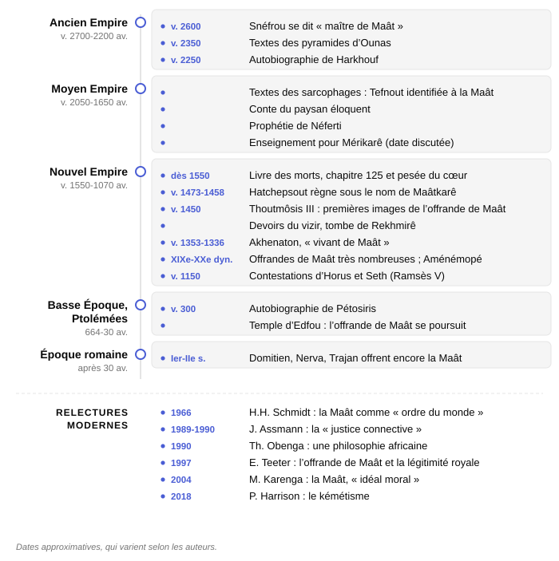
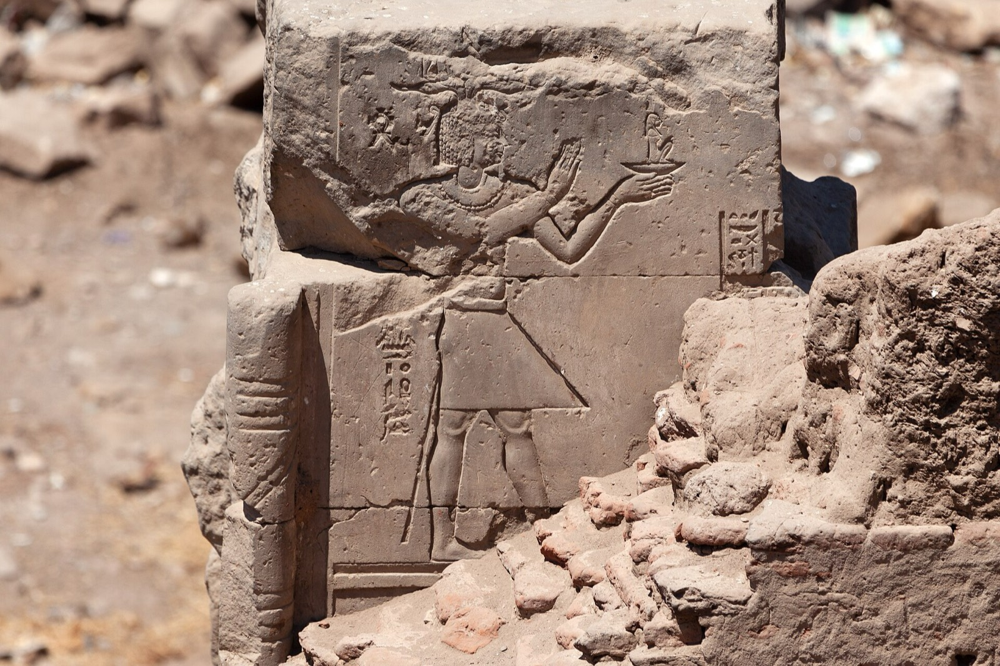

La Maât est l’un de ces mots égyptiens que l’on reconnaît facilement sans jamais pouvoir les enfermer dans une seule définition. On la traduit généralement par « vérité », « justice », « ordre » ou encore « harmonie ». Chacune de ces traductions éclaire une part de son sens, mais aucune ne suffit à elle seule.

Les anciens Égyptiens n’ont d’ailleurs pas laissé de traité consacré à la Maât. Ils n’en avaient pas besoin pour la placer au cœur de leur manière de penser le monde. Elle apparaît dans les titulatures royales, sur les murs des temples, dans les enseignements des sages, dans les textes juridiques et dans les formules qui accompagnent les défunts. Elle désigne à la fois ce qui maintient le monde dans son ordre, ce qui fonde une autorité légitime et ce qui guide la conduite des hommes. Et c'est ce que nous allons essayer de restituer dans ce dossier. 

À travers la déesse [Maât](fiche:maat), mais aussi à travers le concept qu’elle incarne, ce dossier suit le fil qui relie le mouvement du soleil au pouvoir du pharaon, la justice rendue par les hommes à la conduite quotidienne de chacun, puis au jugement des morts. Sur près de trois mille ans, d'histoire, [^1], la Maât sert à penser le fonctionnement du monde, la place de chacun et les conditions de son maintien.

Nous aborderons également les interprétations modernes de la Maât. Tantôt présentée comme une éthique africaine, tantôt comme un principe religieux ou comme une notion mobilisée dans des débats contemporains, elle a continué à être réinterprétée bien après la disparition de la civilisation qui l’avait placée au centre de sa pensée.

## Le concept de la Maât

En égyptien, le mot Maât s’écrit *mȝꜥt*. Les égyptologues le vocalisent « maât » ou « maat », faute de connaître les voyelles. On le rattache en général à une racine qui exprime ce qui est droit, juste et conforme. Selon le contexte, il désigne la vérité d’une parole, la justesse d’une sentence, l’honnêteté d’un poids sur la balance ou l’état d’un pays bien gouverné. Les traductions modernes choisissent l’un de ces sens et perdent les autres.

Le contraire de la Maât porte lui aussi un nom, *isfet* (*jzft*). C’est le mensonge, la violence, l’injustice, et plus largement tout ce qui défait l’ordre. Le roi a pour tâche de faire triompher la première et de chasser la seconde. Un texte du Moyen Empire, la *Prophétie de Néferti*, se termine sur l’annonce d’un roi sauveur sous lequel la Maât reviendra à sa place et l’*isfet* sera chassée[^2].

> [!NOTE]
> **Isfet** : nom égyptien du désordre, opposé à la Maât. Le mot couvre aussi bien le mensonge, le vol et l’injustice que la rébellion contre le roi. L’*isfet* n’est jamais éliminée une fois pour toutes ; elle revient, et l’ordre doit être rétabli sans cesse, par le roi, par les dieux et par chacun.

Pourquoi parle-t-on alors d’un « concept » ? Parce que la Maât n’est définie nulle part. Aucun texte égyptien n’en donne une présentation suivie. Ce que nous en savons est reconstruit à partir de formules dispersées et les égyptologues ne s’accordent pas sur ce qui en fait le centre. Dans une étude de 1966 restée influente, Hans Heinrich Schmidt voyait dans la Maât, comme dans la notion hébraïque de justice qu’il lui comparait, avant tout un « ordre du monde ». Jan Assmann a pris le contre-pied de cette lecture. En effet, pour lui, le cœur de la Maât se trouve dans la vie sociale, dans la solidarité entre les hommes, et l’ordre cosmique n’en est qu’une extension[^3]. Ce débat traverse tout le dossier. Il rappelle que la Maât telle que nous la décrivons est en partie une construction savante, assemblée à partir de différents textes.

## La déesse à la plume

La Maât est aussi une déesse. On la représente en femme assise ou debout, coiffée d’une plume d’autruche. Cette plume sert aussi à écrire son nom, si bien que l’image de la déesse et le mot se confondent : une plume seule, tenue par un dieu ou posée sur un plateau de balance, suffit à évoquer la Maât. Le mot s’écrit aussi avec un autre signe, une sorte de socle allongé. Des égyptologues ont remarqué que ce signe sert de base aux trônes des dieux et peut-être à celui du roi, comme si le pouvoir reposait littéralement sur la Maât[^4].

, feldspath, 6,6 cm. Metropolitan Museum of Art.")

Les textes la disent fille de [Rê](fiche:ra), le dieu solaire. Les *Textes des sarcophages*, au Moyen Empire, vont plus loin. Dans une formule consacrée au dieu de l’air, le créateur [Atoum](fiche:atoum) explique que ses deux premiers enfants, [Shou](fiche:shu) et [Tefnout](fiche:tefnut), sont aussi « la Vie » et « la Maât ». Tefnout y est identifiée à la Maât, à l’origine même du monde organisé[^5]. La Maât n’est donc pas une règle ajoutée après coup. Dans cette théologie, elle naît avec le monde.

Elle est souvent associée à [Thot](fiche:thot), le dieu de l’écriture et du calcul, qui tient les comptes et rédige les verdicts. Ce lien n’est pas une union fixe, puisque, selon les sources, Thot est plutôt rapproché de la déesse Seshat.

, 15,5 cm. Metropolitan Museum of Art.")

La place de la déesse dans le culte contraste avec l’importance de la notion. Emily Teeter signale un temple de Maât élevé par Amenhotep III à Karnak-Nord, peut-être sur un édifice plus ancien. Il y a aussi un autre « temple de Maât » à l’est du Ve pylône de Karnak, où au moins un souverain de la XVIIIe dynastie fut couronné. Teeter renvoie à ce propos au couronnement d’Hatchepsout. Aucune scène d’offrande de Maât n’est connue dans le premier[^6].

Au regard de la masse des textes qui invoquent la Maât, son véritable culte reste discret. La notion importait davantage que la déesse. De plus, ces textes passent de l’une à l’autre sans marquer la différence.

## Le roi qui « fait Maât »

Le pharaon est celui qui « fait » (*jrj*) la Maât et repousse l’*isfet*. La formule revient dans les inscriptions royales de toutes les époques. Pour Jan Assmann, la Maât est, au plus haut degré, une idée qui porte l’État. Le roi est le médiateur par lequel elle descend des dieux vers les hommes. Quant à l’État, il devient, lui-même, dans la vie quotidienne, une instance de salut[^7].

Les noms royaux gardent également cette trace. Dès la IVe dynastie, Snéfrou se fait appeler « maître de Maât » dans deux de ses noms officiels. Au Nouvel Empire, Hatchepsout règne sous le nom de Maâtkarê et presque tous les rois ramessides intègrent la Maât à leur nom de couronnement, comme Ramsès II, Ousermaâtrê[^8].

Après le règne d’Akhenaton, Toutânkhamon fait graver sur sa stèle de la Restauration que la Maât est rétablie à sa place, que le mensonge est devenu une abomination et que le pays est comme au premier temps du monde. Plusieurs rois reprendront cette formule après des périodes de troubles, réels ou présentés comme tels[^9].

### L’offrande de Maât

Le geste le plus visible de cette idéologie est un rite. Sur les murs des temples, le roi tend à un dieu une petite figurine de la déesse accroupie, la plume sur la tête. Emily Teeter a recensé et analysé ces scènes dans *The Presentation of Maat* (1997). Le rite est évoqué dès les *Textes des sarcophages*, mais il n’apparaît en image que sous Thoutmôsis III, vers le milieu de la XVIIIe dynastie. Hatchepsout n’en a laissé aucune représentation, mais une statue la nomme « Hatchepsout qui offre Maât à Amon ». Les scènes deviennent très nombreuses dans les temples ramessides, y compris dans les parties ouvertes aux fidèles, comme les chapelles où l’on venait présenter ses requêtes au dieu[^10].

, attribuée au chef dessinateur Amenhotep. Nouvel Empire, XXe dynastie (vers 1137-1118 avant notre ère), 15 cm. Metropolitan Museum of Art.")

Que signifie ce don ? Les dieux, disent les textes, « vivent de Maât » ; elle est leur nourriture. Ainsi, le fait de l'offrir revient à présenter toutes les offrandes à la fois. Un manuel de culte d’époque ramesside, conservé à Berlin, est d’ailleurs présenté comme le résumé de toutes les autres.

Mais pour Teeter, le rite est la preuve de la légitimité du roi. C'est pratiquement le roi, seul, qui l’accomplit dans les temples, généralement coiffé de la couronne bleue, près des scènes de son couronnement ou de sa purification. Ce n’est sans doute pas un hasard si les premières images datent de la fin du règne de Thoutmôsis III, au moment où il fait effacer le souvenir d’Hatchepsout. À partir de Séthi Ier, le roi offre même parfois son propre nom, écrit sous forme de rébus où figure la déesse : présenter son nom revient à présenter la Maât[^11].

### Akhenaton, « vivant de Maât »

L’épisode amarnien met cette idéologie à l’épreuve. Akhenaton (vers 1353-1336 avant notre ère) fait du disque solaire, [Aton](fiche:aton), le seul dieu du culte officiel. Il ne renonce pas à la Maât pour autant, puisqu'il porte l’épithète « vivant de Maât » (*ꜥnḫ m mȝꜥt*). D'ailleurs Teeter compte une trentaine de scènes d’offrande de Maât à Aton sous son règne, contre quatre seulement pour son père Amenhotep III. Plus de la moitié de celles qu’on peut identifier montrent la reine Néfertiti. Fille de Rê, la Maât servait de pont entre l’ancienne théologie solaire et la nouvelle[^12].

Jan Assmann lit pourtant Amarna comme la vision d’un monde sans division et sans mal, qui conduisait à un monde sans Maât. Teeter discute cette interprétation : des notables d’Amarna, comme Toutou, affirment dans leur tombe que la Maât a fait sa place en eux[^13]. Les deux lectures ne portent pas sur les mêmes textes, et le débat reste ouvert.

## Rendre la justice

La Maât n’est pas seulement une affaire de temples. Elle est aussi le principe de la justice ordinaire, celle des tribunaux et des administrateurs.

### Le vizir, « prêtre de Maât »

Au sommet de l’administration, le vizir porte, selon Teeter, un pendentif en forme de Maât. De plus, le titre de « prêtre de Maât » (*ḥm-nṯr mȝꜥt*) est associé aux fonctionnaires chargés de la justice[^14]. Deux textes du début du Nouvel Empire décrivent sa charge. Les *Devoirs du vizir* sont gravés dans les tombes de quatre vizirs thébains, trois de la XVIIIe dynastie et un de la XIXe. La version la mieux conservée est celle de Rekhmirê, sous Thoutmôsis III. Le texte décrit les audiences du vizir, les rapports qu’il reçoit, les plaintes qu’il examine. Sa date de composition est discutée. En effet, certains indices renvoient à la fin du Moyen Empire, mais G.P.F. van den Boorn, qui l’a édité, le place au tout début de la XVIIIe dynastie[^15].

Le second, l’*Installation du vizir*, provient de la même tombe. Le roi y rappelle au nouveau vizir qu’il doit juger sans faveur, entendre le plaideur jusqu’au bout et traiter l’inconnu comme le proche. Il cite le cas d’un ancien vizir qui, par crainte d’être accusé de favoritisme, désavantageait ses propres parents. Ce n’était plus de la justice, mais un excès qui la trahissait[^16]. La Maât est ici une juste mesure, non une sévérité maximale.

> [!NOTE]
> **Le vizir** : plus haut fonctionnaire de l’État pharaonique après le roi. Il dirigeait l’administration, recevait les rapports des services et des provinces et présidait le tribunal le plus élevé. Plusieurs vizirs ont fait graver dans leur tombe les textes qui décrivaient leur fonction.

Au-dessous du vizir, la justice était rendue par des conseils de fonctionnaires qui avaient aussi d’autres tâches administratives. On les appelait *ḏȝḏȝt* à l’Ancien et au Moyen Empire, puis *qenbet* (*ḳnbt*), mot qui signifie simplement « commission », du Moyen Empire au début de la Basse Époque. À partir du Nouvel Empire, des tribunaux locaux jugeaient les petits litiges, tandis que de grandes cours siégeant dans les capitales traitaient les affaires de terres, celles qui touchaient des fonctionnaires et les crimes graves[^17].

### Le paysan qui parle trop bien

Le texte le plus long jamais consacré à la Maât est un récit du Moyen Empire, le *Conte du paysan éloquent*. Un paysan venu vendre ses produits est dépouillé par un intendant. Il porte plainte devant le grand intendant Rensi et plaide neuf fois de suite. Le roi, charmé par son éloquence, ordonne de le laisser parler sans lui répondre, pour faire mettre ses discours par écrit. Le paysan accuse, supplie, menace, rappelle au juge qu’il doit « faire la Maât pour le maître de la Maât ». À la fin, justice lui est rendue[^18].

Jan Assmann a fait de ce conte le point de départ de sa lecture. Il y relève trois fautes contre la Maât :

- la paresse et l’oubli, qui rompent la réciprocité ;
- la surdité, qui refuse d’écouter autrui ;
- et la cupidité, la plus grave, qui fait passer l’intérêt propre avant le bien commun.

Ces trois fautes concernent la main, l’oreille et le cœur. La Maât apparaît alors comme une solidarité active, qu’il faut entretenir par l’action, la parole et la volonté[^19].

### Le tribunal des dieux

Les dieux eux-mêmes plaident. Le récit des [Contestations d’Horus et Seth](fiche:combat-horus-seth), copié sous Ramsès V, raconte le procès qui oppose [Horus](fiche:horus), fils d’Osiris, à son oncle [Seth](fiche:seth) pour le trône d’Égypte. Le tribunal des dieux, présidé par Rê, hésite pendant quatre-vingts ans ; Rê lui-même penche pour Seth. Thot tient les écritures, [Isis](fiche:isis) mène la ruse et il faut une lettre d’Osiris pour que le droit du fils l’emporte. Le ton est souvent comique, mais l’issue est conforme à la Maât : l’héritier légitime est déclaré juste et couronné[^20].

> [!NOTE]
> **Maâ-kherou, « juste de voix »** : épithète (*mȝꜥ-ḫrw*) donnée à celui qui a gagné son procès, dont la parole a été reconnue vraie. Elle qualifie Horus vainqueur de Seth, puis, après le jugement des morts, chaque défunt admis dans l’au-delà. Sur les stèles et les cercueils, elle suit le nom du mort, un peu comme notre « feu » ou « défunt ».

## Une morale de la vie en société

La Maât règle aussi la conduite de chacun. On la trouve dans deux genres de textes : les enseignements de sagesse et les autobiographies funéraires.

### Les sagesses

Les Égyptiens appelaient *sebayt* (*sbȝyt*) les « enseignements » qu’un père, un vizir ou un roi transmet à son fils. Plusieurs sont attribués à des sages célèbres, dont certains noms, comme celui d’[Imhotep](fiche:imhotep), étaient encore cités au Nouvel Empire comme ceux d’auteurs de maximes. L’*Enseignement de Ptahhotep*, placé sous le nom d’un vizir de l’Ancien Empire, affirme que la Maât est grande, que son effet dure et qu’elle n’a pas été troublée depuis les origines ; celui qui transgresse ses lois est puni[^21]. La Maât y est moins une loi écrite qu’une manière de se tenir :

- parler au bon moment ;
- écouter ;
- ne pas convoiter ;
- ne pas se montrer arrogant devant plus savant que soi.

L’*Enseignement pour Mérikarê*, mis dans la bouche d’un roi de la Première Période intermédiaire, conseille au futur roi de faire la Maât pour durer sur terre. Il évoque aussi un tribunal qui juge les morts et qui ne fait pas grâce : la vie entière y est examinée d’un coup d’œil[^22]. Au Nouvel Empire, l’*Enseignement d’Aménémopé* insiste sur la mesure et l’honnêteté : ne pas déplacer la borne d’un champ, ne pas fausser la balance ni les poids, ne pas se moquer de l’aveugle ou de l’infirme[^23].

> [!NOTE]
> **Sebayt** : mot égyptien pour « enseignement ». Ces textes, copiés et recopiés dans les écoles de scribes, se présentent comme les conseils d’un aîné à son fils. Ils traitent de la conduite en société, de la parole, de l’obéissance au supérieur et de la générosité envers le faible. Les égyptologues les appellent « sagesses » ou « instructions ».

### « J’ai donné du pain à l’affamé »

Dès la fin de l’Ancien Empire, les notables font graver sur leur tombe une autobiographie. Elle raconte leur carrière, mais aussi leur valeur morale, avec des formules qui reviennent d’une tombe à l’autre. Harkhouf, gouverneur d’Éléphantine, déclare ainsi avoir donné du pain à l’affamé, des vêtements à celui qui était nu et fait passer le fleuve à celui qui n’avait pas de bateau[^24]. D’autres affirment avoir « dit la Maât » et « fait la Maât ». Miriam Lichtheim a suivi l’évolution de ce vocabulaire dans les autobiographies, de l’Ancien Empire à la Basse Époque. Elle a montré comment la Maât y désigne l’ordre moral qui règle à la fois la société des hommes et celle des dieux[^25].

Ces textes ont une fonction précise. Ils s’adressent aux vivants qui passent devant la tombe et leur demandent une prière ou une offrande. La vertu du mort justifie qu’on se souvienne de lui. Une stèle du Moyen Empire le dit d’une formule : le monument d’un homme, c’est sa vertu. Pour Assmann, après l’Ancien Empire, le cœur devient le siège et le porteur de la Maât ; ainsi c’est par sa conduite, plus que par la conservation de son corps, que l’on espère durer[^26].

### La « justice connective » et ses critiques

De ces textes, Jan Assmann a tiré une lecture d’ensemble, présentée d’abord au Collège de France et publiée en français en 1989, puis développée en allemand en 1990. La Maât y est une « justice connective » :

- elle relie les hommes entre eux par la réciprocité ;
- elle protège le faible contre le fort ;
- elle relie aussi les vivants aux morts et les hommes aux dieux.

Selon lui, cette solidarité s’affaiblit au Nouvel Empire, quand se développe une « piété personnelle » où l’homme s’en remet directement à la volonté d’un dieu plutôt qu’à l’ordre de la Maât[^27].

Cette dernière thèse a été discutée. Emily Teeter observe qu’Assmann s’appuie surtout sur des hymnes, des lettres et des sagesses, et peu sur les temples. Or les scènes d’offrande de Maât sont justement les plus nombreuses à l’époque ramesside, dans les parties des temples ouvertes au public. Rien, dans ce corpus, n’indique que la Maât ait cessé de compter. Teeter rappelle aussi que Miriam Lichtheim a retiré en 1992 certaines de ses conclusions antérieures sur les sagesses tardives, que la thèse du déclin de la Maât avait reprises[^28]. La « justice connective » reste une lecture forte et souvent citée ; la chronologie de son déclin est moins assurée.

## Le jugement des morts

C’est dans l’au-delà que la Maât prend sa forme la plus célèbre.

> [!NOTE]
> **Le Livre des morts** : nom moderne d’un recueil de près de deux cents formules, que les Égyptiens appelaient « formules pour sortir au jour ». Copiées sur papyrus et souvent illustrées, elles étaient déposées dans les tombes à partir du Nouvel Empire. Aucun exemplaire ne contient toutes les formules. De plus, leur choix comme leur texte varient d’un papyrus à l’autre.

### Le chapitre 125

Le chapitre 125 du *Livre des morts* met en scène l’arrivée du défunt dans la « salle des Deux Maât ». Il comporte deux déclarations d’innocence. Dans la première, le mort s’adresse au grand dieu et énumère les fautes qu’il n’a pas commises : il n’a pas volé, pas tué, pas menti, pas diminué la mesure de grain, pas fraudé sur les poids de la balance, pas détourné l’eau d’un canal, pas fait pleurer. Dans la seconde, il se tourne vers quarante-deux juges, qu’il nomme un par un avec leur lieu d’origine, puis nie devant chacun une faute particulière[^29].

Ces listes rappellent les sagesses. On y retrouve la balance faussée d’Aménémopé ou la borne déplacée. Elles rappellent aussi les règles de pureté imposées aux prêtres avant le service du temple. Pour Assmann, le chapitre 125 codifie les valeurs de la Maât en une loi de l’au-delà. Ensuite, c'est autour du jugement des morts que se réalise l’unité entre sagesse, morale, droit et religion. Il distingue trois lieux où la Maât s’applique : ici-bas, dans la tombe, et dans l’au-delà[^30].

### La pesée du cœur

Les vignettes qui accompagnent le texte montrent la [pesée du cœur](fiche:pesee-du-coeur). Sur l’un des plateaux de la balance, on a le cœur du défunt, siège de sa pensée et de sa mémoire. Sur l’autre, il y a la plume de la Maât. [Anubis](fiche:anubis) surveille l’aiguille, Thot inscrit le résultat et [Ammit](fiche:ammit), la « dévoreuse » au corps de crocodile, de lion et d’hippopotame, attend d’engloutir le cœur d’un coupable. [Osiris](fiche:osiris), souverain des morts, préside. Si le cœur est en équilibre avec la Maât, le mort est déclaré « juste de voix » et rejoint les bienheureux.

 : Anubis règle la balance, Ammit attend sous le plateau et Thot inscrit le verdict avant que le défunt soit conduit devant Osiris. British Museum, EA 9901.")

### Morale ou magie ?

Le rite pose une question que les égyptologues discutent depuis longtemps. D’un côté, il fait dépendre la survie de la conduite menée sur terre. Il s'agit donc de l’une des premières expressions connues d’un jugement moral des morts. De l’autre, le texte est une formule, dont la possession devait suffire à garantir le verdict. Le défunt n’avoue rien. Il récite une liste d’innocences toute prête. Une autre formule, le chapitre 30B, souvent gravée sur le scarabée posé sur la momie, supplie le cœur de ne pas témoigner contre son propriétaire. Et sur les papyrus, la balance est presque toujours en équilibre, Ammit n’a jamais rien à manger.

Siegfried Morenz parlait à ce propos d’une justification « automatique ». Assmann et d’autres y voient au contraire la preuve que la norme morale était intériorisée, puisqu’il fallait la connaître pour la réciter[^31]. Les deux lectures ne s’excluent pas. Pour les Égyptiens, l’écrit et l’image avaient une efficacité propre. Un texte qui énonce l’innocence pouvait à la fois enseigner la règle et protéger celui qui ne l’avait pas toujours suivie.

## L’ordre cosmique

La Maât ne règle pas seulement la conduite des hommes. Elle règle aussi la marche du monde.

Rê, disent les textes, « vit de Maât ». Les hymnes au soleil le montrent naviguant sur sa barque, la Maât à la proue ou à ses côtés. La nuit, la barque traverse le monde souterrain et le [voyage nocturne de Rê](fiche:voyage-nocturne-de-ra) est menacé chaque fois par [Apophis](fiche:apophis), le grand serpent qui tente d’arrêter la course du soleil. Mais il faut souligner que Apophis n’est pas un dieu déchu. Il vient des eaux d’avant la création et incarne ce qui cherche à défaire le monde. Il est repoussé, entravé, découpé, mais il revient la nuit suivante[^32].

Assmann, qui refuse de faire de la Maât d’abord un ordre cosmique, reconnaît qu’elle tient une place importante dans les textes du culte solaire. Elle y est le critère du jugement que rend le soleil et la puissance qui donne la vie à Rê lui-même. Le lever du soleil est présenté comme une « justification » de Rê, avec le même vocabulaire que celle des morts au tribunal d’Osiris : chaque matin, le soleil gagne son procès contre Apophis[^33].

D’où une idée qui distingue la Maât d’une loi au sens moderne. Elle n’est pas fixée une fois pour toutes. Elle doit être refaite chaque jour, par le soleil dans le ciel, par le roi dans les temples, par chacun dans sa conduite. L’égyptologue Erik Hornung voyait dans l’offrande de Maât l’image de cette tâche commune. Dieux et hommes doivent ensemble veiller à ce que le désordre ne submerge pas l’ordre[^34].

## Héritages et relectures

### Dans les temples

La Maât survit à la fin de l’indépendance égyptienne. Les grands temples d’époque ptolémaïque, comme celui d’Edfou, continuent de représenter l’offrande de Maât et c’est d’ailleurs sur leurs reliefs que s’appuient la plupart des études sur l’ordre des rites. Un égyptologue a même proposé, à partir des scènes d’Edfou, que l’offrande de Maât faisait partie du couronnement royal.

À Karnak, l’empereur Domitien fait encore représenter l’offrande de Maât sur les murs d’une chapelle où l’on venait présenter ses requêtes. Une chapelle de même usage, à l’arrière du temple de Kom Ombo, sous Trajan, porte une Maât ailée[^35]. Les autobiographies de la Basse Époque, comme celle du prêtre Pétosiris à Hermopolis, prolongent de leur côté le vocabulaire moral des siècles anciens[^36].

### Des comparaisons à manier avec prudence

La Maât a souvent été comparée à d’autres notions. Hans Heinrich Schmidt la rapprochait de la « justice » des sagesses hébraïques. Assmann, de son côté, l’inscrit dans une longue histoire de l’idée de libération de l’oppression qui mènerait, selon lui, jusqu’à Moïse, Paul et Nietzsche. Il se demande si l’Égypte n’a pas connu plus d’un millénaire avant l’heure le tournant que le philosophe Karl Jaspers plaçait au milieu du Ier millénaire avant notre ère[^37]. Ces rapprochements éclairent la Maât par contraste. Ils n’établissent ni une équivalence ni une filiation.

### La Maât comme éthique africaine

Au XXe siècle, la Maât a pris une place centrale dans des courants intellectuels qui revendiquent l’Égypte ancienne comme une civilisation africaine et cherchent à en faire la source d’une philosophie et d’une éthique africaines. Ces lectures sont un objet d’étude en elles-mêmes. On les présente ici sans les reprendre à son compte ni les juger.

L’historien sénégalais Cheikh Anta Diop a posé le cadre de ce courant. Ses successeurs s’appuient notamment sur ses travaux pour rapprocher la Maât de conceptions présentes dans des cultures africaines actuelles[^38]. Le Congolais Théophile Obenga, qui se présente comme son principal continuateur, consacre une large part de *La philosophie africaine de la période pharaonique* (1990) à la Maât. Il propose d’en distinguer trois niveaux :

- universel, où elle désigne l’harmonie du cosmos ;
- politique, où elle s’oppose à l’injustice et fonde l’autorité du pharaon sur les rebelles et les pays étrangers ;
- individuel, où elle recouvre les règles concrètes du savoir-vivre et de la morale.

Il a ensuite étendu ce modèle à cinq sphères de réalité, du divin à la personne, croisées avec cinq dimensions[^39].

Aux États-Unis, Maulana Karenga, professeur d’études africaines-américaines titulaire d’un doctorat en éthique sociale, a publié en 2004 *Maat, the Moral Ideal in Ancient Egypt*. Il y étudie la Maât comme un « idéal moral », à travers les sagesses, les autobiographies et le chapitre 125. Il désigne ce dernier comme les « déclarations d’innocence » et l'analyse comme un ensemble de normes idéales[^40]. En 2023, Joseph Aketema et Ọbádélé Kambon, de l’université du Ghana, qui qualifient ce livre d’ouvrage fondateur, ont discuté sa notion d’idéal pour défendre une Maât comprise avant tout comme pratique vécue. Ils rapprochent les textes égyptiens des usages funéraires des Kasena-Nankana du nord du Ghana. Ils relèvent aussi que l’on traduit aujourd’hui couramment la Maât par sept vertus cardinales (vérité, justice, droiture, harmonie, équilibre, ordre et réciprocité), liste qui vient de ces lectures modernes plutôt que d’un texte ancien[^41].

Ces travaux ont suscité des critiques chez les égyptologues et les historiens de l’Afrique. Les plus détaillées ne visent pas la Maât elle-même, mais les méthodes historiques et surtout linguistiques de Diop et d’Obenga. En 2000, le volume collectif *Afrocentrismes*, dirigé par François-Xavier Fauvelle-Aymar, Jean-Pierre Chrétien et Claude-Hélène Perrot, réunit plusieurs de ces critiques, dont celle de l’égyptologue Pascal Vernus. Obenga leur a répondu en 2001 et le débat reste vif[^42].

### Le kémétisme et les « 42 lois de Maât »

Une autre relecture est religieuse. Aujourd’hui, des groupes qui se disent « kémétiques » (de *Kmt*, nom égyptien de l’Égypte) cherchent à faire revivre la religion égyptienne ancienne, en s’appuyant sur les textes antiques, mais aussi sur les publications des égyptologues. La Maât y occupe une grande place, comme principe de conduite. L’égyptologue Paul Harrison leur a consacré en 2018 la première étude d’ensemble, fondée sur des entretiens. Il y montre que ces visions concurrentes de l’Égypte, qui puisent dans les mêmes sources que les savants, remettent en question le rôle de gardien du passé égyptien que s’attribuait l’égyptologie[^43].

C’est dans ces milieux, et plus largement sur internet, que circulent les « 42 lois de Maât ». Ces listes reprennent les déclarations d’innocence de la seconde partie du chapitre 125, souvent tournées en commandements à la première personne ou à l’impératif (« je ne volerai pas », « tu ne mentiras pas »). La différence avec le texte ancien est nette. Le chapitre 125 n’est pas une loi donnée aux vivants, mais une formule que le mort récite devant ses juges. Et il n’en existe pas de version unique. En effet, selon les papyrus, une déclaration peut être remplacée par une autre et celles d’un roi ne pouvaient pas être celles d’un paysan[^44]. L’histoire de ces listes modernes, de leurs traductions de départ et de leur diffusion, reste à écrire.

> [!NOTE]
> **Les « 42 lois de Maât »** : listes modernes de règles morales tirées des quarante-deux déclarations d’innocence du chapitre 125 du *Livre des morts*. Dans le texte ancien, ce sont des négations prononcées par le défunt (« je n’ai pas volé »), adressées chacune à l’un des quarante-deux juges de l’au-delà. Leur contenu varie d’un manuscrit à l’autre. Leur transformation en code fixe de commandements est une adaptation contemporaine.

### Kémétisme et kémitude

On confond parfois le kémétisme avec un mot voisin, la « kémitude ». Les deux sont formés sur *Kmt*, le nom que les Égyptiens donnaient à leur pays, mais ils ne désignent pas la même chose.

Le kémétisme est une démarche religieuse. Ses fidèles cherchent à pratiquer la religion égyptienne, à honorer ses dieux et à suivre la Maât comme règle de conduite. La kémitude relève d’une autre logique, identitaire et culturelle plutôt que cultuelle. Le mot, construit comme « négritude », circule dans des milieux militants francophones d’Afrique et de la diaspora. Il désigne la conscience d’un héritage. L’Égypte ancienne y est revendiquée comme une civilisation négro-africaine, dont les peuples africains d’aujourd’hui seraient les héritiers. Cette conscience s’appuie sur les travaux de Cheikh Anta Diop, qui a soutenu dès *Nations nègres et culture* (1954) l’origine négro-africaine de la civilisation pharaonique. Il y lisait le nom *Kmt* comme « les Noirs » plutôt que comme « la terre noire ». On en rapproche souvent la « kamitude », notion identitaire proposée vers 1990 par le théologien guadeloupéen Pierre Nillon. Ces termes n’ont pas encore fait l’objet d’études universitaires et leurs définitions varient d’un auteur à l’autre[^45].

Les thèses de Diop ont été discutées par les spécialistes dès 1974, lors du colloque réuni par l’UNESCO au Caire sur le peuplement de l’Égypte ancienne, où lui et Théophile Obenga les ont exposées. Le rapport de synthèse relève un large accord sur l’intérêt de leurs comparaisons entre l’égyptien ancien et les langues africaines. L’égyptologue Serge Sauneron y souligne que l’égyptien ne peut être isolé de son contexte africain, tout en rappelant qu’un écart de cinq mille ans le sépare des langues actuelles. Il note en revanche, sur le peuplement, de nombreuses objections et un désaccord « demeuré profond ». Sur le sens de *kmt*, les égyptologues présents ont retenu l’interprétation courante, « le pays noir », c’est-à-dire l’Égypte, et non « les Noirs »[^46]. Le débat s’est poursuivi depuis, comme on l’a vu plus haut.

En somme, le kémétisme cherche à faire revivre une religion, la kémitude à affirmer une identité et une filiation historique. La Maât occupe une place dans les deux : règle de vie pour les premiers, témoin d’une pensée africaine ancienne pour les seconds, dans le prolongement des lectures de Diop, d’Obenga et de Karenga.

> [!NOTE]
> **Kémétisme, kémitude, kamitude** : trois mots formés sur *Kmt*, le nom égyptien de l’Égypte. Le **kémétisme** désigne des pratiques religieuses qui cherchent à faire revivre le culte des dieux égyptiens. La **kémitude** désigne une conscience identitaire et culturelle qui revendique l’Égypte ancienne comme un héritage négro-africain, dans le sillage de Cheikh Anta Diop. La **kamitude**, proposée par Pierre Nillon, est une notion identitaire proche. Ces deux derniers termes viennent de milieux militants et n’ont pas de définition fixe.

## Ce qu'il faut retenir !

La Maât est l’une des notions les mieux attestées de l’Égypte ancienne, mais aussi l’une des plus difficiles à saisir. Plusieurs limites tiennent à la nature des sources.

D’abord, presque tous les textes qui en parlent viennent d’une élite : inscriptions royales, reliefs de temples, tombes de hauts fonctionnaires, sagesses copiées dans les écoles de scribes. Ils disent ce que les rois et les notables voulaient qu’on retienne d’eux. Ils disent peu de choses de la manière dont un paysan ou un artisan comprenait la Maât. Teeter souligne que certaines parties des temples étaient accessibles au public et que les scènes d’offrande y étaient visibles, mais cela renseigne sur ce que les fidèles voyaient, non sur ce qu’ils en pensaient.

Ensuite, ces textes s’étendent sur près de trois mille ans. Il est tentant d’en faire un système unique, en plaçant côte à côte la formule de Snéfrou, la plainte du paysan éloquent, le chapitre 125 et les reliefs de Domitien. Le débat sur le « déclin » de la Maât au Nouvel Empire montre que la notion a une histoire et que cette histoire est encore discutée.

Enfin, la Maât est en partie une reconstruction des égyptologues. Faute de définition antique, chacun l’a décrite à partir des textes qu’il privilégiait :

- l’ordre du monde pour Schmidt ;
- la solidarité sociale pour Assmann ;
- la légitimité royale pour Teeter ;
- l’idéal moral pour Karenga.

Même la distinction entre la déesse et le principe est en partie moderne, puisque les Égyptiens passaient de l’une à l’autre sans la marquer. Ce que les sources établissent avec certitude, c’est la place de la Maât au croisement de la religion, du pouvoir et de la morale, mais aussi l’idée qu’elle n’était jamais acquise ; il fallait la refaire chaque jour.

[^1]: Les grandes périodes sont données ici avec des dates approximatives, qui varient selon les auteurs : Ancien Empire, vers 2700-2200 avant notre ère ; Première Période intermédiaire, vers 2200-2050 ; Moyen Empire, vers 2050-1650 ; Nouvel Empire, vers 1550-1070 ; Troisième Période intermédiaire, vers 1070-664 ; Basse Époque, 664-332 ; époque ptolémaïque, 332-30 ; époque romaine ensuite.

[^2]: *Prophétie de Néferti*, traduite dans Lichtheim, *Ancient Egyptian Literature*, vol. I. Le texte, situé sous Snéfrou, a été composé au début de la XIIe dynastie pour célébrer Amenemhat Ier.

[^3]: Ramos (1992), p. 168-169, résumant Assmann (1990), p. 31-39 et 268, qui discute l’ouvrage de H.H. Schmidt, *Gerechtigkeit als Weltordnung* (1966), cité par Assmann.

[^4]: Teeter (1997), introduction, citant Kuhlmann (1977) pour le trône du roi et Hornung (1992) pour les trônes divins.

[^5]: *Textes des sarcophages*, formule 80, commentée par Allen (1988). La même identification est reprise dans les fiches de Shou, de Tefnout et d’Atoum.

[^6]: Teeter (1997), introduction (temple à l’est du Ve pylône, d’après Murnane) et chapitre 2, p. 7 (temple d’Amenhotep III à Karnak-Nord, d’après Varille, et hypothèse de Van Siclen sur un édifice antérieur d’Amenhotep II).

[^7]: Assmann (1990), p. 200-231, d’après le compte rendu de Ramos (1992), p. 171. Teeter (1997), introduction, reprend la formule d’Assmann sur la centralité de la Maât dans l’État.

[^8]: Teeter (1997), introduction, notes 9 et 10, et chapitre 2, note 23, qui dresse la liste des rois des XVIIIe-XXe dynasties dont un nom contient la Maât.

[^9]: Stèle de la Restauration de Toutânkhamon, traduite et commentée par Teeter (1997), chapitre 2, p. 9, qui cite aussi l’édit d’Horemheb et un texte du grand prêtre Osorkon reprenant la même phraséologie.

[^10]: Teeter (1997), chapitre 2, p. 7-14, et chapitre 4, p. 39. La statue d’Hatchepsout provient de Deir el-Bahari.

[^11]: Teeter (1997), chapitre 6, p. 81-83. Le manuel de culte est le papyrus Berlin 3055 ; l’expression « les dieux vivent de Maât » est citée par Teeter d’après W. Helck.

[^12]: Teeter (1997), chapitre 2, p. 8-9 et 14. L’épithète *ꜥnḫ m mȝꜥt* est notamment attestée à Akhetaton et sur le cercueil de la tombe 55 de la Vallée des Rois.

[^13]: Assmann (1990), p. 231-236, d’après Ramos (1992), p. 171 ; Teeter (1997), chapitre 6, p. 84-85, citant les textes rassemblés par Žabkar (1954).

[^14]: Teeter (1997), introduction et note 18, d’après Strudwick (1985), pour qui le titre est « habituellement associé aux fonctionnaires de la justice ». Le titre n’était donc pas réservé au vizir.

[^15]: Van den Boorn (1988), qui en donne la traduction et le commentaire. Le titre moderne remonte à Philippe Virey, qui avait d’abord intitulé le texte « Rekhmara expédie les affaires du gouvernement ».

[^16]: *L’Installation du vizir Rekhmirê*, traduite dans Lichtheim, *Ancient Egyptian Literature*, vol. II. Le vizir cité en exemple est nommé Khéty (Akhtoy) selon les traductions.

[^17]: Lippert (2012). À partir de la XXVIe dynastie, les membres des tribunaux semblent avoir été surtout des prêtres formés au droit, appelés *wpwtjw*, « juges ».

[^18]: *Le Paysan éloquent*, traduit dans Lichtheim, *Ancient Egyptian Literature*, vol. I. La formule citée est traduite en français d’après sa version anglaise.

[^19]: Assmann (1990), chapitre III, p. 60-89, d’après Ramos (1992), p. 169.

[^20]: Papyrus Chester Beatty I, traduit dans Lichtheim, *Ancient Egyptian Literature*, vol. II, sous le titre *Horus and Seth*. Voir aussi la fiche du récit.

[^21]: *Enseignement de Ptahhotep*, cinquième maxime, dans Lichtheim, *Ancient Egyptian Literature*, vol. I. Les traductions divergent sur la fin de la phrase : Lichtheim comprend « depuis le temps d’Osiris », la traduction de J.A. Wilson citée par Teeter (1997, introduction) « depuis le temps de celui qui l’a faite ». La mention d’Imhotep comme auteur de maximes vient du *Chant du harpiste*, lui aussi traduit par Lichtheim (vol. I).

[^22]: *Enseignement pour Mérikarê*, dans Lichtheim, *Ancient Egyptian Literature*, vol. I ; le conseil « fais la Maât pour durer sur terre » est aussi cité par Teeter (1997), introduction. La date de composition, placée par le texte sous la Xe dynastie, est discutée et certains auteurs la situent au Moyen Empire.

[^23]: *Enseignement d’Aménémopé*, dans Lichtheim, *Ancient Egyptian Literature*, vol. II.

[^24]: Autobiographie de Harkhouf, VIe dynastie, dans Lichtheim, *Ancient Egyptian Literature*, vol. I. Ces formules se retrouvent, avec des variantes, dans de nombreuses tombes.

[^25]: Lichtheim (1992), première étude, qui suit la notion de l’Ancien Empire à la Basse Époque.

[^26]: Assmann (1990), p. 110 (stèle de Montouhotep) et p. 121, d’après Ramos (1992), p. 170.

[^27]: Assmann (1989) pour les conférences du Collège de France ; Assmann (1990), p. 248, 252-272 et 283-288, d’après Ramos (1992), p. 168 et 171.

[^28]: Teeter (1997), introduction et note 28, et chapitre 6, p. 83-86.

[^29]: *Livre des morts*, chapitre 125, traduit dans Lichtheim, *Ancient Egyptian Literature*, vol. II. Le rapprochement entre le nombre des juges et celui des provinces d’Égypte est fréquent, mais n’est pas établi par les textes.

[^30]: Assmann (1990), p. 136-156, d’après Ramos (1992), p. 170.

[^31]: Morenz est cité par Teeter (1997), introduction, à propos de l’« expiation automatique » (Morenz 1973, p. 127-130). La lecture d’Assmann est celle de son chapitre sur la littérature funéraire (1990, p. 136-156).

[^32]: Voir les fiches de Rê, d’Apophis et du voyage nocturne. Teeter (1997) relève l’expression « Rê vit de Maât » dans plusieurs tombes thébaines du Nouvel Empire (chapitre 2, notes sur la tombe TT 218 et voisines).

[^33]: Assmann (1990), chapitre VI, d’après Ramos (1992), p. 170.

[^34]: Hornung, *Conceptions of God in Ancient Egypt* (1982), p. 213, cité par Teeter (1997), introduction. L’ouvrage est la traduction anglaise de *Der Eine und die Vielen* (1971), traduit en français sous le titre *Les Dieux de l’Égypte. Le Un et le Multiple*.

[^35]: Teeter (1997), chapitre 4, p. 39-43. L’hypothèse du couronnement est celle d’Ibrahim ; Teeter note que les reliefs antérieurs à l’époque ptolémaïque ne la confirment ni ne l’infirment.

[^36]: Inscriptions de la tombe de Pétosiris (début de l’époque ptolémaïque), traduites dans Lichtheim, *Ancient Egyptian Literature*, vol. III ; voir aussi Lichtheim (1992).

[^37]: Ramos (1992), p. 167-169, résumant l’introduction d’Assmann (1990), p. 15-28 ; pour Schmidt, voir la note 3.

[^38]: Aketema et Kambon (2023), qui citent notamment la traduction anglaise de *Civilisation ou barbarie* de Diop (1991). Sur la place de Diop et d’Obenga dans ce courant, voir Fauvelle-Aymar, Chrétien et Perrot (2000).

[^39]: Obenga (1990), p. 158, cité et traduit par Aketema et Kambon (2023), qui citent aussi le modèle des cinq sphères d’après Obenga, *Icons of Maat* (1996).

[^40]: Karenga (2004), p. 3-5 et 132, cité par Aketema et Kambon (2023), qui utilisent une édition datée de 2003.

[^41]: Aketema et Kambon (2023), introduction et conclusion.

[^42]: Fauvelle-Aymar, Chrétien et Perrot (2000). La réponse d’Obenga est *Le sens de la lutte contre l’africanisme eurocentriste* (2001). Ces critiques portent sur la parenté linguistique entre l’égyptien ancien et les langues africaines actuelles et sur la place de l’Égypte dans l’histoire du continent, non sur l’analyse de la Maât elle-même.

[^43]: Harrison (2018).

[^44]: Aketema et Kambon (2023), section 5, s’appuyant sur la traduction de W.K. Simpson (*The Literature of Ancient Egypt*, 2003, p. 269-270), qui signale ces variantes. Sur la nature du texte, voir Lichtheim, *Ancient Egyptian Literature*, vol. II.

[^45]: Le kémétisme est décrit d’après Harrison (2018). Les termes « kémitude » et « kamitude » ne sont connus que par des publications et des sites militants, qui en donnent des définitions variables ; aucune étude universitaire ne leur a été consacrée. La thèse de Diop et sa lecture de *kmt* sont résumées dans le rapport du colloque du Caire (voir la note suivante), p. 802.

[^46]: Devisse (1980), rapport de synthèse du colloque du Caire (28 janvier-3 février 1974), p. 808 (objections et désaccord sur le peuplement) et p. 818 (accord sur les analyses linguistiques ; interprétation de *kmt* par A.M. Abdalla et S. Sauneron). Les actes complets ont été publiés par l’UNESCO en 1978.
