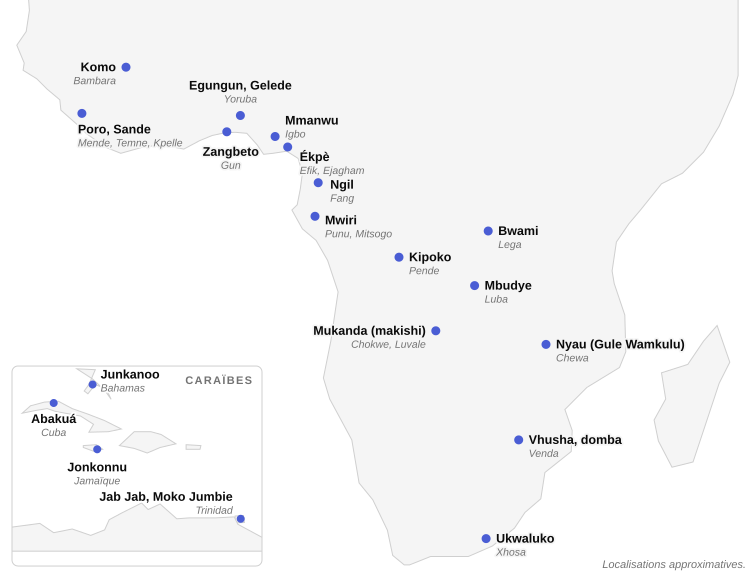
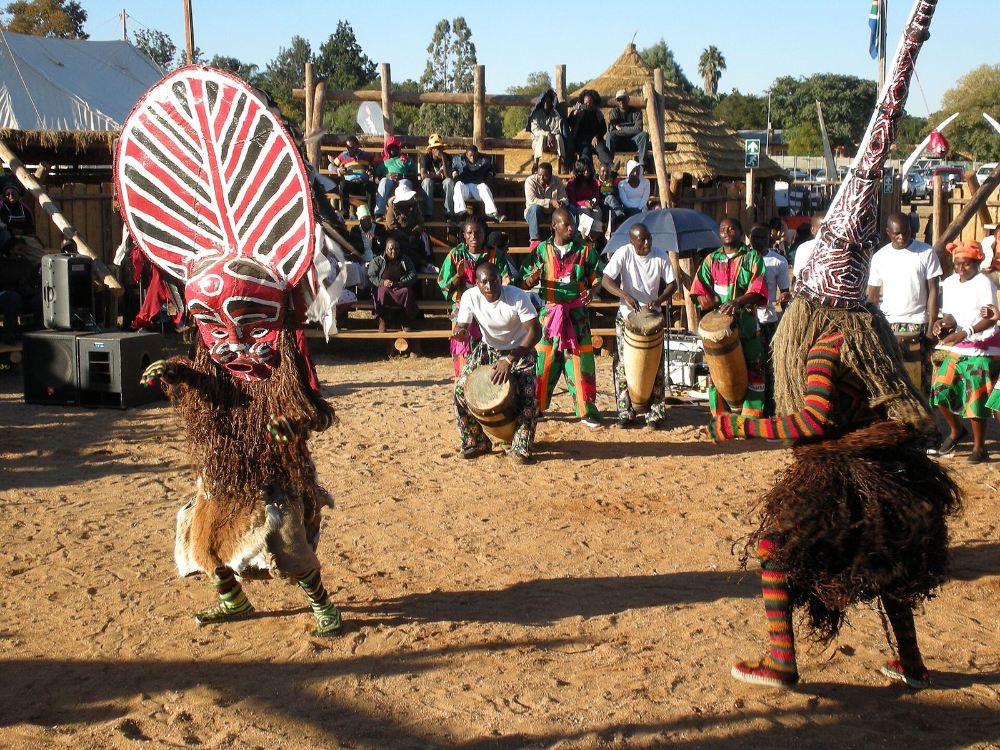
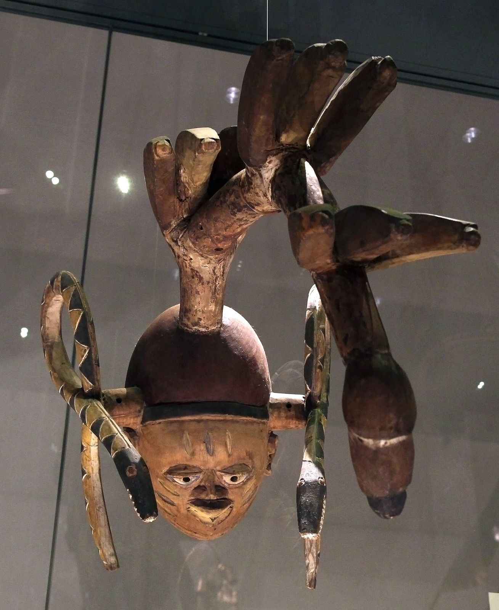
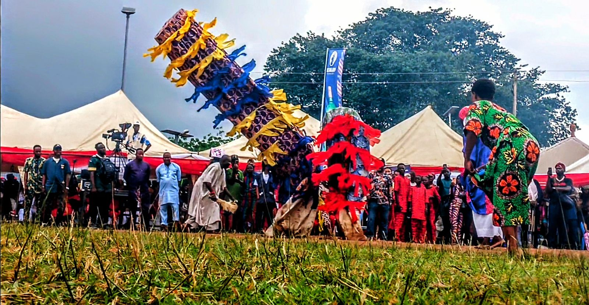
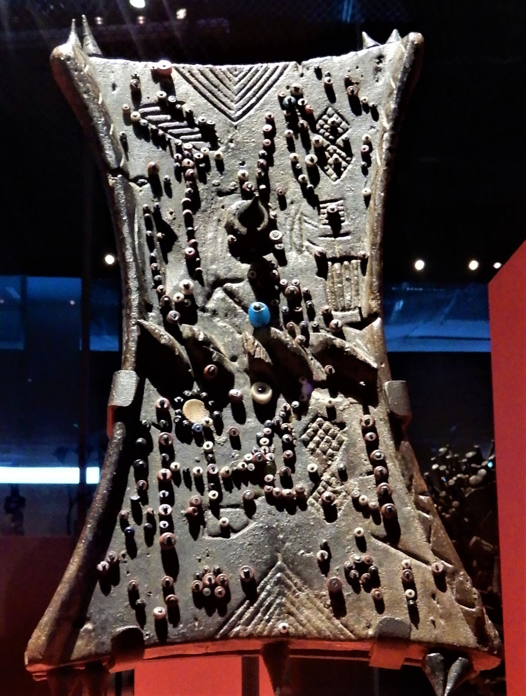

Dans une vitrine, un masque africain est un visage de bois avec un cartel qui indique un peuple, un pays, une date. Ceux qui le faisaient danser ne le voyaient pas ainsi. L’universitaire igbo Osita Okagbue, spécialiste du théâtre, écrit que, lorsque les ancêtres viennent sous forme de masques, on peut jouer avec eux, les nourrir, les soudoyer et même les gronder quand ils ont déçu[^1]. Le masque n’est pas une image de l’ancêtre ; c’est l’ancêtre de passage, avec un corps, une voix, une démarche et un public.

Ce dossier part de cet écart entre l’objet exposé et l’être qui sort. Il ne fait pas l’inventaire des masques d’Afrique. Il compare les sociétés qui les font sortir à partir de ce qu’elles font : transmettre un savoir réservé, faire des adultes, faire revenir les morts, garder la mémoire d’un royaume, rendre la justice. Il suit aussi leur histoire face aux missions, aux colonisateurs, aux musées et aux festivals, jusqu’à Cuba et aux Bahamas.

## Qu’est-ce qu’un masque ?

Le mot français désigne un objet posé sur le visage. Les institutions décrites ici parlent d’un personnage complet, fait d’un couvre-chef ou d’un visage sculpté, d’un costume qui cache le corps entier, d’une danse, d’une voix, d’une musique et d’un nom. Chez les Mitsogho du Gabon, l’ethnologue Pierre Sallée notait que chaque masque a son nom et son symbolisme propre, mais que la forme sculptée ne suffit pas à l’identifier. C’est le chant lancé à sa sortie et sa manière de danser qui précisent sa personnalité. Il signalait aussi des « masques sonores », entités qui ne se manifestent que par la voix, comme le Ya Mwèi, autre nom du [Mwiri](fiche:mwiri)[^2]. Un masque peut donc exister sans visage visible.

.")

Le même constat vaut pour les objets. Daniel Biebuyck, qui a étudié le [bwami](fiche:bwami) des Lega de l’est du Congo entre 1951 et 1957, concluait que la forme des sculptures utilisées dans cette association n’a pas de sens en elle-même. Le sens naît, pendant l’initiation, du jeu entre les objets, les paroles, la danse, la musique et le chant[^3].

Les masques ne sont pas faits pour durer. Selon Felwine Sarr et Bénédicte Savoy, dans beaucoup de sociétés africaines certains masques sont enterrés au bout de quelques années puis recréés, pour que se renouvelle la force qui les rend efficaces. Chez les Chokwe, les masques propres à l’initiation des garçons étaient brûlés avec le camp à la fin du rite, d’après les travaux de Marie-Louise Bastin[^4].

On parle de « sortie » des masques : ils viennent de la brousse ou du monde des morts et ils y retournent. Pour Okagbue, le masque est chez les Igbo la manière de donner un corps aux esprits et aux ancêtres, qui viennent alors renforcer les normes, régler les querelles, réprimander les fautifs et instruire les vivants[^5]. Cette visite suppose que le porteur s’efface, mais l’anonymat est moins absolu qu’on ne le dit. Henry et Margaret Drewal ont observé que la plupart des danseurs [gelede](fiche:gelede) regardaient à travers un voile plutôt que par les trous d’un masque, si bien que le public pouvait reconnaître leur visage. D’autres enquêteurs ont noté que les spectateurs savent souvent qui danse, mais évitent de le dire. L’historienne de l’art Susan Gagliardi rapproche ces observations de la notion de « secret public » proposée par Michael Taussig : savoir ce qu’il ne faut pas savoir[^6].

.")

> [!NOTE]
> **Mascarade** : dans la littérature sur l’Afrique, le mot (en anglais *masquerade*) est utilisé poru designer un rituel festif, religieux ou initiatique au cours duquel des porteurs de masques et de costumes traditionnels représentent des esprits, des ancêtres ou des forces mystiques.
> 
> Cela concerne donc l’ensemble que forment le masque, le costume, le porteur, la musique, la danse et le public. Les chercheurs l’emploient pour rappeler que l’objet sculpté n’est qu’un élément de la performance. Amanda Carlson plaide pour une définition large, qui inclut des danses féminines longtemps exclues de la catégorie parce qu’elles ne cachaient pas le visage.

| Société ou mascarade                       | Peuples                           | Région                                       | Fonction principale                  | Qui porte les masques                                                                              | Sources                        |
| ------------------------------------------ | --------------------------------- | -------------------------------------------- | ------------------------------------ | -------------------------------------------------------------------------------------------------- | ------------------------------ |
| [Egungun](fiche:egungun)                   | Yoruba                            | sud-ouest du Nigeria, Bénin                  | retour des morts                     | des hommes                                                                                         | Na’Allah 1996                  |
| Gelede                                     | Yoruba (Nago)                     | Bénin, Nigeria, Togo                         | hommage aux « mères »                | un danseur masculin sur les photographies de Drewal ; société dirigée par des hommes et des femmes | UNESCO ; Gagliardi 2018a       |
| [Mmanwu](fiche:mmanwu)                     | Igbo                              | sud-est du Nigeria                           | visite des ancêtres, ordre           | des hommes                                                                                         | Okagbue 2019                   |
| [Zangbeto](fiche:zangbeto)                 | Ogu (Gun)                         | Badagry (Nigeria), sud du Bénin              | police de nuit                       | les membres de la société                                                                          | Okunola et Ojo 2013            |
| [Poro](fiche:poro) et [Sande](fiche:sande) | Mende, Temne, Kpelle et voisins   | Sierra Leone, Liberia, Guinée, Côte d’Ivoire | initiation, gouvernement             | hommes (Poro), femmes de haut rang (Sande)                                                         | Käihkö 2019 ; Kart 2020        |
| [Komo](fiche:komo)                         | Bambara et autres locuteurs mandé | Mali, Guinée, Burkina Faso                   | savoir, protection                   | des hommes ; masques interdits à la vue des femmes                                                 | Gagliardi 2018b                |
| Bwami                                      | Lega                              | est de la RDC                                | morale, grades                       | initiés des grades supérieurs                                                                      | Biebuyck 2010                  |
| [Mukanda](fiche:mukanda) (makishi)         | Chokwe, Luvale, Luchazi, Mbunda   | Angola, RDC, Zambie                          | faire des hommes                     | des hommes, y compris pour les personnages féminins                                                | UNESCO ; Penoni 2018           |
| Nyau ([Gule Wamkulu](fiche:gule-wamkulu))  | Chewa                             | Malawi, Zambie, Mozambique                   | funérailles, initiation              | des hommes                                                                                         | Yoshida 1992 ; UNESCO          |
| [Ngil](fiche:ngil)                         | Fang                              | Gabon, Guinée équatoriale, Cameroun          | justice, lutte contre la sorcellerie | les membres de la société                                                                          | Cinnamon 2012 ; Kreeger Museum |

## Le secret et l’initiation

La littérature coloniale a rangé ces institutions sous l’étiquette de « sociétés secrètes ». Le terme suggère des groupes cachés, alors que presque tous les hommes, ou presque toutes les femmes, d’une communauté y appartiennent généralement. L’administrateur français Louis Tauxier le remarquait dès 1927 à propos du Komo et du Kono. Poui lui, ces associations ne sont « pas très secrètes », puisqu’elles comprennent presque tous les hommes d’un village. Elles ne le sont que pour les femmes, les enfants et les étrangers.

Le terme porte aussi la marque d’un regard extérieur. Au Liberia, observe l’anthropologue Ilmari Käihkö, les masques de ces sociétés sont couramment appelés *devils*, « diables ». La connotation maléfique a été promue par les missionnaires chrétiens et par l’élite américano-libérienne, qui voyait dans ces institutions des rivales de l’État[^7]. Patrick McNaughton a proposé de parler de « sociétés de pouvoir » pour traduire le mot mandé *jo* (pluriel *jow*), qui regroupe le Komo, le Kono, le Ciwara ou le Nya. Gagliardi reprend cette expression, plus fidèle à l’accent que ces organisations mettent sur un savoir restreint[^8].

Les anthropologues ont aussi déplacé la question du contenu du secret vers sa pratique. Beryl Bellman, qui a étudié le Poro chez les Kpelle du Liberia, écrivait que le contenu des secrets compte moins que le fait de faire secret. Pour Käihkö, qui le cite, ce qui reste caché tient plus des pratiques que d’un corpus de connaissances. Aussi, la limitation de l’accès au savoir crée à la fois une solidarité entre ceux qui le partagent et une hiérarchie entre eux ainsi que les autres, comme l’avait vu Georg Simmel[^9]. Au Malawi et en Zambie, Kenji Yoshida décrit chez les Chewa une société entière qui « fait semblant ». Les femmes savent souvent ce qu’on leur cache, mais doivent faire comme si elles l’ignoraient, sous peine de lourdes amendes[^10].

Le secret s’organise aussi en grades. Chez les Lega, les sculptures n’apparaissaient qu’aux grades les plus élevés, pour les hommes comme pour les femmes. Quant au dernier rite, réservé à ceux qui atteignaient le sommet, il se passait de danse et de chant. Le sens des figurines y restait, selon Biebuyck, entièrement secret[^11]. Chez les Luba, l’initiation à la [Mbudye](fiche:mbudye) comportait de nombreuses étapes, chacune payante. Le missionnaire protestant W.F.P. Burton, l’un des rares à l’avoir décrite tant qu’elle était active, n’avait rien pu apprendre des trois niveaux supérieurs[^12].

L’autre trait commun est la séparation. Les novices quittent le village pour un camp ou un enclos en brousse, interdit aux non-initiés. Dans le mukanda du haut Zambèze, la séparation d’avec les mères et d’avec l’enfance ouvre une longue réclusion pendant laquelle les garçons sont introduits au savoir des hommes, avant d’être réintégrés à la vie du village. L’UNESCO décrit ce séjour comme la mort symbolique de l’enfant[^13].

> [!NOTE]
> **L’école de brousse** : expression (en anglais *bush school*) par laquelle les observateurs ont désigné les camps de réclusion des initiations, comme ceux du Poro, de la Sande ou du mukanda. Elle souligne que la réclusion sert aussi à enseigner : chants, danses, règles de conduite, savoirs pratiques, histoire du groupe. Le mot « école » ne doit pas faire oublier que cet enseignement passe par des épreuves, par le secret et par une transformation de statut que l’école ordinaire ne prétend pas opérer.

## Devenir adulte

Le cas le mieux documenté d’une initiation masquée est le mukanda, pratiqué par les Chokwe, les Luvale, les Luchazi, les Mbunda ainsi que leurs voisins, entre l’Angola, la République démocratique du Congo et la Zambie. Selon la fiche d’inscription de l’UNESCO, les garçons de huit à douze ans passent, au début de la saison sèche, un à trois mois dans un camp isolé. La réclusion est généralement ramenée aujourd’hui à un mois pour s’accorder au calendrier scolaire. Chaque novice se voit attribuer un personnage masqué qui l’accompagne d’un bout à l’autre : un *likishi* (pluriel *makishi*), esprit d’un ancêtre revenu pour aider les garçons[^14]. Les makishi forment un monde. Le conservateur Manuel Jordán en compte plus d’une centaine de types.

Bastin distinguait chez les Chokwe un masque royal réservé aux grands chefs, des masques propres au mukanda, qui tiennent les femmes à l’écart et vont chercher la nourriture préparée par les mères, mais aussi des masques de divertissement, propriété de leurs danseurs[^15]. Chez les masques du mukanda figure [Cikunza](fiche:cikunza) ; parmi les plus célèbres, [Mwana Pwo](fiche:mwana-pwo). Les makishi servent d’intermédiaires entre le camp et le village, entre les hommes et les femmes, entre initiés et non-initiés[^16].

En Sierra Leone et au Liberia, le Poro remplit une fonction comparable à une autre échelle. Käihkö rappelle que les rites d’initiation y ont toujours fait des adolescents des adultes dotés de tous leurs droits et devoirs, à commencer par l’obéissance aux aînés. Les masques y tiennent une place discutée. Pour Kenneth Little, le cercle intérieur du Poro chez les Mano portait des masques et était traité comme un ensemble d’esprits. Pour Bellman, la hiérarchie du Poro contrôle directement le masque principal. D'autres auteurs y voient des masques autonomes, appartenant à des maisonnées. Bellman notait d’ailleurs des différences importantes entre les Poro de deux communautés voisines[^17].

Chez les Chewa, Yoshida observe qu’à peu près tous les garçons de douze à quinze ans entrent dans l’association nyau, sans laquelle un homme n’est pas tenu pour un membre de plein droit de la société[^18].

Le masque n’est pourtant pas une condition de l’initiation. Chez les Xhosa d’Afrique du Sud, l’[ukwaluko](fiche:ukwaluko) (ou *ulwaluko*) fait passer le garçon (*inkwenkwe*) au statut d’homme (*indoda*) par une opération, une réclusion et un enseignement. Celle-ci se fait sous l’autorité de l’opérateur, l’*ingcibi*, ainsi que celle du gardien des novices, l’*ikhankatha*. La théologienne Nobuntu Penxa-Matholeni souligne que l’initiation impose de garder secret ce qui se passe à l’école et qu’au retour, les hommes mûrs du village transmettent leurs conseils aux *amakrwala*, les nouveaux hommes. Un homme circoncis à l’hôpital, rapporte-t-elle d’après Sakhumzi Mfecane, n’est pas reconnu comme un vrai homme[^19]. Aucun masque n’y intervient.

Chez les Venda, les filles passaient par plusieurs écoles successives, dont le [vhusha](fiche:vhusha) et le [domba](fiche:domba), où l’enseignement passait par des chants, des danses et des mimes. L’ethnomusicologue John Blacking leur a consacré en 1969 une série de quatre articles qui, selon un compte rendu de l’époque, dissipait l’exotisme entretenu autour de la « danse du python » par les guides touristiques et le cinéma, en montrant les accomplissements intellectuels du domba[^20]. Initiation et masque se recoupent donc généralement, sans se confondre.

## Les femmes et les masques

Dans la plupart des traditions comparées ici, les masques appartiennent aux hommes et leur vue est interdite aux femmes. Cette règle connaît des exceptions.

La plus connue est celle de la Sande, la société des femmes chez les Mende, les Temne et leurs voisins. Selon l’historienne de l’art Susan Kart, la mascarade n’est pas répandue sur tout le continent et, là où elle existe, elle est généralement le fait des hommes. En Sierra Leone et au Liberia, au contraire, des femmes sont les principales chanteuses et danseuses de la mascarade. Ce sont elles qui commandent et portent les masques de bois. L’ensemble formé par la femme, le masque et le costume de fibres noires s’appelle *sowo*. Il préside à la fête qui clôt l’initiation des filles, mais aussi à des mariages, à des funérailles et au jugement d’hommes accusés de crimes contre des femmes[^21]. Pour l’Art Institute of Chicago, ces "casques" aux coiffures élaborées, dansés par des responsables de haut rang de la Sande, sont l’un des rares cas africains de masques sculptés dansés par des femmes. Kart regrette que les musées occidentaux, riches en masques [sowei](fiche:sowei), aient effacé de leurs récits les femmes âgées qui les commandaient et les faisaient danser[^22].

, atelier Monowulo, vers 1945, bois et raphia noirci. Chazen Museum of Art, université du Wisconsin.")

« Rare » ne veut pas dire « unique ». Dans le moyen Cross River, au Nigeria, Amanda Carlson a étudié les mascarades agot des femmes bakor, apparentées aux Ejagham. Les danseuses y sont entièrement cachées sous de longues robes de tissu, avec une coiffe de bois sculpté. Elles incarnent aussi bien un personnage masculin qu’un personnage féminin, lors de funérailles ou de la fête de l’igname nouvelle. Pour Carlson, ces performances sont rarement reconnues comme des mascarades parce que la définition savante a été construite à partir des traditions masculines[^23].

L’hommage aux femmes ne passe pas toujours par des femmes masquées. Le Gelede des Yoruba-Nago, entre le Bénin, le Nigeria et le Togo, honore selon l’UNESCO la mère primordiale Ìyá Nlá ainsi que le rôle des femmes dans l’organisation de la société yoruba. La société qui l’organise est dirigée par des groupes d’hommes et de femmes, chacun avec sa tête masculine et féminine[^24]. Mais le danseur que Drewal photographiait à Ilaro en 1978, et dont on distingue le visage sous le voile, est un homme. Chez les Chokwe, Mwana Pwo représente une ancêtre féminine et incarne, selon l’Art Institute of Chicago, la fécondité et la place des femmes dans la société. Il est toujours porté par un homme[^25]. Isabel Penoni rappelle que tous les makishi féminins sont dansés par des hommes, les femmes se contentant de les accompagner. Elle précise que ces masques dansent la *ciyanda*, une danse enseignée aux filles pendant leur propre réclusion, le *mwali*. Un homme masqué reprend en public le savoir corporel des femmes[^26].

L’interdit lui-même est plus souple qu’il n’y paraît. Gagliardi, qui a travaillé vingt-deux mois depuis 2004 dans l’ouest du Burkina Faso, montre que les chapitres locaux du Komo et du Kono autorisent certaines femmes à voir leurs masques, que d’autres, sans les voir, interagissent avec eux pendant les sorties, font appel à leurs responsables pour résoudre leurs problèmes, entretiennent les cours de leurs maisons ou préparent la nourriture et la bière des cérémonies. Elle parle d’un « public qui ne voit pas » mais reste présent. Une autre société de pouvoir de la région, le Wara, invite au contraire les femmes à ses sorties[^27]. Chez les Chewa, Yoshida décrit une répartition des rôles : aux hommes du nyau les masques et les funérailles, aux femmes possédées par l’esprit du python la pluie et l’initiation des filles[^28].

## Le retour des morts

Chez les Yoruba, l’Egungun est la plus célèbre. Son origine même est discutée. L’historien yoruba Samuel Johnson la plaçait chez les Nupe, voisins du nord. Siegfried Nadel, pour qui les adeptes des mascarades du pays nupe étaient des Yoruba « nupéisés », puis le folkloriste Oludare Olajubu y voyaient au contraire une institution yoruba. Abdul-Rasheed Na’Allah, qui a réexaminé ces thèses, tranche en faveur de l’origine nupe et invite à regarder la tradition sans romantisme, en tenant compte de son usage pour intimider les femmes, les enfants et les voisins. Il rappelle qu’à Ilorin, ville aujourd’hui très majoritairement musulmane, l’Egungun ne doit plus être montré[^29].

Chez les Igbo, le mmanwu repose sur une conception cyclique. Selon Okagbue, la vie se déroule pour les Igbo sur trois plans, celui des morts, celui des vivants et celui des enfants à naître. On passe du monde des esprits à la matière par la naissance et de la matière aux esprits par la mort. Le masque offre un troisième passage, temporaire, qui permet aux ancêtres de revenir parmi les vivants. Okagbue décrit ainsi une sortie de l’*ijele* d’Unubi, l’un des plus grands masques igbo, aux funérailles d’un aîné respecté à Nkpor, en 1994[^30].

Chez les Chewa, le lien entre masques et funérailles est plus explicite encore. Yoshida observe que la fonction principale du nyau est de danser lors des rites funéraires, et en particulier du *bona*, qui clôt le deuil après la récolte de maïs de l’année suivante. Pour les Chewa qu’il a interrogés, un défunt simplement enterré reste attaché à la terre et ne peut renaître. Les masques, et surtout les grandes structures d’animaux de la brousse, emportent son esprit pour en faire un ancêtre capable de se réincarner dans ses descendants. Dans ce contexte, la danse nyau, le Gule Wamkulu ou « grande danse », est aussi appelée la « grande prière »[^31]. L’UNESCO ajoute qu’elle se danse aux mariages, à l’installation ou à la mort d’un chef ainsi qu'à la fin de l’initiation des garçons[^32].

La comparaison fait apparaître une même idée, celle d’une visite des morts, et trois accents :

- la lignée et la ville chez les Yoruba ;

- la circulation entre les plans de l’existence chez les Igbo ;

- la réincarnation des ancêtres chez les Chewa.

Dans les trois cas, le masque ne représente pas le défunt : il le fait passer.

## Savoir, mémoire, pouvoir

Certaines sociétés font de l’initiation une transmission de savoir longue et graduée. Les sociétés de pouvoir mandé, dont le Komo, sont dirigées selon Gagliardi par des spécialistes qui développent des connaissances pour soigner, combattre les forces malfaisantes et résoudre les difficultés des individus ainsi que celles des communautés[^33].

Chez les Lega, le bwami fait de la morale le contenu même de l’initiation. Chaque objet présenté aux initiés est associé à au moins un aphorisme, chanté et dansé par les aînés, mais le lien entre la forme et le texte est le plus souvent invisible : une même figurine est identifiée différemment selon ses propriétaires. Les aphorismes enseignent surtout par le contraire, en mettant en scène des personnages à ne pas imiter[^34]. Les sculptures ne parlent pas, dit le titre de son article : ce sont les Lega qui les font parler.

, probablement XIXe siècle. Selon le musée, les figurines d’ivoire étaient réservées aux membres des grades supérieurs du bwami. Cleveland Museum of Art (2005.3).")

Chez les Luba du Katanga, la Mbudye a la garde de l’histoire du royaume. Mary Nooter Roberts et Allen Roberts ont montré que, pour beaucoup de sociétés africaines, le pouvoir tient à l’accès inégal au savoir, à sa protection, à sa transmission et à sa reformulation selon les besoins politiques du moment. La Mbudye contrôle ce savoir tout en servant le roi ou le chef. Ses « hommes de mémoire » s’appuient sur le [lukasa](fiche:lukasa), une planchette couverte de perles et de reliefs. Pour les Roberts, la mémoire luba n’est pas passive et le récit historique n’est jamais deux fois le même[^35]. Studstill, un chercheur initié au premier grade de la société, y voyait un enseignement hiérarchisé, avec ses examens et son élite instruite, qui démentait l’idée que les sociétés sans écriture ignorent l’école[^36].

> [!NOTE]
> **Le lukasa** : petite planchette de bois couverte de perles et de reliefs sculptés, dont les membres de la Mbudye se servent pour raconter l’histoire de la royauté luba, ses lignées et les lieux qui la jalonnent. Ce n’est pas un texte à déchiffrer signe par signe. En effet, la même planchette peut donner lieu à des récits différents selon le récitant et l’occasion. Les lukasa conservés dans les musées, séparés de ceux qui savaient les lire, ne livrent plus qu’une partie de leur sens.

Le masque peut aussi servir la royauté. Chez les Pende de l’Est, au Congo, le [kipoko](fiche:kipoko) est décrit par le musée de Cleveland comme un masque de protection et de guérison lié aux insignes des chefs, qui clôt l’initiation des garçons et paraît lors des cérémonies pour les ancêtres[^37]. Chez les Chokwe, Bastin distinguait de même un masque royal gardé par les chefs les plus importants[^38]. Savoir, mémoire et royauté se répondent : les sociétés d’initiation peuvent soutenir un pouvoir, mais aussi le contenir, puisque ce sont elles qui détiennent les récits qui le légitiment.

## Maintenir l’ordre

Le Zangbeto, société de masques des Gun du sud du Bénin et des Ogu de Badagry, au Nigeria, en est l’exemple le plus étudié. Son nom signifie, selon l’informateur principal de l’enquête, « l’homme qui veille la nuit ». L’enquête menée en 2012 à Badagry par les sociologues Rashidi Okunola et Matthias Ojo décrit huit quartiers ayant chacun leur groupe, dirigé par un *zanga*, et des groupes qui se prêtent main-forte pendant les rondes. Les voleurs arrêtés de nuit sont remis à la police nigériane, avec laquelle les relations sont réglées, même si les membres se plaignent qu’elle ne poursuive pas toujours. On prête aussi au Zangbeto le pouvoir de neutraliser les sorciers, que son bourdonnement suffirait à paralyser[^39]. Les membres, qui pour la plupart se disent chrétiens ou musulmans, présentent leur appartenance comme un service rendu à la communauté. Le Zangbeto, disent-ils, n’est ni une religion ni un dieu à adorer. Ses récits d’origine et ses sorties lors des fêtes du vodun sont évoqués dans [le dossier sur le Dahomey](dossier:dahomey).

Chez les Fang du Gabon, de Guinée équatoriale et du sud du Cameroun, le Ngil (ou *ngi*, « gorille ») s’est répandu, selon l’anthropologue John Cinnamon, pendant les bouleversements de la fin de la période précoloniale et du début de la colonisation. Il protégeait contre les sorciers, que son chef était réputé voir au moment même où ils agissaient. Aubame le jugeait « plus politique que religieux », puisqu’il visait à garantir l’ordre et la sécurité des personnes et des biens. Philippe Laburthe-Tolra notait que ses membres pouvaient traquer, démasquer, punir et tuer les sorciers. Comme les mouvements qui l’ont suivi, ajoute Cinnamon, le Ngil renforçait aussi les inégalités et se prêtait aux abus[^40]. Ses masques blanchis au kaolin, qui évoquent les esprits des ancêtres, devaient selon la notice du Kreeger Museum effrayer le public lors de sorties nocturnes, puis aider à identifier l’origine des sorts[^41].

Au Liberia, Käihkö décrit des sociétés qui maintiennent l’ordre par un mélange de légitimité et de contrainte, de moyens sacrés et profanes. Les décisions de leurs dirigeants sont tenues pour définitives par beaucoup. Il cite l’historien Stephen Ellis, pour qui l’esprit masqué de la forêt est redoutable, voire dangereux, mais pas maléfique. En effet, sa puissance sert à infliger des punitions dans l’intérêt de la communauté et il est le garant de l’ordre[^42]. On a vu que le *sowo* de la Sande paraît lui aussi au jugement d’hommes accusés de crimes contre des femmes. De même, les esprits du mmanwu règlent les querelles et réprimandent les fautifs.

## Face aux missions et à la colonisation

Missions et administrations ont vu dans ce secret une menace. Leurs réponses ont varié de l’interdiction à l’intégration.

Chez les Lega, selon Maria Corina Rocha, le caractère secret du bwami et son influence politique ont éveillé les soupçons de l’administration belge. Combattu par des fonctionnaires et des missionnaires dès 1916, il fut déclaré illégal en 1948 ; mesure annulée à l’indépendance en 1960. Les dommages furent durables, puisque l’art lega, selon l’historien de l’art Joseph Cornet, n’a jamais retrouvé la même intensité[^43]. Le Ngil fut interdit par l’administration coloniale française au début du XXe siècle. Et l’usage de ses masques déclina ensuite. D’autres mouvements contre la sorcellerie prirent le relais, comme celui de Mademoiselle à partir des années 1950 et le Ndéndé qui en est issu, que James Fernandez présentait comme une version du Ngil au milieu du XXe siècle[^44].

Le nyau a connu une autre trajectoire. Yoshida rapporte que les autorités coloniales et les missionnaires l’ayant interdit, il dut poursuivre ses activités dans la clandestinité. C’est sans doute à cette époque qu’il s’est répandu dans tous les villages, alors qu’il n’existait auparavant que dans des centres rituels régionaux. En Zambie, ses sorties publiques ne furent de nouveau autorisées qu’après l’indépendance, en 1964. L’enterrement lui-même est aujourd’hui largement christianisé, mais seuls des membres du nyau peuvent encore mettre le corps en terre[^45]. L’UNESCO note que les missionnaires ont tenté d’interdire le Gule Wamkulu, qui a survécu en adoptant certains aspects du christianisme, et que beaucoup d’hommes chewa appartiennent à la fois à une Église et à une société nyau[^46].

Au Liberia, l’État lui-même a changé d’attitude. Selon Käihkö, il a interdit en 1912 de nombreuses sociétés et regardé le Poro ainsi que la Sande avec méfiance. Puis, faute de pouvoir gouverner l’intérieur sans elles, il a dû revenir sur cette position. Le président William Tubman (1944-1971) a reconnu le Poro et la Sande comme « sociétés secrètes tribales », placé le Poro sous l’autorité de son ministère de l’Intérieur et en a pris lui-même la tête. La plupart de ses successeurs en ont été membres. Par ailleurs, des responsables politiques paient encore des danseurs masqués pour paraître à leurs manifestations[^47].

D’autres sociétés ont intégré la colonisation au masque. Okagbue se souvient que l’ijele de Nkpor portait, dans son enfance, l’administrateur colonial en kaki et casque, le navire qui avait apporté la colonisation, les policiers, les interprètes, puis les bicyclettes, les voitures et les avions. Ensuite, un nouvel élément y fut ajouté après la guerre du Biafra : le masque accumule l’histoire au lieu de la subir[^48].

## De l’autre côté de l’Atlantique

Le cas le mieux établi de transmission d’une société d’initiation vers les Amériques est celui de l’[Abakuá](fiche:abakua) cubain. Dans *Voice of the Leopard* (2009), l’historien Ivor Miller montre comment des membres des sociétés du léopard du Cross River, appelées Ékpè chez les Efik et Ngbè chez les Ejagham, réduits en esclavage et déportés à Cuba, y ont réorganisé leurs loges sous le nom d’Abakuá. Réservées d’abord aux Africains, ces loges se sont ouvertes ensuite à des membres de toutes origines.

Abakuá et Ékpè se sont retrouvés pour la première fois à Calabar en 2004[^49]. La filiation est solide, mais elle n’est pas une copie. Carlson observe que le Cross River connaît un système rituel à deux sexes, avec des associations et des mascarades féminines, alors que l’Abakuá cubain est une confrérie exclusivement masculine où les femmes sont absentes du rituel[^50].

.")

> [!NOTE]
> **Ékpè** : société du léopard du bassin du Cross River, entre le sud-est du Nigeria et l’ouest du Cameroun, appelée Ékpè chez les Efik de Calabar et Mgbè ou Ngbè chez les Ejagham. Aux XVIIIe et XIXe siècles, ses loges réglaient la vie de communautés autonomes et de petites cités marchandes. Elles servaient de réseau entre peuples voisins. Ensuite, elles ont intégré des langues, des musiques, des costumes et des danses de toute la région.

Pour les fêtes masquées des Caraïbes anglophones, les filiations sont plus discutées. Le [Junkanoo](fiche:junkanoo) des Bahamas, appelé Jonkonnu en Jamaïque, passe souvent pour une fête profane de Noël. L’anthropologue Kenneth Bilby a montré que certaines de ses variantes anciennes restent liées à des conceptions et à des pratiques religieuses d’origine africaine. Pour lui, l’apparence profane résulte d’une sécularisation, en réponse à la stigmatisation des formes africaines de religiosité, qui n’a réussi qu’en partie[^51].

Jeroen Dewulf propose une autre piste. Les premiers témoignages sur le Jankunu présentent des parallèles avec les traditions ibériques de la *calenda*, que beaucoup d’Africains déportés auraient connues avant leur arrivée, notamment par les confréries d’entraide et d’enterrement liées aux Portugais en Afrique[^52]. Ces lectures ne s’excluent pas, mais interdisent de faire du Junkanoo la simple survivance d’un masque africain précis. Les mêmes précautions valent pour le [Jab Jab](fiche:jab-jab), diable du carnaval de Trinidad, et pour le [Moko Jumbie](fiche:moko-jumbie), danseur sur échasses, pour lesquels on avance aussi des origines africaines.

 à Kingston, en Jamaïque, à Noël 1975.")

## Musées, patrimoine et festivals

Au début du XXe siècle, les masques africains entrent dans l’histoire de l’art européenne par l’atelier des peintres. Sarr et Savoy rappellent les « fécondations » qu’ils ont permises, de Picasso aux surréalistes en passant par les expressionnistes allemands, et le prix de cet apport : environ soixante-dix mille objets d’Afrique au musée du quai Branly, soixante-neuf mille au British Museum, cent quatre-vingt mille au musée royal de l’Afrique centrale en Belgique. Ils citent un masque de la région de Ségou acheté sept francs en 1931 par la mission Dakar-Djibouti, l’équivalent d’une douzaine d’œufs, alors que le prix moyen d’un masque africain atteignait deux cents francs aux enchères en France la même année[^53]. En 2022, un masque attribué à la société du Ngil, rapporté du Gabon par un gouverneur colonial et revendu cent cinquante euros par ses descendants à un brocanteur, a été adjugé plus de quatre millions d’euros à Montpellier. Une dizaine d’exemplaires comparables seulement sont répertoriés dans les collections occidentales[^54].

L’UNESCO a proclamé le patrimoine oral du Gelede (Bénin, Nigeria, Togo) en 2001, le Gule Wamkulu (Malawi, Mozambique, Zambie) et la mascarade makishi (Zambie) en 2005, puis les a inscrits tous trois en 2008 sur la Liste représentative du patrimoine culturel immatériel. Chacune de ces fiches signale les mêmes menaces :

- le tourisme, qui transforme le Gelede en produit folklorique ;
- la réduction du Gule Wamkulu au spectacle pour touristes ou à l’outil politique ;
- la demande croissante de danseurs makishi pour les rassemblements sociaux et les meetings de partis[^55].

Les festivals sont devenus un grand lieu de sortie des masques. En Zambie, les Luvale organisent depuis les années 1950 le Likumbi Lya Mize. En Angola, un festival traditionnel luvale se tient depuis 2010 dans l’Alto Zambeze, où Penoni l’a observé en 2012 et 2013, après une guerre qui avait empêché toute recherche dans la région pendant près de quarante ans. Le festival s’ouvre par un cortège de makishi sortis des bois qui entourent les tombes des anciennes reines et présente une version condensée du mukanda. Penoni le situe dans le mouvement général d’objectivation et de mise en marché de la « culture » décrit par Jean et John Comaroff[^56]. Dans un festival comme au musée, ce qui sort devant tous n’est qu’une partie de ce que le masque était.

## Ce qu'il faut retenir !

Ce dossier ne dit que ce qui a déjà été publié. Il ne cherche pas à révéler ce que les initiés taisent et il s’abstient de reprendre certains détails que des ouvrages publiés ont livrés. Les chercheurs eux-mêmes se sont posé la question. Yoshida, initié au nyau après un an passé dans un village chewa, précise qu’il a obtenu la permission de révéler une partie des secrets à des fins d’enseignement. Il garde pour lui les énigmes et le vocabulaire réservés qui ne servent pas son propos[^57]. Miller, initié à l’Ékpè à Calabar, écrit qu’il est tenu de ne pas révéler ce qu’on lui a enseigné. La politiste Sybille Ngo Nyeck lui reproche en retour un manque de distance critique et des méthodes de vérification qu’il ne précise pas[^58]. Gagliardi, femme étudiant le Komo, savait que son sexe l’empêcherait de voir certaines sorties[^59].

Les sources sont inégales. Les plus anciennes viennent de missionnaires, comme Burton pour la Mbudye, ou d’administrateurs coloniaux, comme Tauxier pour le Komo, qui observaient de l’extérieur. L’anthropologie du XXe siècle a apporté des enquêtes de longue durée, mais souvent fondées sur un seul village ou une seule ville : Yoshida pour un village chewa de Zambie, Okunola et Ojo pour quarante personnes interrogées à Badagry.

Les travaux de chercheurs africains, comme Okagbue, Penxa-Matholeni, Na’Allah, Okunola et Ojo, ont renouvelé les questions sans effacer le problème de position. Le spécialiste nigérian des religions Umar Habila Dadem Danfulani, reprenant le proverbe selon lequel « on ne regarde pas une mascarade d’un seul endroit », plaide pour une approche qui multiplie les points de vue. Il note qu’un chercheur considéré comme « de l’intérieur » se voit parfois refuser ce qu’on confie plus volontiers à un étranger, au motif qu’un secret emporté au loin reste un secret[^60].

Le plus grand danger est celui d’un « masque africain » générique. Kart rappelle que la mascarade n’est pas répandue sur tout le continent. Gagliardi, à la suite de Sidney Kasfir, critique le modèle « une tribu, un style » qui attribue chaque masque à un groupe ethnique supposé homogène et immobile, alors que chaque sortie dépend de personnes, d’un lieu et d’un moment[^61]. Les sociétés comparées ici ont des fonctions communes, mais aucune étude d’ensemble ne permet de les rattacher à une origine unique. Par ailleurs, les dates de leurs fondations, de leurs interdictions ou de leurs transformations varient d’une source à l’autre. Ce que l’on peut dire avec certitude, c’est qu’un masque africain n’existe vraiment qu’au moment où il sort, devant un public qui sait ce qu’il doit ne pas savoir.

[^1]: Okagbue (2019), qui reprend un passage d’un de ses textes de 1993.

[^2]: Sallée (1975), p. 88-90. Sallée écrit que le Ya Mwèi est l’une de ces entités invisibles qui se manifestent au cours des cérémonies et des initiations, et désigne la société du Mwiri sous les deux noms. Le présent dossier ne reprend pas sa description des procédés qui donnent leur voix à ces entités.

[^3]: Biebuyck (2010), conclusion. Les enquêtes de Biebuyck datent de 1951-1953, 1955 et 1957.

[^4]: Sarr et Savoy (2018), chapitre sur la « vie » des objets ; pour les Chokwe, Bastin (1984, p. 41), cité par Penoni (2018).

[^5]: Okagbue (2019), section sur la cosmologie igbo.

[^6]: Gagliardi (2018a), qui s’appuie sur les photographies de Drewal et Drewal (1983, p. 265-266), sur Karin Barber (1981) pour la ville d’Òkukù, au Nigeria, et sur Polly Richards (2006) pour le pays dogon, et qui cite Taussig (1999).

[^7]: Pour Tauxier (1927, p. 272), Gagliardi (2018b). Pour le Liberia, Käihkö (2019), qui s’appuie sur Brown (1982) et Ellis (2010).

[^8]: McNaughton (1979), cité par Gagliardi (2018b), note 1. Gagliardi relève que les équivalents proposés (confrérie, culte, société secrète, association d’initiation) insistent tous sur le caractère masculin ou religieux de ces organisations.

[^9]: Bellman (1984, p. 17) et Simmel (1906), cités par Käihkö (2019), section méthodologique. La thèse de Bellman est connue ici à travers cette citation.

[^10]: Yoshida (1992), p. 216. Yoshida a travaillé dans le village de Kaliza, dans la province orientale de la Zambie.

[^11]: Biebuyck (2010). Les grades supérieurs sont, pour les hommes, *yananio* et *kindi*, pour les femmes, *bulonda* et *bunyamwa*.

[^12]: Kelly (2015), chapitre 2, d’après Studstill (1979, p. 72-75). Le témoignage de Studstill est connu ici à travers Kelly.

[^13]: Pour les trois phases du mukanda, Penoni (2018), note 16 ; pour la mort symbolique, UNESCO, fiche « Makishi masquerade ».

[^14]: UNESCO, fiche « Makishi masquerade », qui situe la pratique chez les Luvale, les Chokwe, les Luchazi et les Mbunda des provinces du Nord-Ouest et de l’Ouest de la Zambie. L’âge des novices et la durée de la réclusion varient selon les sources.

[^15]: Penoni (2018), qui cite Jordán (1996 ; 2006) et Bastin (1982, p. 81-92 ; 1984, p. 41). Le masque royal chokwe est appelé Cikungu par Bastin. Il ne faut pas confondre les makishi, masques d’ancêtres de l’initiation, avec le kishi, ogre des contes mbundu d’Angola : les mots sont apparentés, les réalités très différentes.

[^16]: Penoni (2018), d’après Jordán (2006, p. 21).

[^17]: Käihkö (2019), qui cite Little (1965, p. 359), Bellman (1984, p. 19 et 30-31) et Siegmann et Perani (1976, p. 42). Les travaux de Käihkö portent surtout sur le comté de Grand Gedeh, où le Poro n’existe pas, et sur des sociétés voisines.

[^18]: Yoshida (1992), p. 213.

[^19]: Penxa-Matholeni (2021), section 5, qui cite Mfecane (2016, p. 208), Ncaca (2014) et Ntombana (2009).

[^20]: Tracey (1970), compte rendu des quatre articles de Blacking parus dans *African Studies*, 28, en 1969 : « Vhusha », « Milayo », « Domba » et « The Great Domba Song ». Tracey cite le but que s’assignait Blacking : attirer l’attention sur les accomplissements humains et intellectuels de la danse domba.

[^21]: Kart (2020), introduction, qui s’appuie sur Phillips (1978), Boone (1986) et Lamp (2014).

[^22]: Art Institute of Chicago, notice de l’objet 1997.361, qui note que la guerre civile de 1991-2002 a bouleversé ces pratiques ; Kart (2020).

[^23]: Carlson (2019), premier acte, fondé sur ses propres recherches dans le moyen Cross River. Carlson renvoie au numéro spécial d’*African Arts* consacré en 1998 aux femmes et aux masques.

[^24]: UNESCO, fiche « Oral heritage of Gelede », qui présente aussi le Gelede comme la seule société masquée connue qui soit également gouvernée par des femmes. Cette formule, qui ignore la Sande, montre combien les généralisations sur le genre des masques restent fragiles.

[^25]: Pour les photographies de Drewal, Gagliardi (2018a) ; pour Mwana Pwo, Art Institute of Chicago, notice de l’objet 1992.731, qui suggère que certains visages pourraient être inspirés d’une femme réelle.

[^26]: Penoni (2018), notes 23 et 29, d’après Jordán (2006, p. 24). Le *mwali* est l’initiation des filles chez les Luvale.

[^27]: Gagliardi (2018b), introduction. Ses enquêtes portent sur des communautés de langues senufo et mandé de l’ouest du Burkina Faso ; elles ne valent pas sans précaution pour le Komo bambara du Mali.

[^28]: Yoshida (1992), résumé et p. 203-204. Yoshida précise qu’aujourd’hui le nyau n’est plus guère invité à l’initiation des filles, où il jouait autrefois un rôle.

[^29]: Na’Allah (1996), qui discute Johnson (dans l’édition de 1973), Nadel (1954) et Olajubu (1970). La conclusion de Na’Allah en faveur d’une origine nupe n’est pas partagée par tous ; les sources ne permettent pas de trancher.

[^30]: Okagbue (2019), section consacrée à l’ijele.

[^31]: Yoshida (1992), p. 213-217 et 239-240. Yoshida présente les grandes structures animales, et en particulier l’antilope, comme plus importantes que les masques de défunts.

[^32]: UNESCO, fiche « Gule Wamkulu ».

[^33]: Gagliardi (2018b), introduction.

[^34]: Biebuyck (2010).

[^35]: Pour la Mbudye et le rapport entre savoir et pouvoir, Roberts et Roberts (2007, p. 21), cités par Kelly (2015) ; pour le lukasa et le caractère performatif de la mémoire, Nooter Roberts et Roberts (1996), d’après le résumé de l’article. 

[^36]: Studstill (1979, p. 76), cité par Kelly (2015), qui oppose ses observations aux thèses de l’anthropologue Stanley Diamond sur l’absence d’enseignement formel dans les sociétés sans écriture.

[^37]: Cleveland Museum of Art, notice de l’objet 1976.179, attribué au style des Pende de l’Est et daté des environs de 1940. Les notices de musée sur le kipoko varient dans leur interprétation.

[^38]: Bastin (1982), cité par Penoni (2018).

[^39]: Okunola et Ojo (2013), enquête par entretiens auprès de quarante personnes et d’un informateur principal, haut dignitaire chargé des religions traditionnelles à Badagry. L’étymologie du nom varie selon les auteurs.

[^40]: Cinnamon (2012), note 3, qui cite Fernandez (1982, p. 222 et 225), Aubame (2002, p. 141-147) et Laburthe-Tolra (1985, p. 353 et 364).

[^41]: Kreeger Museum, notice de l’objet 1973.12.

[^42]: Käihkö (2019), qui cite Ellis (2007, p. 220). Käihkö souligne qu’il existe peu de recherches récentes sur le rôle actuel de ces sociétés au Liberia après les guerres civiles.

[^43]: Rocha (2009), qui cite Cornet (1971, p. 258) et s’appuie sur les travaux de Biebuyck.

[^44]: Kreeger Museum, notice de l’objet 1973.12, qui situe l’interdiction au début du XXe siècle sans donner de date ; les présentations du Ngil divergent sur ce point. Pour Mademoiselle et le Ndéndé, arrivé à Oyem à la fin de 1957, Cinnamon (2012), qui cite Fernandez (1982, p. 225).

[^45]: Yoshida (1992), p. 213-217. Le lien entre la clandestinité coloniale et la diffusion du nyau est présenté par Yoshida comme probable.

[^46]: UNESCO, fiche « Gule Wamkulu ».

[^47]: Käihkö (2019), section « Masks, “bush devils” and “secret” societies ».

[^48]: Okagbue (2019).

[^49]: Ngo Nyeck (2009), compte rendu de Miller, *Voice of the Leopard: African Secret Societies and Cuba* (University Press of Mississippi, 2009). Le livre de Miller est connu ici à travers ce compte rendu et les citations qu’il en donne.

[^50]: Carlson (2019), deuxième acte. Carlson évoque aussi l’œuvre de la graveuse cubaine Belkis Ayón (1967-1999), qui a répondu en artiste non initiée à l’effacement des femmes dans l’Abakuá.

[^51]: Bilby (2010), d’après le résumé de l’article, fondé sur des enquêtes ethnographiques récentes en Jamaïque et dans d’autres pays de la Caraïbe.

[^52]: Dewulf (2021), d’après le résumé de l’article.

[^53]: Sarr et Savoy (2018), introduction et chapitre sur les modes d’acquisition. Les chiffres des collections sont ceux du rapport, qui précise que les inventaires des musées nationaux africains dépassent rarement trois mille objets.

[^54]: Tassin (2023). Les montants varient selon la presse : 4,2 millions d’euros hors frais, 5,25 millions avec les frais. Le couple vendeur a contesté la vente en justice.

[^55]: UNESCO, fiches « Oral heritage of Gelede », « Gule Wamkulu » et « Makishi masquerade ».

[^56]: Penoni (2018), introduction et note 2. L’article est fondé sur l’observation des éditions de 2012 et 2013 du festival angolan.

[^57]: Yoshida (1992), p. 215-216 et notes 4 et 5.

[^58]: Ngo Nyeck (2009), qui cite Miller (2009, p. 30-31).

[^59]: Gagliardi (2018b), qui rapporte que les responsables des sociétés, loin de lui accorder un statut équivalent à celui d’un homme, ont insisté sur sa condition de femme.

[^60]: Danfulani (1999), qui s’appuie sur ses recherches sur les fêtes et les mascarades des peuples du plateau de Jos, au Nigeria, en particulier les Mupun, et cite Bourdillon (1996, p. 141) sur la position des chercheurs « de l’intérieur ».

[^61]: Kart (2020) ; Gagliardi (2018a), qui cite Kasfir (1984) et Appadurai (1988).
