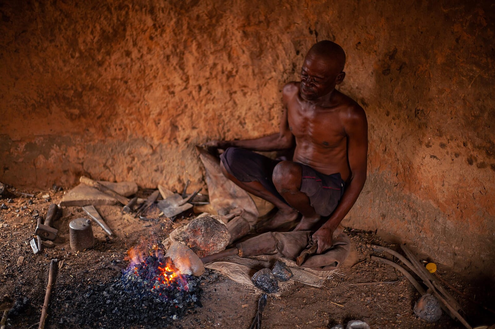
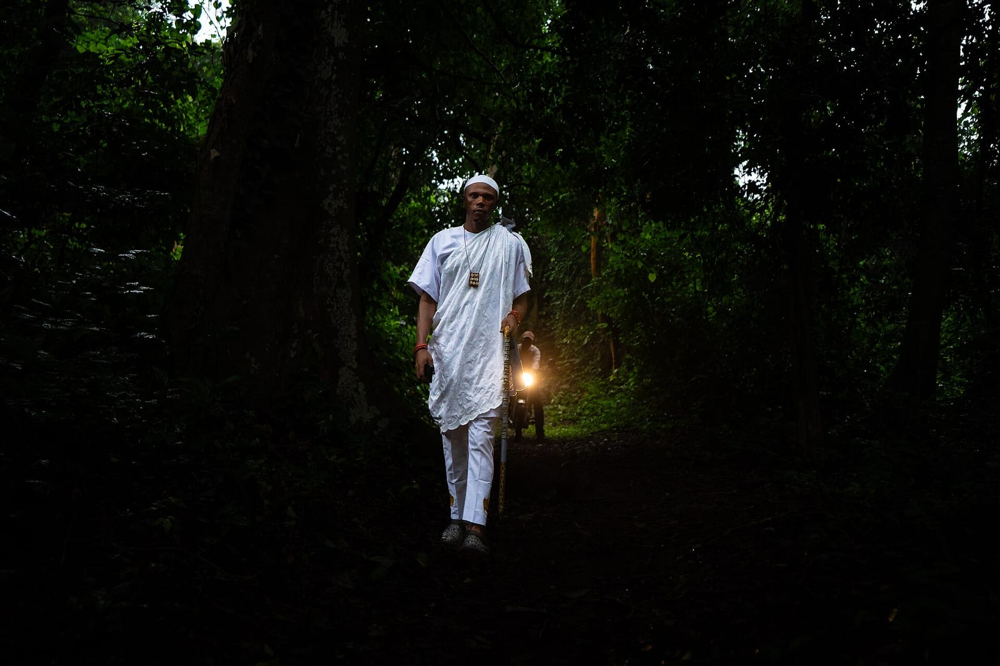
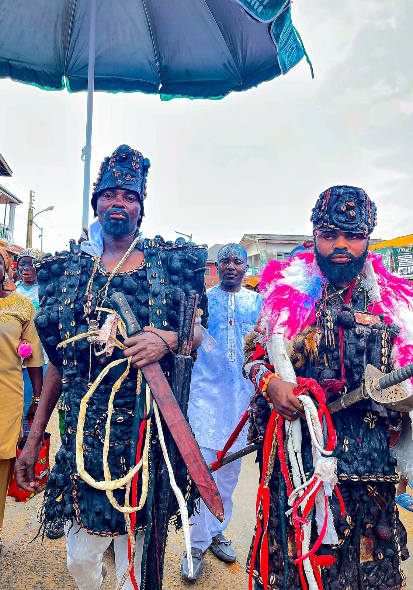
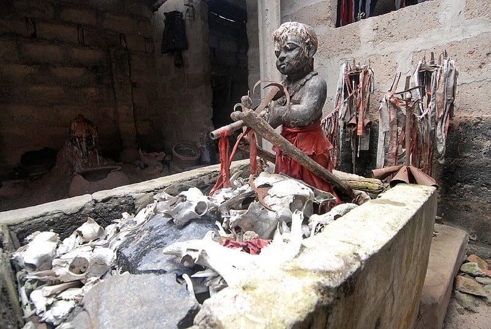
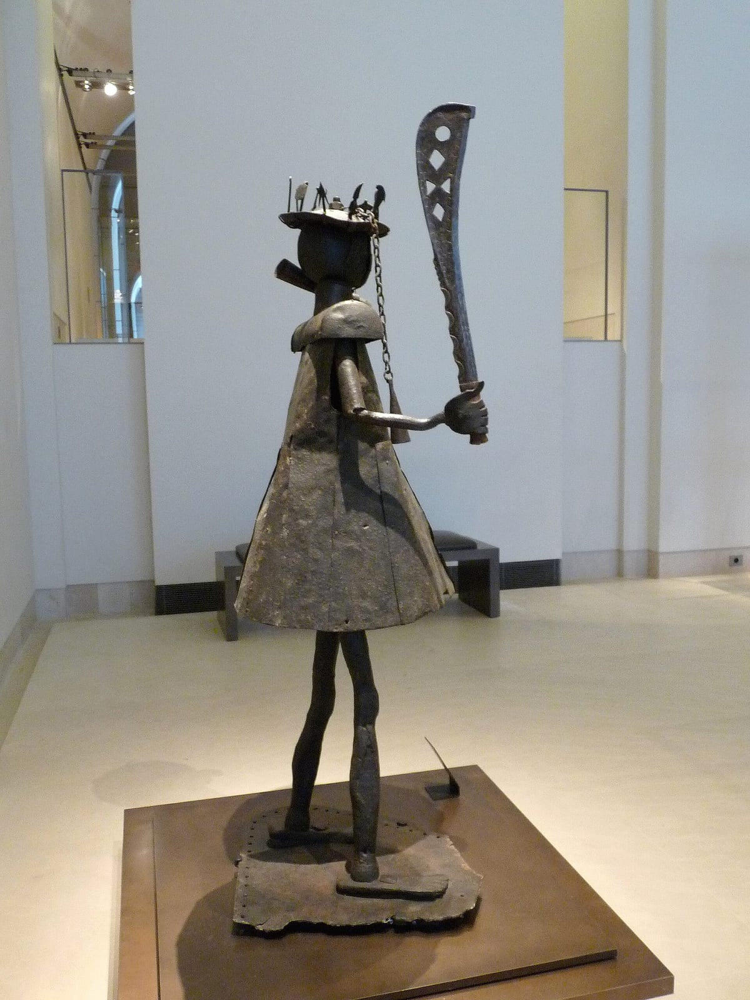
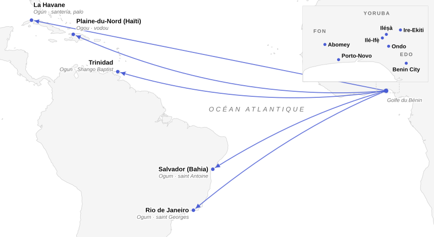
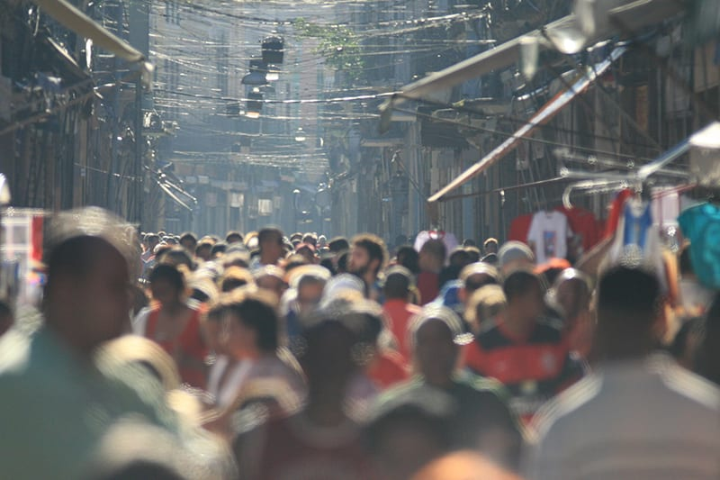

« Puisses-tu ne jamais marcher quand la route a faim. » Wole Soyinka a placé cette bénédiction des mères yoruba aux voyageurs dans *The Road*, sa pièce de 1965 sur les chauffeurs et les accidents de la route[^1]. La route qui nourrit et la route qui dévore appartiennent au même dieu. Pour les Yoruba, [Ògún](fiche:ogun) est celui qui, au commencement, a défriché à la machette le chemin par lequel les autres divinités ont pu atteindre la terre. Pour Pierre Verger, il ferme les chemins aux forces néfastes venues du dehors et ouvre la voie à toute entreprise[^2].

Ce chemin est tracé avec du fer. Le métal fait la houe qui cultive, le coutelas qui défriche, l’arme qui tue, et c’est pourquoi les récits d’Ògún mêlent toujours la fondation et le massacre. L’anthropologue Sandra Barnes a parlé à son propos de « métaphore racine », comparable à Œdipe ou à Shiva. La figure condense le besoin humain d’explorer, de conquérir et de transformer le monde, souvent en détruisant[^3].

Le dieu porte plusieurs noms :

- Ògún chez les Yoruba ;
- Gú chez les Fon ;
- Ògú chez les Gun de Porto-Novo, généralement écrit Gou ou Ogou en français[^4] ;
- Ogou en Haïti ;
- Ogún ou Oggún à Cuba ;
- Ogum au Brésil.

Dès 1988, Olatunde Lawuyi rappelait qu’il est servi au Bénin comme dans les Amériques et que les Yoruba eux-mêmes en distinguent sept variantes[^5]. Ce dossier suit cette figure du fer sous ses différents visages, sans, bien évidemment, supposer qu’ils ne forment qu’un seul dieu.

> [!NOTE]
> **Orisha et vodun** : les Yoruba appellent ọ̀rìṣà (orisha) les divinités qui servent d’intermédiaires entre les humains et [Olódùmarè](fiche:olodumare), le dieu suprême, trop lointain pour recevoir un culte ordinaire. Les peuples de langue gbe, dont les Fon et les Gun, parlent de vodun. Les deux mots désignent des puissances qui ont leurs prêtres, leurs autels, leurs interdits et leurs offrandes. Dans le bas Bénin, où Yoruba et Gbe vivent côte à côte depuis des siècles, beaucoup de divinités portent un nom dans chacune des deux langues.

## Le fer avant les dieux

L’ancienneté du fer en Afrique de l’Ouest reste discutée. Pour l’historien Jan Vansina, les plus anciens sites de réduction du minerai, du Sénégal au Niger, au Nigeria et au Cameroun, ne peuvent pas être datés plus précisément qu’entre 840 et 420 avant notre ère. La courbe de calibration du carbone 14 est plate sur ces quatre siècles, de sorte que tous ces sites donnent la même date. De plus, la question de savoir si les Africains ont inventé la métallurgie par eux-mêmes ou l’ont empruntée reste, selon lui, ouverte[^6]. Saskia Cousin Kouton, qui reprend les travaux réunis par l’UNESCO sous la direction de Hamady Bocoum, défend une métallurgie autonome dans une zone allant du sud du Togo au Nigeria et au Niger. À cet effet, elle cite une ancienneté de plus de 3 500 ans[^7].

Le linguiste Robert G. Armstrong est allé plus loin. Comparant des mots apparentés au nom d’Ògún dans cinq langues de la région, dont l’edo, l’idoma et le fon, il y trouvait des sens liés à l’acte de tuer, mais aussi à la purification et à la transformation. Chez les Idoma, le terme est réservé aux grands chasseurs qui ont tué un homme et que les forgerons purifient. Il en concluait que la notion associée à Ògún serait plus ancienne que l’âge du fer, la chasse, la guerre et la forge en formant des étapes successives[^8].

Ceux qui travaillent le fer ont presque partout un statut à part, mais ce statut varie. L’anthropologue Bruno Martinelli soulignait en 1992 qu’il est « d’une grande variabilité » en Afrique de l’Ouest, selon la dépendance des forgerons envers les pouvoirs, les fournisseurs de minerai et les clients[^9]. Dans les monts Mandara, au nord du Cameroun, les forgerons forment des groupes endogames qui ne cultivent pas et ne font pas la guerre. Les chercheurs les ont décrits comme des « déviants permis », associés aux femmes par une même puissance créatrice et une même impureté, entretenue par leur rôle dans les funérailles[^10]. Dans le monde mandingue, une tradition rattache l’endogamie des forgerons à la défaite du roi-forgeron du Sosso, [Soumaoro Kanté](fiche:soumaoro-kante), face au fondateur du Mali. Les premiers rois auraient ainsi tenu les forgerons loin du pouvoir[^11].

Au Danxomè, le royaume fon d’Abomey, le travail du fer était lié à la cour. Les artisans du palais formaient des corporations attachées à des quartiers de la capitale, et leur chef recevait la dignité de « maître d’un siège ». Les Hountondji, installés près du palais par le roi Houégbadja, furent ainsi forgerons avant de devenir bijoutiers sous Ghézo[^12]. Le métier touchait aussi au culte. Le forgeron Ekplékendo Akati, à qui l’on attribue la grande statue de Gu aujourd’hui exposée au Louvre, était un *gounon*, un prêtre de Gu. Les héritiers de ces artisans de cour reconnaissent encore en Gu l’être divin qui donne aux travailleurs du métal le don de créer[^13]. Le royaume forgeait aussi ses propres armes. En effet, l’analyse par neutrons de six sabres dahoméens du XIXe siècle a montré qu’ils avaient été fabriqués en Afrique, probablement avec du fer produit sur place[^14].

Le forgeron qui maîtrise le feu inquiète autant qu’il sert. C’est sur ce fond que se dessinent les dieux du fer.

## Ògún chez les Yoruba

Les premières descriptions écrites sont sobres. Le pasteur yoruba Samuel Johnson, mort en 1901, présente Ògún comme le dieu de la guerre, à qui sont consacrés tous les instruments de fer, « d’où vient qu’Ogun est le dieu des forgerons ». Son image est un fromager planté pour lui, au pied duquel on pose une pierre arrosée d’huile de palme et du sang des animaux sacrifiés, le plus souvent un chien[^15]. L’officier britannique A.B. Ellis, en 1894, ajoute qu’il est aussi, comme [Ṣàngó](fiche:shango), un patron des chasseurs, que n’importe quel morceau de fer peut le représenter et que la terre lui est sacrée parce qu’on en tire le minerai. Le chien est son offrande habituelle. Un proverbe dit qu’« un vieux chien doit être sacrifié à Ogun », car le dieu exige ce qu’il y a de meilleur, puis une tête de chien est accrochée en évidence dans les ateliers des forgerons[^16].

> [!NOTE]
> **Le chien d’Ògún** : le chien, compagnon du chasseur, est l’animal que les sources associent le plus constamment à Ògún. Des voyageurs européens signalent des sacrifices de chiens et de coqs dès le début du XIXe siècle ; et on en offre encore lors des cérémonies du XXe siècle décrites plus loin.

Les récits récents donnent à Ògún une biographie. Envoyé défricher la forêt à la machette pour que les autres divinités puissent atteindre la terre, il enseigne la chasse, donne les outils, fonde des campements, ouvre l’agriculture et la forge. Cependant, il est violent et il gère mal son héritage comme ses mariages. Selon les traditions qu’analyse Saskia Cousin Kouton, il est le frère de Ṣàngó, l’époux d’[Ọya](fiche:oya) et d’Ọ̀ṣun, l’allié ou le fils d’Odùduwà, le fondateur d’Ilé-Ifẹ̀, qu’il aide à soumettre les villages voisins afin d'en faire une ville. Odùduwà installe alors une forge sacrée dans son palais. Ses fils ainsi que les capitaines l’imitent en fondant d’autres royaumes[^17]. Ọya est aussi, dans les traditions d’Oyo, l’épouse de Ṣàngó qui le suit dans sa fuite, comme le rappelle [le dossier consacré à Shango](dossier:shango-d-oyo-aux-ameriques)[^18].

### Le roi d’Ire

Le récit que l'on rapporte généralement se passe à Ire. Il en existe plusieurs versions. Dans l’une, Ògún devient roi d’Ire malgré lui. Dans une autre, il tue le roi d’Ire et installe sur le trône son fils aîné, qui prend le titre d’Onírè. Une version recueillie à Porto-Novo par Verger fait de lui un guerrier envoyé « casser les villes » pour Odùduwà. Il tue le roi d’Ire, emmène ses habitants en captivité et rapporte la tête du vaincu à son maître, qui manque d’en mourir. Odùduwà lui donne alors les prisonniers et l’envoie régner sur Ire[^19].

La fin du récit est la plus célèbre. Après une longue absence, Ògún, « enivré par Eshu (Legba), dieu de la discorde (parfois présenté comme son frère) », massacre les siens par erreur au combat. [Èṣù](fiche:eshu-elegba) est ici le fauteur de trouble. Selon la variante notée par Verger, il arrive pendant une cérémonie où « les assistants ne devaient parler sous aucun prétexte ». Personne ne lui répond, personne ne l’apaise, et il tue. Comprenant trop tard, il plante son coutelas en terre, rendant au sol le fer qu’on en avait tiré[^20].

> [!NOTE]
> **Onírè** : le préfixe yoruba *oní-* désigne celui qui possède ou gouverne. *Onírè* est le titre du souverain d’Ire. Donné à Ògún, ce titre fait de lui le premier roi de la ville. Ire n’est pas son seul grand centre, puisque ’anthropologue William Bascom le présentait comme la principale divinité d’Iléṣà, où il tient la place qu’Odùduwà occupe à Ilé-Ifẹ̀[^21].

Le rapport du récit au métal n’est pas simple. D’après l’historien de l’art Denis Williams, les objets de culte d’Ire, la « capitale » d’Ògún, n’étaient traditionnellement pas en fer. Cousin Kouton fait la même observation à Porto-Novo, en distinguant l’apparence de la divinité, ses « habits », de sa composition, qui reste cachée aux non-initiés[^22].

### Èṣù, Ọ̀ṣọ́ọ̀sì et les chasseurs

Ògún et Èṣù se croisent dans beaucoup de récits. L’un ouvre la route, l’autre garde les carrefours. Au début du XXe siècle, Fernando Ortiz relevait qu’on les confondait parfois, aussi bien à Cuba qu’à Bahia, parce que tous deux sont représentés par des objets de fer et que l’un et l’autre ont un caractère combatif. Un fidèle de Bahia expliquait au médecin Raimundo Nina Rodrigues qu’Ògún « ouvre le chemin » à Èṣù ; preuve, ajoutait Ortiz, qu’il s’agit bien de deux divinités distinctes[^23].

Le monde de la chasse le relie aussi à Ọ̀ṣọ́ọ̀sì, l’orisha des chasseurs, qu’Ellis décrit armé d’un arc, ou représenté par un arc seul, et à qui l’on offre le produit de la chasse[^24]. La fiche d’[Oxóssi](fiche:oxossi) suit sa forme brésilienne. Ògún, Ọ̀ṣọ́ọ̀sì et Èṣù se retrouveront réunis, de l’autre côté de l’Atlantique, dans le culte cubain des « guerriers ».

## Ògún aujourd’hui

Le domaine d’Ògún s’est étendu avec les techniques. Saskia Cousin ainsi que le sculpteur Théodore Dakpogan, lui-même né dans une famille de forgerons de Porto-Novo et qui se dit « fils du dieu Ògún », rappellent que le dieu protège tous ceux qui travaillent le métal, des forgerons aux chauffeurs[^25]. En 1974, rapporte l’anthropologue Robert Armstrong, les chauffeurs du service de transport de l’université d’Ibadan ont offert un sacrifice à Ògún en présence du vice-chancelier et d’une douzaine de hauts responsables ; un chien fut sacrifié, puis l’on dansa[^26].

Le serment sur le fer est ancien. Ellis notait en 1894 que, lorsqu’on jure par Ògún, on touche de la langue un objet de fer[^27]. Les sources réunies ici ne disent rien, en revanche, de l’usage de ce serment devant les juridictions coloniales ou actuelles du Nigeria, ni du cadre juridique dans lequel il serait admis.

> [!NOTE]
> **Wole Soyinka** : né en 1934 à Abeokuta, dramaturge et poète nigérian, prix Nobel de littérature en 1986. Il a fait d’Ògún sa divinité tutélaire et le centre de sa réflexion sur le théâtre.

Wole Soyinka a fait d’Ògún une figure de la tragédie moderne. Dans son essai « The Fourth Stage », repris dans *Myth, Literature and the African World* (1976), il décrit un « quatrième stade » de l’expérience, à côté du monde des ancêtres, des vivants et des enfants à naître : l’abîme de transition où se joue la tragédie. Ògún, qui a traversé le premier cet abîme pour ouvrir aux dieux le chemin de la terre, en est le héros. Soyinka le rapproche de Dionysos, comme il rapproche Obàtálá, le créateur paisible, d’Apollon[^28]. Son long poème *Idanre*, écrit après une marche nocturne vers les collines d’Idanre, est présenté par l’auteur lui-même comme « une Passion d’Ogun, frère aîné de Dionysos »[^29].

Dans *The Road*, le Professeur, maître d’un atelier de pièces détachées, retire les panneaux de signalisation aux virages pour que les chauffeurs s’écrasent et revend les pièces des épaves. Il fournit ainsi à Ògún, écrit Dele Layiwola, un « sport tragique » dont il empoche le sanglant bénéfice[^30]. Le dramaturge a d’ailleurs été nommé en 1987 premier président de la Commission fédérale de la sécurité routière du Nigeria[^31].

> [!NOTE]
> **Et chez les Edo ?** Le royaume de Benin, dont la capitale est l’actuelle Benin City, au sud-est du pays yoruba, connaît lui aussi une puissance du fer. Le linguiste Robert G. Armstrong range un terme edo, *ògbú*, parmi les mots apparentés au nom d’Ògún[^32].
> 
> Sandra Barnes et Paula Girshick Ben-Amos lient la maîtrise du fer, pour les armes comme pour l’agriculture, à l’essor des royautés de la région[^33]. Le culte propre d’Ògún chez les Edo et sa place auprès de la royauté de Benin restent en revanche peu documentés dans les études comparatives, centrées sur les Yoruba et les Gbe.

## Gu chez les Fon

Chez les Fon d’Abomey, la divinité du fer s’appelle [Gu](fiche:gu) (ou Gou). Les traditions publiées par Bernard Maupoil, l’ethnographe de la divination fa, font de Gu et de [Legba](fiche:legba-fon) des créatures du couple créateur [Mawu-Lisa](fiche:mawu-lisa). Gu n’est que rarement lié au Fa, la divination que les Fon partagent avec l’[Ifá](fiche:ifa) yoruba, mais Maupoil y voyait les traces d’un rôle plus ancien aux côtés de celui-ci[^34]. Dès 1864, l’explorateur Richard Burton, à Abomey sous le règne de Glèlè, identifiait « Gun, ou Gu » au « dieu Ogun d’Abeokuta »[^35].

Le nom de Gu est attaché à la guerre et à la royauté. Selon des traditions de Porto-Novo, des ancêtres partis de Tado emportèrent le gubasa, le sabre du roi de Tado. Le forgeron Sagbo Ayato, fondateur du quartier de Gúkọmẹ, serait venu d’Allada avec son Gú[^36]. Un informateur d’Abomey disait que tout vrai Fon mérite le titre de « Gun ». Jacques Bertho y voyait un titre élogieux lié à la divinité de la guerre, de la chasse et du fer[^37].

> [!NOTE]
> **Gú, Ògú, Ògún** : Saskia Cousin Kouton réserve Gú au fon, Ògú au gun de Porto-Novo et garde Ògún comme terme générique. À Porto-Novo, chaque Ògú est un Gú particulier, avec son caractère et sa collectivité. Gúgbo, Ògú « mère » du quartier de Gúkọmẹ, protège la communauté, tandis qu’Ògú « père », le chasseur, doit rester debout et à l’air libre ; c’est lui qui domine la forge[^38].

### La statue du Louvre

L’œuvre la plus célèbre consacrée à Gu est la grande statue de fer attribuée au forgeron Ekplékendo Akati, exposée au Louvre. Deux versions de son origine coexistent. Dans la première, le roi Ghézo ou son fils Glèlè l’aurait fait saisir, avec son auteur d’origine yoruba, dans la ville de Danmé, qu’elle protégeait. Dans la seconde, rapportée par le petit-fils du forgeron, Glèlè l’aurait commandée à Abomey pour les funérailles de son père Ghézo[^39]. Abandonnée sur une plage de Ouidah en 1892, après la défaite de l’armée de Béhanzin, elle fut recueillie par le capitaine Fonssagrives, qui la donna au musée d’Ethnographie du Trocadéro. Ses tiges de fonte auraient été forgées avec des ancres de marine, et des plaques de blindage européennes entrent dans sa composition.

Pour Cousin et Dakpogan, la statue qui avance les yeux fermés incarne les rois d’Abomey qui ont combattu l’armée française, sûrs de leur victoire jusqu’à leur écrasement[^40]. Son absence du retour des œuvres au Bénin en 2021 est évoquée dans [le dossier consacré au Dahomey](dossier:dahomey).

Gu n’a pas disparu avec la royauté. Théodore Dakpogan a lui aussi forgé des Gu. L’un, en fer rouillé, est entré dans les années 1990 dans la collection de Jean Pigozzi. Un autre, le « Gù manchot », fait de bassines et d’assiettes émaillées venues du Nigeria, répond à la statue du Louvre. Un troisième, installé en 2014 à Porto-Novo, porte un parapluie contre la foudre de [Xevioso](fiche:xevioso), que les auteurs présentent comme le frère d’Ògún[^41].

### Ce qui distingue Gu d’Ògún

Les deux noms désignent une même puissance du fer, et les échanges entre Yoruba et Fon sont anciens. Mais l’accent n’est pas le même. Les récits yoruba donnent à Ògún une biographie de défricheur, de chasseur, de conquérant et de roi d’Ire. Les sources fon présentent surtout Gu comme une créature de Mawu-Lisa et comme une puissance de la guerre royale, attachée aux sabres ainsi qu'aux armes du souverain. Burton, de son côté, opposait le culte de Gu à Abomey à celui d’Ogun à Abeokuta[^42]. Ces différences tiennent en partie aux sources : Ògún est connu par des récits mythiques, Gu surtout par l’art de cour et l’ethnographie du royaume.

## Ogou en Haïti

En Haïti, on ne sert pas un [Ogou](fiche:ogou), mais une famille. Le journal de terrain de Michel Leiris, en octobre 1948, nomme :

- Ogoun Badagri, représenté en uniforme militaire avec un sabre, amateur de rhum et de gros cigares ;
- Ogoun Ferraille, patron des forgerons ;
- Ossangne Bakoulé, rangé lui aussi parmi les Ogoun[^43].

Saskia Cousin Kouton ajoute :

- Ogou Panama, le politicien ;
- Ogou Chango, qui fond Ògún et Ṣàngó ;
- Achade, le sorcier[^44].

Le dramaturge Faubert Bolivar met en scène un personnage qui connaît « Ogou Féraille, Ogou Balendjo et Ogou Badagri »[^45]. Dans le [vodou haïtien](fiche:vodou-haitien), Deborah Jenson rattache Ogou à la nation nago, dont le nom renvoie à l’héritage yoruba[^46].

> [!NOTE]
> **Lwa et nations** : en Haïti, les esprits servis par les fidèles s’appellent lwa. Ils sont regroupés en « nations » (nanchon) qui gardent le souvenir de leur provenance africaine : rada pour les esprits d’origine fon, nago pour ceux d’origine yoruba, petwo pour un ensemble d’esprits plus « chauds ».

Le rouge est leur couleur. Lors du sacrifice d’un taureau auquel assistait Leiris, les rubans donnés aux initiées étaient dits « couleur d’Ogoun », et du rhum répandu près du poteau central fut enflammé et les initiées marchèrent sur les flammes. Une note précise qu’Ogoun Badagri « est en rapport avec le feu ». La femme possédée par Ogoun Badagri versa du rhum sur la tête du taureau et lui enfonça la bouteille dans la gueule[^47].

### Saint Jacques et Plaine-du-Nord

Le chef des Ogou est identifié à saint Jacques le Majeur, le saint cavalier armé d’une épée. L’historien des religions Terry Rey explique ce rapprochement par l’abondance du métal et de l’imagerie guerrière autour du saint, patron de l’Espagne. Il souligne aussi l’apport des captifs kongo catholiques, nombreux dans le nord de la colonie. Saint Jacques était de fait le patron du royaume du Kongo, où le roi Afonso Ier disait l’avoir vu combattre à ses côtés en 1506[^48]. Chaque année, avant la fête du saint, le 25 juillet, des milliers de pèlerins se rendent à Plaine-du-Nord, près du Cap-Haïtien. Au « Trou Sèn Jak », une mare boueuse, ils prennent des bains de purification puis reçoivent des baptêmes, et certains s’immergent dans la boue[^49].

### Ogou Desalin

Le lien entre Ogou et l’histoire nationale passe par Jean-Jacques Dessalines, chef de la guerre d’indépendance. Joan Dayan, citée par Deborah Jenson, observe que Dessalines a été « divinisé » dans le vodou, où Papa Desalin et Desalin Ogou incarnent l’esprit du guerrier. La tradition, selon le folkloriste haïtien Emmanuel C. Paul, voulait que Dessalines fût nago et que son dieu principal fût un Ogou[^50]. Cousin Kouton fait d’Ogou Feray l’inspirateur de la révolution de 1804 et des fureurs de Dessalines[^51].

## Ogún, Ogum et les autres

### Cuba : Oggún parmi les guerriers

À Cuba, dans la [santería](fiche:santeria) ou Regla de Ocha, Ogún (Oggún) fait partie des « guerriers », que l’on reçoit, comme les colliers consacrés, parmi les premières étapes du parcours religieux, pour la protection et la défense de la personne. Éléguá y est une tête de ciment aux yeux de cauris, Ogún le forgeron avec son assemblage d’outils de fer, Ochosi le chasseur avec son arc de métal et Osun une coupe de métal surmontée d’un coq.

Selon l’anthropologue Lioba Rossbach de Olmos, les prêtres de la Regla de Ocha et ceux d’Ifá se disputent souvent cette remise, que les seconds intègrent à leur cérémonie dite « main d’Orula »[^52]. Ortiz rapportait en 1906 que, dans les cultes afro-cubains, Ogún était appelé saint Pierre et qu’il « ouvre le chemin aux purifications ». Il se demandait si le rôle de portier céleste du saint, et ses clefs, qui pouvaient passer pour de grands objets de fer, n’avaient pas favorisé ce rapprochement[^53].

Dans le [palo](fiche:palo-mayombe), la religion cubaine d’origine kongo, le réceptacle rituel de Zarabanda (Sarabanda) correspond à Ogún. Beaucoup de pratiquants sont initiés aux deux religions et l’on observe souvent une progression du palo à la Regla de Ocha, puis à Ifá[^54].

### Brésil : saint Antoine et saint Georges

Au Brésil, les saints associés à Ogum changent d’une région à l’autre. En 1906, Ortiz notait déjà que les Afro-Bahianais le vénéraient sous le nom de saint Antoine[^55]. Le sociologue Reginaldo Prandi donne la même correspondance pour les religions afro-brésiliennes, « par la capacité guerrière de chacun », tout en rappelant que, d’une nation du [candomblé](fiche:candomble) à l’autre, Ogum est aussi Roximucumbe, Doçu, saint Antoine et saint Georges[^56]. Prandi associe en revanche saint Georges à Oxóssi, le chasseur, pour sa lutte contre le dragon[^57].

À Rio de Janeiro, en revanche, Ogum est saint Georges. Bartolomeu Tito Figueirôa de Medeiros a observé la fête du saint, le 23 avril 1991, à l’église São Jorge de la Praça da República. Des files de fidèles dès l’aube, des fleurs rouges et blanches, et, devant les images, des épées et des casques d’Ogum avec des demandes écrites à l’orixá. Il relève une différence de couleur :

- le bleu de l’Ogum du candomblé ketu de Bahia, que l’on retrouve sur les bougies ;
- et le rouge de l’[umbanda](fiche:umbanda), qui voit surtout en lui le guerrier[^58].

Dans l’umbanda de Rio et de Bahia, Ogum est aussi associé à saint Antoine et passe pour le chef d’Exu. Quand on fait une offrande à Exu, on en porte aussi une à Ogum[^59]. Comme saint Antoine, il est salué le mardi[^60].

### Trinidad : saint Michel

À Trinidad, Lawuyi indique que les fidèles d’Ogun l’identifient à saint Michel archange[^61]. La religion des orisha de l’île est présentée dans la fiche [Shango Baptist](fiche:shango-baptist).

| Nom  | Lieu                         | Couleur               | Saint associé                                | Emblème                                   | Sources                                      |
| ---- | ---------------------------- | --------------------- | -------------------------------------------- | ----------------------------------------- | -------------------------------------------- |
| Ògún | pays yoruba                  | non précisée          | aucun                                        | tout morceau de fer ; chien sacrifié      | Ellis 1894 ; Johnson 1921                    |
| Gu   | royaume d’Abomey, Porto-Novo | non précisée          | aucun                                        | coutelas et cloche (statue) ; sabre royal | Cousin et Dakpogan 2016 ; Cousin Kouton 2023 |
| Ogou | Haïti                        | rouge                 | saint Jacques le Majeur                      | sabre ; rhum                              | Leiris 2005 ; Rey 2005                       |
| Ogún | Cuba                         | non précisée          | saint Pierre                                 | outils de fer dans un chaudron            | Ortiz 1906 ; Rossbach de Olmos 2014          |
| Ogum | Bahia                        | bleu (candomblé ketu) | saint Antoine                                | non précisé                               | Ortiz 1906 ; Prandi 2011 ; Medeiros 2007     |
| Ogum | Rio de Janeiro               | rouge (umbanda)       | saint Georges ; saint Antoine dans l’umbanda | épées et casques                          | Lawuyi 1988 ; Medeiros 2007 ; Sangenis 2021  |
| Ogun | Trinidad                     | non précisée          | saint Michel                                 | non précisé                               | Lawuyi 1988                                  |

## Ce qu’on retient !

Une même idée traverse l’Atlantique : le fer ouvre le chemin et celui qui l’ouvre peut aussi le fermer. On la retrouve dans le coutelas d’Ògún, dans le sabre des rois d’Abomey, dans le sabre d’Ogou Badagri, dans les clefs de saint Pierre à Cuba et dans l’épée de saint Georges à Rio. La violence du dieu n’est jamais effacée. Le massacre d’Ire, la statue qui marche les yeux fermés vers la guerre, la route qui « a faim » chez Soyinka disent la même ambivalence.

Les formes, quant à elles, elles divergent.

- En pays yoruba, Ògún a des variantes, sept selon Lawuyi, et plusieurs centres de culte, mais une biographie commune de défricheur, de chasseur et de roi.
- Chez les Fon, Gu est surtout la puissance du fer au service de la royauté.
- En Haïti, la figure s’est fragmentée en une famille d’Ogou aux caractères distincts, du forgeron au politicien, et s’est confondue avec Ṣàngó dans Ogou Chango.
- À Cuba et au Brésil, Ogún et Ogum restent des figures unifiées, mais leur saint change d’une ville à l’autre : saint Pierre à Cuba, saint Antoine à Bahia, saint Georges à Rio, saint Michel à Trinidad.

Ces correspondances ne viennent pas d’un seul principe. Elles reposent tantôt sur le métal (l’épée, les clefs), tantôt sur une fonction (le portier, le guerrier), tantôt sur une histoire régionale, comme le culte kongo de saint Jacques en Haïti.

Qu'en est-il des limites ? Les plus anciennes descriptions d’Ògún et de Gu viennent d’auteurs européens du XIXe siècle, comme Burton et Ellis, ou de missionnaires et de lettrés formés par les missions, comme Johnson. Ils insistent sur les sacrifices humains, qu’Ellis attribue au culte d’Ògún « dans les grandes occasions » et Burton à celui d’Abeokuta. Quant à Johnson, il présente Èṣù comme « Satan », une lecture héritée des missions[^62]. Les grandes ethnographies du XXe siècle, celles de Melville et Frances Herskovits sur le Dahomey, de Pierre Verger sur les orisha et les vodun, d’Alfred Métraux sur le vodou haïtien, de Lydia Cabrera sur Cuba, restent les références de base. Elles sont citées ici d’après les auteurs qui s’en servent. Le culte d’Ògún chez les Edo, les grandes fêtes annuelles d’Ondo et d’Ire ainsi que le cadre juridique du serment sur le fer restent peu documentés dans les travaux cités. Enfin, comme le rappelle Cousin Kouton, une partie de ce qui fait Ògún, sa composition et ses secrets, reste réservée aux initiés.

[^1]: Layiwola (1996), p. 30-31, qui cite la pièce (*Collected Plays 1*, Oxford University Press, 1973, p. 228-229) et la date de 1965. La traduction est la nôtre.

[^2]: Cousin Kouton (2023), chapitre 7, « La révolution d’Ògún », § 2 et 19, d’après Verger, *Notes sur le culte des Òrìṣà et Vodún*, IFAN, 1957, p. 142.

[^3]: Cousin Kouton (2023), chapitre 7, § 24, qui résume la thèse de Barnes (dir.), *Africa’s Ogun: Old World and New* (Indiana University Press, 1989 ; 2e éd. 1997).

[^4]: Cousin Kouton (2023), chapitre 7, § 1 et note 6. L’autrice relève aussi que, selon le ton, *ogun* (tons moyens) signifie « héritage » et *Ògún* (tons bas) la puissance qui le transforme (§ 40 et 44).

[^5]: Lawuyi (1988), p. 127. Bolaji Idowu, cité par Layiwola (1996, note 10), donne aussi sept désignations à Ògún.

[^6]: Vansina (2006), p. 321. Vansina précise que des dates antérieures à 800 avant notre ère plaideraient pour une invention indépendante, des dates plus tardives pour un emprunt.

[^7]: Cousin Kouton (2023), chapitre 7, § 6 et note 19, qui renvoie à H. Bocoum (dir.), *Aux origines de la métallurgie du fer en Afrique* (UNESCO, 1999-2002). Ce chiffre, donné sans référence de page, ne concorde pas avec la fourchette de Vansina, qui range les mêmes sites du Niger parmi ceux que l’on ne peut dater avant 840 avant notre ère.

[^8]: Robert G. Armstrong, « The Etymology of the Word “Ògún” », dans Barnes (dir.), *Africa’s Ogun*, p. 29-38, d’après Cousin Kouton (2023), chapitre 7, § 6 et 43. L’étymologie proposée par Ellis (1894, p. 67), « celui qui perce », du verbe *gun*, est différente.

[^9]: Martinelli (1992), p. 25.

[^10]: Langlois (2009), § 5 et 72-90. L’expression « permissible deviants » est de J.H. Vaughan (1970), la comparaison avec les femmes de N. David et J. Sterner (1991), tous deux cités par Langlois. Pour Langlois, l’activité funéraire est à la fois la justification et l’une des causes de l’endogamie.

[^11]: Langlois (2009), § 63, d’après Tal Tamari (*Les castes de l’Afrique occidentale*, 1997). Le texte nomme le roi Sumangaru. Langlois souligne que ce schéma, lié à des États centralisés, ne vaut pas pour les monts Mandara.

[^12]: Houénoudé et Togo (2017), p. 131, d’après Paul Mercier (*Civilisations du Bénin*, 1962, p. 198) pour les corporations et d’après des entretiens menés à Abomey en 2015 pour les Hountondji. Les dates de règne données par les auteurs sont 1645-1685 pour Houégbadja et 1818-1858 pour Ghézo.

[^13]: Houénoudé et Togo (2017), p. 139. Les auteurs ajoutent que les autres artistes de cour donnent à cet être le nom d’Aziza.

[^14]: Anderson, Salvemini, Avdeev et Luzin (2025). Les auteurs opposent ce résultat aux rares récits historiques et le versent au débat sur les importations de fer européen en Afrique de l’Ouest.

[^15]: Johnson (1921), chapitre « Religion », p. 27-28. Johnson ne mentionne pas de culte public d’Ògún comparable à celui de Ṣàngó à Oyo.

[^16]: Ellis (1894), p. 67-68. Ellis fait aussi naître Ògún du corps de Yemoja, version qu’Ortiz (1906, p. 61) reprend d’après lui, tandis que le missionnaire Bowen, cité par Ortiz, en fait le frère de Ṣàngó. Pour les sacrifices de chiens et de coqs signalés par les voyageurs européens, Cousin Kouton (2023, chapitre 7, note 18) cite John Adams (1823).

[^17]: Cousin Kouton (2023), chapitre 7, § 2-4. La datation de cette « mythologie politique » vers la fin du Xe siècle, que propose l’autrice, n’est pas appuyée par une référence.

[^18]: Johnson (1921), chapitre « Religion » : Ọya, n’osant suivre Ṣàngó en pays étranger, s’arrête à Ira, sa ville, et s’y donne la mort en apprenant le suicide de son époux. Les sources n’établissent pas la tradition selon laquelle Ọya aurait quitté Ògún pour Ṣàngó.

[^19]: Cousin Kouton (2023), chapitre 7, § 4 et notes 11-12, d’après Verger (1957, p. 142). Les versions sur la royauté d’Ire ne sont pas toutes attribuées à une source précise. Cousin Kouton situe Ire dans l’actuel État d’Osun, près d’Oshogbo ; plusieurs localités du sud-ouest du Nigeria portent ce nom, et les sources ne permettent pas de trancher.

[^20]: Cousin Kouton (2023), chapitre 7, § 4 et note 13, d’après Verger (1957, p. 142). Le texte ne dit pas ce qui enivre Ògún ; d’autres auteurs parlent de vin de palme, détail que les sources citées ici n’attestent pas. Soyinka évoque ce massacre comme la « guerre d’Ire » dans *Ogun Abibiman* (1976), selon Layiwola (1996, p. 25 et note 14).

[^21]: Cousin Kouton (2023), chapitre 7, § 4 et note 10, d’après Bascom, *The Yoruba of Southwestern Nigeria* (1969). L’explication du préfixe *oní-* est une indication grammaticale courante, non une étymologie établie par ces sources.

[^22]: Cousin Kouton (2023), chapitre 7, § 22 et note 51, d’après Denis Williams, *Icon and Image* (Allen Lane, 1974).

[^23]: Ortiz (1906), p. 61-62, qui cite Nina Rodrigues pour Bahia. Ortiz emploie le vocabulaire criminologique et colonial de son temps (« brujos », « fetiches ») ; il n’est retenu ici que pour ce qu’il rapporte des correspondances.

[^24]: Ellis (1894), section consacrée à Oshosi.

[^25]: Cousin et Dakpogan (2016), § 2. La formule « fils du dieu Ògún » est de Théodore Dakpogan.

[^26]: Robert Armstrong, « The Etymology of the Word “Ogun” », cité par Layiwola (1996), p. 39 et note 47. L’un des danseurs les plus ardents venait d’Igarra, ville ebira, un indice que le culte déborde le seul pays yoruba.

[^27]: Ellis (1894), p. 67. Ellis ne précise pas le contexte du serment (justice coutumière ou engagement privé).

[^28]: Layiwola (1996), p. 22-29, qui renvoie à « The Fourth Stage », dans *Myth, Literature and the African World* (Cambridge University Press, 1976), p. 140-160, et cite Idowu sur Ògún qui « met la touche finale » à l’œuvre d’Obàtálá. Layiwola résume la pensée de Soyinka ; ce dossier n’en connaît le texte qu’à travers lui et Ferguson (2007).

[^29]: Ferguson (2007), qui cite la note de Soyinka aux metteurs en scène de son adaptation des *Bacchantes* (1973, p. 234). Pour la marche nocturne, Layiwola (1996), p. 21, qui cite la préface d’*Idanre*.

[^30]: Layiwola (1996), p. 30-31.

[^31]: Layiwola (1996), note 30.

[^32]: Armstrong, d’après Cousin Kouton (2023), chapitre 7, § 6 et 43.

[^33]: Barnes et Ben-Amos, « Ogun, the Empire Builder », dans Barnes (dir.), *Africa’s Ogun*, p. 39-64, d’après Cousin Kouton (2023), chapitre 7, § 4 et note 14, qui cite aussi I.A. Akinjogbin, « L’impact du fer en pays yorùbá » (UNESCO, 1999). Cousin Kouton rapporte surtout ce que le chapitre dit de la royauté d’Ilé-Ifẹ̀, dont Ògún serait devenu la divinité protectrice, et non ce qu’il avance sur Benin City.

[^34]: Cousin Kouton (2023), chapitre 7, § 2 et notes 7-8, d’après Maupoil, *La Géomancie à l’ancienne Côte des Esclaves* (1943).

[^35]: Burton (1893 [1864]), vol. 2, chapitre XVII, « Of the Dahoman Religion », p. 95-96. Burton appelle « fétiches » les divinités qu’il énumère ; il nomme aussi Afa, dont le devin est appelé « babbalawo » chez les Egba.

[^36]: Cousin Kouton (2023), chapitre 7, § 8 et note 21. Ces traditions de Porto-Novo ne disent pas si le gubasa était consacré à Gu.

[^37]: Cousin Kouton (2023), chapitre 7, § 14-15, d’après les travaux de Jacques Bertho.

[^38]: Cousin Kouton (2023), chapitre 7, § 1, 22 et note 6.

[^39]: Cousin et Dakpogan (2016), § 28, d’après Marlène Biton, première à identifier l’auteur, et les recherches de Gaëlle Beaujean-Baltzer. La date de fabrication n’est pas établie : la statue est souvent datée des environs de 1858, mais les deux versions la placent sous Ghézo ou au début du règne de Glèlè, sans date précise.

[^40]: Cousin et Dakpogan (2016), § 28-31, d’après Fonssagrives (cité par Delafosse, *La Nature*, 1894) pour les ancres et d’après Joseph Adandé pour le blindage. Le coutelas et la cloche de la statue, égarés dans les réserves du musée de l’Homme, n’ont été retrouvés que dans les années 2000, lors de son transfert au Louvre.

[^41]: Cousin et Dakpogan (2016), § 26-31. La parenté entre Ògún et Hevioso (Xevioso), assimilé à Ṣàngó, est celle que donnent les auteurs ; elle varie selon les traditions.

[^42]: Burton (1893 [1864]), vol. 2, p. 95-96. La différence porte, selon Burton, sur les sacrifices humains, qu’il dit offerts à Ogun à Abeokuta et non à Gu au Dahomey ; il ne précise pas sa source.

[^43]: Leiris (2005), § 5, 17, 45 et notes 3, 29 et 41. Les notes de l’édition, qui s’appuient en partie sur Métraux, présentent Ogoun Ferraille comme le patron des forgerons.

[^44]: Cousin Kouton (2023), chapitre 7, § 24. L’autrice cite aussi Ogou Badagri, « plus porté sur les conquêtes amoureuses », et Sin Jak Maj, la forme catholique du conquérant.

[^45]: Desrivières (2018), § 6 et 27. L’orthographe varie (Balenjo, Balendjo) dans le même article.

[^46]: Jenson (2012), p. 635. Rey (2005, note 17) relève que Ṣàngó et Ògún, bien distincts chez les Yoruba, ont fusionné en Haïti.

[^47]: Leiris (2005), § 19, 30, 36 et notes 3 et 29.

[^48]: Rey (2005), § 12 et 28, qui cite Donald Cosentino sur les fêtes kongo comme « modèle » de ce que les Africains réinventèrent en Haïti. Leiris (2005, note 13) identifie aussi saint Jacques au chef des Ogoun.

[^49]: Rey (2005), § 27-29. L’article donne le 25 juillet pour la fête du saint (§ 29) et le 26 juillet dans sa liste des pèlerinages (§ 1). Rey précise qu’il ne peut dire combien de pèlerins tiennent l’eau du Trou pour celle des simbi, esprits des lieux.

[^50]: Jenson (2012), p. 615-616 et 635, qui cite Dayan (*Haiti, History, and the Gods*, 1995, p. 22-24) et Emmanuel C. Paul (*Panorama du folklore haïtien*, 1978, p. 57). Jenson discute la lecture de Dayan, qui fait de Dessalines un créole devenu « africain » par ses gestes.

[^51]: Cousin Kouton (2023), chapitre 7, § 24.

[^52]: Rossbach de Olmos (2014), p. 15. L’article porte sur des santeros cubains installés en Allemagne et à Cuba.

[^53]: Ortiz (1906), p. 61-62. Lawuyi (1988) ne donne pas de saint pour Cuba ; d’autres correspondances (saint Paul, saint Jean-Baptiste, saint Michel) sont citées dans la littérature, sans que les sources permettent d’en établir la répartition.

[^54]: Rossbach de Olmos (2014), p. 15 et p. 50, note 38.

[^55]: Ortiz (1906), p. 62, d’après Nina Rodrigues.

[^56]: Prandi (2011), p. 23-24. Prandi présente ces équivalences entre orixás, voduns et inquices comme presque complètes.

[^57]: Prandi (2011), p. 23-24, qui associe aussi Oxóssi à saint Sébastien, sans préciser de région. Lawuyi (1988, p. 127) donne saint Antoine pour Ogun à Bahia et saint Georges à Rio.

[^58]: Medeiros (2007), p. 76-78 et 95-96. L’auteur n’a pas pu établir si le bleu du manteau de l’image du saint venait de l’Ogum de Bahia ; les couleurs officielles de la confrérie sont le rouge et le noir.

[^59]: Sangenis (2021), p. 271-272, qui cite Bahia (2015). Sangenis rappelle aussi qu’à Bahia saint Antoine est associé à Ogum et à Recife à Xangô, d’après Arthur Ramos.

[^60]: Sangenis (2021), p. 263.

[^61]: Lawuyi (1988), p. 127.

[^62]: Ellis (1894), p. 68 ; Burton (1893 [1864]), vol. 2, p. 95-96 ; Johnson (1921), chapitre « Religion », p. 28. Dans les passages cités, ni Ellis ni Burton ne disent avoir assisté à un sacrifice humain offert à Ògún.
