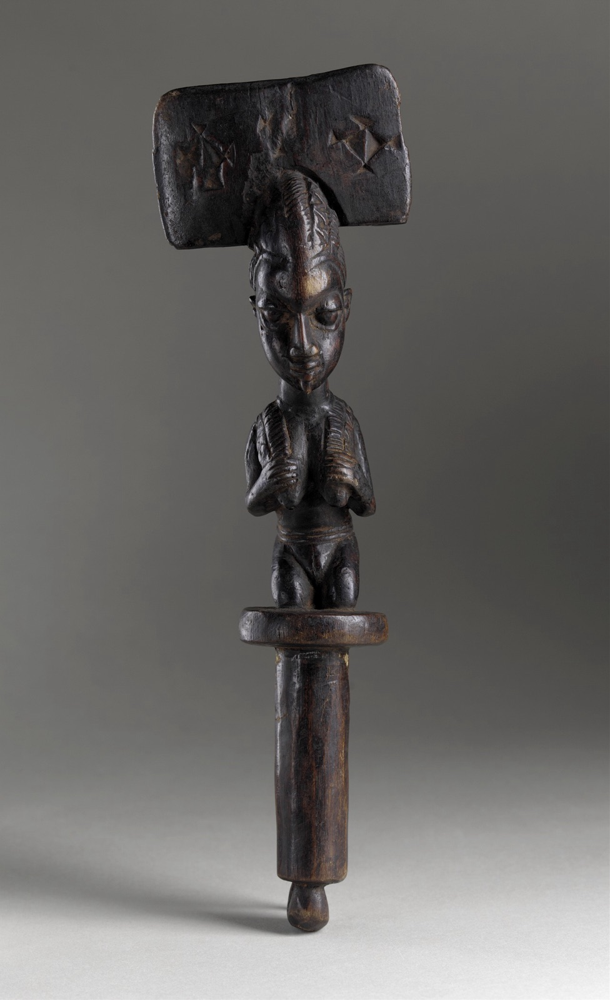
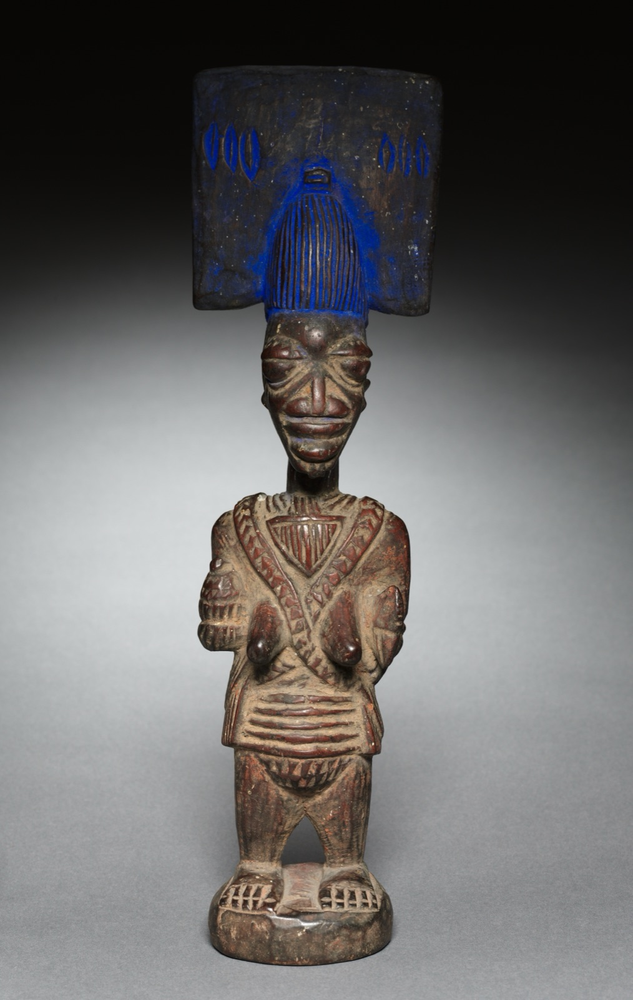
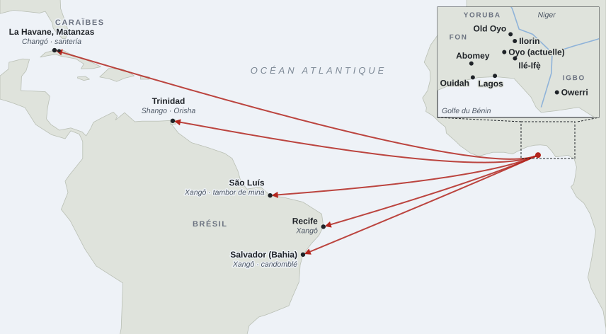
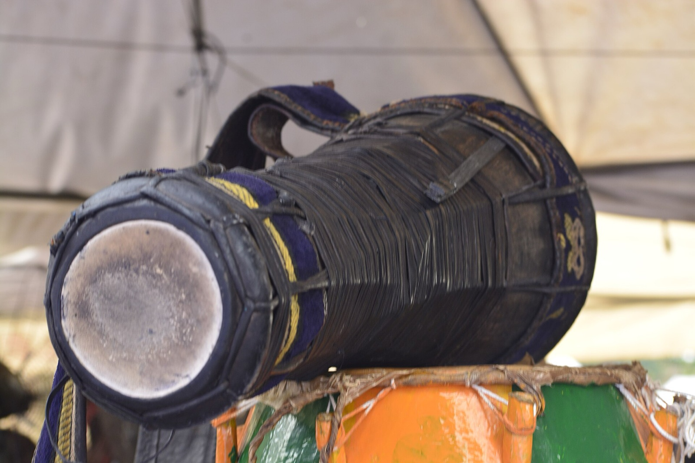
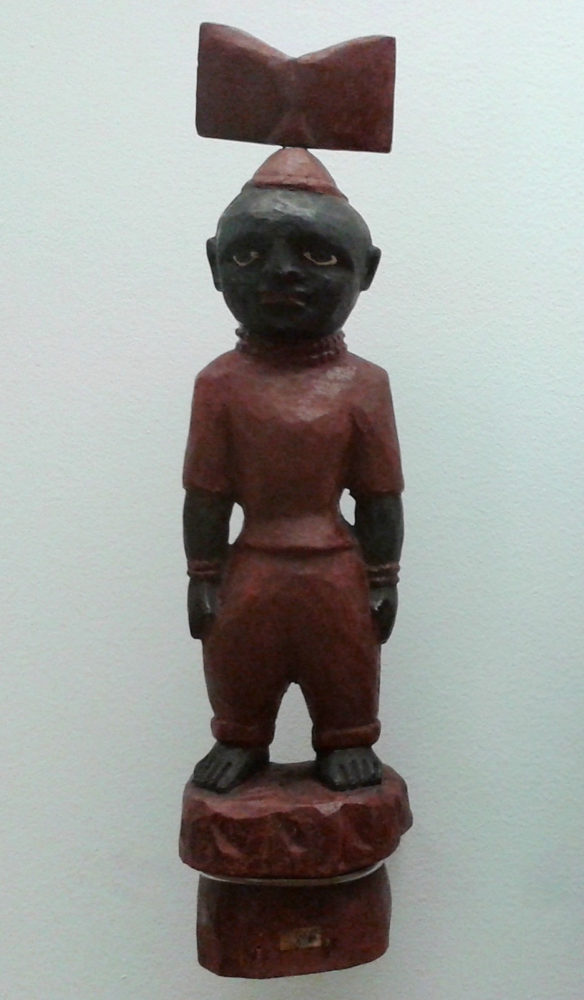

Peu de divinités africaines ont autant voyagé que Ṣàngó. Dans le pays yoruba, il est à la fois un roi des origines d’Oyo et la puissance qui lance la foudre. À La Havane, il a pris l’image de sainte Barbe. À Salvador, il préside l’une des maisons de candomblé les plus prestigieuses. À Recife, son nom a fini par désigner toute une religion. À Trinidad, on a parlé de « Shango » pour l’ensemble du culte des orisha avant d'adopter le mot « Orisha ».

Dans ce dossier, nous allons suivre [Shango](fiche:shango) à travers un empire, sa chute, la traite qui l’a accompagnée et les manières dont des communautés déportées ont reconstruit une royauté sans royaume.

> [!NOTE]
> **Orisha** : nom yoruba (ọ̀rìṣà) des divinités qui servent d’intermédiaires entre les humains et [Olodumare](fiche:olodumare), le dieu suprême, qui reste lointain. Chaque orisha a ses lieux de culte, ses prêtres, ses interdits et ses offrandes. Le nom s’écrit orixá au Brésil et oricha à Cuba.

## Shango : le roi et le dieu

Le récit qui est généralement repris vient de *The History of the Yorubas* de Samuel Johnson, pasteur yoruba mort en 1901, dont le manuscrit fut publié par son frère en 1921. Johnson y décrit Shango, ou Olufiran, comme le quatrième roi des Yoruba, fils d’Oranyan et frère d’Ajaka, qu’il remplace sur le trône pendant sept (07) ans. Sa mère serait Torosi, fille d’Elempe, roi des Nupe (les « Tapa »), ce qui inscrit le dieu de la foudre dans les relations, tour à tour alliées et hostiles, entre Oyo et ses voisins du nord. Johnson le décrit colérique, guerrier, crachant feu et fumée, et détenteur d’une préparation capable d’attirer la foudre. En l’essayant depuis une colline, il aurait foudroyé son propre palais, tué ses femmes et ses enfants, puis pris la route du pays nupe. Abandonné par ses compagnons, il se serait pendu à un karité à Koso, où il fut enterré[^1].

Johnson donne lui-même une seconde version, dans son chapitre sur la religion : Shango, tyran détrôné, abandonné par ses amis et par son épouse [Oya](fiche:oya), se tue. Ses fidèles, humiliés par les railleries, vont apprendre chez les Bariba l’art d’attirer la foudre sur les maisons de leurs ennemis. Quand les incendies se multiplient, ils déclarent que le roi défunt se venge et deviennent, en lui offrant des sacrifices, les *mogba*, ses « avocats » et prêtres ; charge que leurs descendants tenaient encore à son époque. La formule « Ọba kò so », « le roi ne s’est pas pendu », qui condense ce retournement, n’apparaît pas telle quelle chez Johnson, qui cite plutôt le dicton « Ṣàngó wọlẹ̀ ni Kòso », « Shango a disparu à Koso ». Les héros divinisés, précise-t-il, ne meurent pas, ils disparaissent. La formule a été popularisée au XXe siècle, notamment par la pièce *Ọba kò so* de Duro Ládiípọ̀, créée à Osogbo dans les années 1960.

*Faut-il voir en Shango un souverain réel ?* Johnson lui-même range son règne dans une première période qu’il intitule « rois mythologiques et héros divinisés ». Robin Law a montré que les listes d’alaafin divergent d’une tradition oyo à l’autre. Shango y figure au troisième, au quatrième ou au septième rang ; et, s’il a existé, les généalogies le placeraient au mieux au début du XVIe siècle[^2]. B.A. Agiri relevait dès 1975 que l’histoire ancienne d’Oyo s’était figée sur le texte de Johnson et signalait un récit d’origine où apparaît un roi nupe nommé Shago ; ce qui laisse ouverte l’hypothèse d’un dieu antérieur au roi, intégré après coup à la généalogie dynastique[^3]. Law a de son côté examiné, dans un article de 1984, la façon dont Johnson a recueilli et mis en forme les traditions orales. Johnson n’est pas exempt de ces mises en forme. En effet, il déduit de la diffusion du culte jusqu’au Dahomey et chez les « Popo » que Shango a régné sur ces pays, et il corrige une tradition qui plaçait sous son règne le combat de Timi et de Gbonka, qu’il rattache à un roi plus tardif.

Les sources ne permettent donc ni de dater Shango, ni d’établir qu’il fut d’abord un homme. Elles permettent en revanche d’affirmer que, dans la mémoire d’Oyo, la figure du roi et celle du dieu sont indissociables ; et cette association servait la royauté.

> [!NOTE]
> **Oyo et l’alaafin** : Oyo, aujourd’hui appelée Old Oyo (Ọ̀yọ́-Ilé), était la capitale d’un royaume yoruba de la savane, dans l’ouest de l’actuel Nigeria, non loin du fleuve Niger. Grâce à sa cavalerie, il devint aux XVIIe et XVIIIe siècles l’État le plus puissant de la région. Son souverain portait le titre d’alaafin, « possesseur du palais », et gouvernait avec un conseil de sept (07) dignitaires, l’Ọ̀yọ́ Mèsì, qui pouvait le contraindre à se donner la mort. Abandonnée vers 1836, la capitale a été refondée plus au sud. C’est l’actuelle Oyo, ou New Oyo.

## Un culte d’État

Le culte de Shango était au cœur du pouvoir de l’alaafin. Johnson décrit le sacrifice de Jakuta, autre nom de Shango, qui réunissait tous les cinq (05) jours le roi et les grands du conseil Ọ̀yọ́ Mèsì, ainsi que le couronnement du roi, dont une étape se déroulait à Koso, sanctuaire principal du dieu, placé sous la garde de l’eunuque Otun Iwefa. Henry Lovejoy, s’appuyant sur Law et sur Matory, rappelle que les *ilari*, messagers royaux envoyés dans les provinces, étaient généralement des prêtres initiés de Shango ou voyageaient avec eux. De plus, la dévotion à Shango servait aux dignitaires et aux royaumes tributaires de gage de loyauté envers l’alaafin[^4]. Shango n’était pas pour autant le seul culte d’Oyo, puisque les quartiers de la capitale honoraient d’autres orisha et une communauté musulmane y vivait.

Ce culte pouvait aussi se retourner contre le roi. Johnson rapporte qu’un alaafin plus tardif, Onisile, fut frappé par une foudre que les fidèles de Shango auraient attirée sur son palais, puis rejeté par les chefs. Et chaque foudroiement mettait en scène l’autorité du dieu. La maison frappée était interdite à tous sauf aux prêtres de Shango, qui en extrayaient la « pierre de foudre ». Cett règle concernait également les rois des provinces qui devaient venir y rendre hommage, à l’exception du seul alaafin.

J. Lorand Matory a montré dans *Sex and the Empire That Is No More* (1994) que ce culte de possession, comme celui de Yemoja, donnait aux femmes un réel pouvoir politique de prêtresses, et que la royauté d’Oyo utilisait le langage du genre. Les *ilari* masculins étaient des « épouses » du roi, comme les possédés de Shango, les *elegun*, sont les « épouses » que le dieu « monte ». L’emblème de ces prêtres est l’*oṣé*, la hache double, avec les pierres de foudre (*ẹ̀dùn àrá*), les haches polies néolithiques recueillies sur les autels[^5]. Les tambours *bàtá*, trio de tambours à double membrane en forme de sablier qui reproduisent les tons de la langue, appartiennent à Shango et servaient aussi à transmettre les traditions d’Oyo.

> [!NOTE]
> **La possession** : dans les cultes d’orisha, certains initiés reçoivent la divinité dans leur corps pendant la cérémonie. Ils dansent et parlent alors en son nom. Le vocabulaire yoruba décrit cette relation comme celle d’un cavalier et de sa monture, ou d’un époux et de son épouse, quel que soit le sexe de l’initié. À Cuba comme au Brésil, l’initié possédé est encore appelé le « cheval » de l’orisha.

Le volume dirigé par Joel Tishken, Tóyìn Fálọlá et Akíntúndé Akínyẹmí (2009), seul ouvrage d’ensemble consacré à cette divinité, confirme que l’image de Shango n’est pas uniforme en pays yoruba. Un chapitre de Marc Schiltz confronte Shango à une autre divinité yoruba du tonnerre, Ará, sous l’angle de la souveraineté et Akínyẹmí souligne l’ambivalence de ses représentations dans la littérature yoruba.

Les récits entourent Shango de figures féminines dont les rôles varient. Chez Johnson, Oya est l’épouse fidèle qui le suit vers le pays nupe, mais s’arrête à Ira, sa ville natale, et s’y donne la mort : « Oya a disparu à Ira, Shango a disparu à Koso ». Dans le même chapitre, pourtant, elle fait partie de ceux qui l’ont abandonné. [Oshun](fiche:oshun) est une autre de ses épouses, et des récits recueillis par Pierre Verger font de [Yemoja](fiche:yemoja) sa mère, ce que d’autres versions ignorent. Un récit rapporté par Verger, où Shango demande à Oya de déchaîner le vent pour disperser les feuilles d’[Osanyin](fiche:osanyin), est d’abord connu dans sa version brésilienne. Ces généalogies sont donc des variantes locales plutôt qu’un système fixe[^6].

## Les voisins de la foudre

Shango n’est pas le seul maître de la foudre de la région (Afrique de l'Ouest) et on peut être tenté de faire de tous ces dieux un seul. Les sources invitent à la prudence.

Chez les Fon d’Abomey et chez les Ewe, [Xevioso](fiche:xevioso) (Hevioso, ou Sogbo) dirige le panthéon du Tonnerre. Les traits communs avec Shango sont nets dans l’ethnographie de Melville Herskovits (1938) :

- le bélier comme animal ;
- la hache de tonnerre ;
- les haches néolithiques tenues pour des pierres de foudre ;
- et le foudroyé considéré comme coupable, dont le corps et les biens reviennent aux prêtres.

Mais Xevioso a sa propre mythologie. Enfant de Mawu-Lisa, il garde au ciel l’eau et le feu et forme avec Sakpata, la Terre, un couple de la pluie et de la fécondité qui n’a pas d’équivalent dans les récits de Shango. Rien n’y fait de lui un ancien roi. Les échanges sont pourtant anciens. Johnson affirme que le culte de Shango s’étendait au Dahomey. Et à São Luís du Maranhão, la famille du tonnerre de la Casa das Minas, rattachée à Xevioso, est dite d’origine nagô, c’est-à-dire yoruba. Les sources ne permettent pas de dire si l’un des cultes dérive de l’autre ou s’ils se sont influencés mutuellement[^7].

Chez les Igbo, [Amadioha](fiche:amadioha) partage avec Shango la foudre, la couleur rouge, le bélier, le rôle de justicier ainsi que les morts foudroyés qui sont aussi réservés à ses prêtres. Ikechukwu Kanu rapproche explicitement les deux figures. Mais Amadioha est surtout honoré dans le sud du pays igbo, avec un sanctuaire principal à Ozuzu, en pays etche, et les sources ne lui prêtent aucun passé humain ni aucun lien avec une dynastie. La ressemblance tient à une fonction, la foudre comme sanction, que l’on retrouve chez les trois peuples. Elle ne prouve aucune origine commune et aucune étude d’ensemble n’a comparé systématiquement ces cultes.

## La traversée

Le destin américain de Shango est lié à la chute de l’empire qui en avait fait son emblème. À partir de 1817, le soulèvement d’Ilorin, porté par le jihad venu du nord, ouvre une crise qui aboutit vers 1836 à l’abandon de la capitale, Old Oyo. Les guerres qui suivent jettent sur le marché des captifs de langue yoruba en très grand nombre. Pour Cuba, Lovejoy estime que plus de 90 % des déportés venus du golfe du Bénin sont arrivés après 1817, et que le plus fort de ces arrivées coïncide avec l’effondrement d’Oyo. Bahia reçut de son côté de nombreux captifs issus du même espace[^8].

> [!NOTE]
> **Lucumí, nagô et « nations »** : au XIXe siècle, les locuteurs du yoruba ne se désignaient pas encore par un nom commun. Dans les Amériques, les captifs étaient classés en « nations » d’après leur langue ou leur port d’embarquement : lucumí à Cuba, nagô au Brésil (d’Anago, nom que les Fon donnaient aux Yoruba). Ces noms de nation sont ensuite devenus des noms de traditions religieuses, comme le candomblé nagô ou ketu.

### Changó à Cuba

À Cuba, où les captifs de langue yoruba étaient appelés lucumí, Changó s’est installé dans les *cabildos de nación*, associations d’Africains tolérées par l’administration coloniale. Lovejoy a retrouvé dans les archives le dossier de Juan Nepomuceno Prieto, ancien sergent de la milice noire, qui dirigea vers 1818-1835 le Cabildo Lucumí Elló (c’est-à-dire Oyo), aussi appelé Santa Bárbara, et y organisait chaque année une procession de la sainte. Les objets saisis chez lui en 1835 montrent un culte centré sur le couple Changó et sainte Barbe, mêlé à des éléments catholiques et peut-être kongo. Lovejoy l’identifie au cabildo Changó Tedún, dont Fernando Ortiz et Lydia Cabrera ont recueilli les traditions. Selon un récit consigné par Ortiz, deux Africains, Añabí et Atandá, auraient construit et consacré vers 1830 les premiers tambours *batá* « de fondement » de l’île, jugeant ceux qu’on jouait jusque-là non consacrés[^9]. Lovejoy y voit une reconstitution symbolique d’Oyo dans la Cuba coloniale. La royauté de Changó et ses tambours en sont les signes les plus visibles. Dans la [santería](fiche:santeria), ou Regla de Ocha, Changó garde le rouge et le blanc ; l’association avec sainte Barbe, invoquée contre la foudre et patronne des artilleurs, en est devenue la marque.

> [!NOTE]
> **Saints et orisha** : à Cuba comme au Brésil et à Trinidad, chaque orisha a été mis en correspondance avec un ou plusieurs saints catholiques, d’après un attribut partagé. Ainsi, on a sainte Barbe, protectrice contre la foudre, pour Changó. On a longtemps lu ces correspondances comme un « syncrétisme » ou un « masque » destiné à tromper les autorités coloniales. Ces lectures sont aujourd’hui discutées, car les correspondances varient d’un lieu à l’autre et beaucoup de fidèles fréquentent les deux religions sans y voir de contradiction.

### Xangô au Brésil

Au Brésil, [Xangô](fiche:xango) est d’abord un roi. Luis Nicolau Parés a montré le rôle de l’orixá dans la fondation des plus anciennes maisons nagô, aussi bien dans le [candomblé](fiche:candomble) de Bahia que dans la Casa de Nagô du [tambor de mina](fiche:tambor-de-mina) de São Luís, et l’usage de références royales d’Oyo dans l’organisation de ces maisons, jusqu’au corps des obás de Xangô de l’Ilê Axé Opô Afonjá. Il souligne aussi la plasticité du dieu : ses multiples « qualités », comme Aganju ou Airá, et ses rapprochements avec les voduns du tonnerre, avec des caboclos et avec les saints catholiques[^10]. Saint Jérôme est l’identification la plus citée à Bahia. Saint Jean-Baptiste, fêté par les feux de juin, est aussi mentionné par des sources de pratiquants, sans qu’une étude d’ensemble ait établi la répartition régionale de ces correspondances.

> [!NOTE]
> **Le terreiro** : au Brésil, la maison de culte s’appelle terreiro (ou casa, ilê). Chacune est dirigée par une mère ou un père de saint (iyalorixá, babalorixá) et se rattache à une « nation », ketu, jeje ou angola par exemple, qui fixe sa langue liturgique, ses chants et ses divinités. L’Ilê Axé Opô Afonjá, fondé en 1910 à Salvador par Mãe Aninha, est l’une des maisons ketu les plus réputées et l’une des plus liées à Xangô.

Son épouse la plus citée est [Iansã](fiche:iansa), forme brésilienne d’Oya, qui partage avec lui le mercredi, la foudre et la guerre, et qui est elle-même rapprochée de sainte Barbe. Viennent ensuite [Oxum](fiche:oxum) et Obá, dont la rivalité pour Xangô donne l’un des récits les plus connus des terreiros. Dans le Pernambouc et en Alagoas, « Xangô » a fini par nommer l’ensemble des cultes d’orixás, mais une partie des pratiquants de Recife rejette ce terme venu de l’extérieur et parle de nagô[^11].

### Shango à Trinidad

À Trinidad, Herskovits dans *Trinidad Village* (1947), puis George Eaton Simpson et William Bascom ont décrit une dévotion à Shango si importante que toutes les formes de culte d’origine yoruba de l’île étaient désignées comme « Shango ». Simpson a comparé en 1962 le culte trinidadien à son modèle nigérian. Le saint associé y était traditionnellement saint Jean.

Stephen Glazier relève que des responsables religieux ont ensuite cherché à atténuer cette place en parlant d’« Orisha work », mais qu’un recensement récent des autels de Shango indique un regain de son culte, avec une préférence nouvelle chez les fidèles pour saint Jérôme et sainte Barbe[^12]. La religion, reconnue sous le nom d’Orisha, côtoie celle des baptistes spirituels, d’où le nom de [Shango Baptist](fiche:shango-baptist) donné aux fidèles qui fréquentent les deux, et d’autres orisha, comme [Ogun](fiche:ogun), y ont aussi reçu leurs saints.

| Nom    | Foyer                      | Saint associé                                          | Sources                     |
| ------ | -------------------------- | ------------------------------------------------------ | --------------------------- |
| Ṣàngó  | Oyo et pays yoruba         | aucun                                                  | Johnson 1921 ; Lovejoy 2012 |
| Changó | La Havane et Regla, Cuba   | sainte Barbe                                           | Lovejoy 2012 ; Brown 2003   |
| Xangô  | Salvador, Recife, São Luís | saint Jérôme, saint Jean-Baptiste                      | Verger 1981 ; Parés 2006    |
| Shango | Trinidad                   | saint Jean ; plus récemment saint Jérôme, sainte Barbe | Glazier 2009                |

## Ce qu'on retient !

Plusieurs continuités traversent l’Atlantique : la foudre, la hache double, les pierres de tonnerre, le bélier, le rouge et le blanc, les tambours et, surtout, la royauté.

- À Oyo, Shango légitimait un alaafin.
- À La Havane, un cabildo se nommait Oyo et promenait sainte Barbe.
- À Salvador, l’Opô Afonjá a reconstitué une cour de ministres autour de Xangô.

La figure du roi a survécu à la disparition du royaume ; et c'est qu'on retrouve précisément dans le titre de Matory, « l’empire qui n’est plus ».

Les transformations ne sont pas moins nettes. Le culte, organisé en Afrique autour de lignages, de villes et d’un État, s’est recomposé en maisons, en nations et en cabildos, avec des panthéons réunis qui juxtaposaient des divinités autrefois servies dans des villes différentes. Les saints catholiques ont fourni des correspondances qui varient d’une île et d’une ville à l’autre. Le nom même du dieu est devenu, à Recife comme à Trinidad, celui d’une religion entière, avant d’être contesté de l’intérieur.

Ces faits nourrissent un débat ancien. L’historiographie de Nina Rodrigues et de Roger Bastide valorisait la « pureté » nagô de certaines maisons de Bahia. Parés a montré l’apport décisif des traditions gbe au candomblé et Stefania Capone a analysé la « réafricanisation » par laquelle des maisons cherchent à se rapprocher d’une Afrique jugée plus authentique. Matory a renversé la perspective, puisque, pour lui, l’identité yoruba elle-même s’est en partie construite au XIXe siècle à travers des circulations entre Lagos et Bahia. De plus, le prestige de la « pureté » nagô doit beaucoup à des Afro-Brésiliens lettrés, commerçants et voyageurs, comme le babalaô Martiniano Eliseu do Bonfim, formé à Lagos et proche de Mãe Aninha, fondatrice de l’Opô Afonjá[^13]. À Trinidad, Frances Henry décrit une « africanisation » de même nature à partir des années 1970 et le chapitre de Kamari Maxine Clarke dans le volume de 2009 en examine les ressorts politiques et esthétiques.

Les chercheurs ont eux-mêmes participé à cette histoire. Pierre Verger, initié babalawo au Bénin, reçut à l’Opô Afonjá le titre d’Ojú Ọba, « les yeux du roi » Xangô[^14] ; le livre de Bastide, fondé sur les maisons nagô de Bahia, a contribué à en faire un modèle. De son côté, Capone souligne le rôle des écrits d’ethnologues dans la quête d’une tradition « pure ». Lovejoy note de même que les batteurs cubains connaissent le récit d’Añabí et d’Atandá souvent par la lecture d’Ortiz.

Restent les limites. Les traditions sur le Shango royal ne sont connues que par des sources écrites de la fin du XIXe siècle et du XXe, Johnson en tête, et ne permettent ni de dater ni d’attester le roi. Le rôle politique du culte dans l’empire est reconstruit à partir de ces mêmes traditions et de l’ethnographie de New Oyo, fondée après la chute. La critique adressée à Peter Morton-Williams par J.A. Atanda, à propos d’une autre institution, l’Ogboni, rappelle le risque de projeter sur Old Oyo ce qu’on observe dans la ville refondée[^15]. Pour la diaspora, les témoignages antérieurs au milieu du XIXe siècle sont rares et souvent judiciaires, comme le dossier Prieto. Enfin, la comparaison avec Xevioso et Amadioha reste à faire de manière systématique. Même s'il y a des fonctions communes, on n'a pas pu retracer les emprunts.

[^1]: Johnson, *The History of the Yorubas*, chapitre « Religion » et récit du règne de « Sango or Olufiran ». La même section raconte la ruse par laquelle Shango aurait pris Oyo-Koro et l’origine des scarifications royales ; Johnson indique aussi que, selon d’autres récits, Shango n’abdiqua pas de lui-même mais fut poussé au départ par un parti hostile.

[^2]: Lovejoy (2012), chapitre 1, d’après Law, *The Oyo Empire*, p. 44 et 48-49. Lovejoy rappelle que les listes de Johnson proviennent des *arokin*, historiens officiels d’Oyo.

[^3]: Agiri (1975). L’hypothèse d’un culte de la foudre préexistant, rattaché ensuite à un roi, n’est ni démontrée ni réfutée par les sources disponibles.

[^4]: Lovejoy (2012), chapitre 1, citant Matory (1994, p. 104) et Law (1977). Sur les *mogba*, les sources divergent : Johnson en fait les prêtres de Shango et nomme « Mogba » le chef de ce culte, tandis que Lovejoy présente le Mogba comme le devin d’[Ifá](fiche:ifa) personnel de l’alaafin.

[^5]: Le terme *elegun* et les objets rituels (*oṣé*, *ẹ̀dùn àrá*, *bàtá*) sont documentés dans la collection *Sacred Arts of the Black Atlantic* dirigée par Matory à l’université Duke. La description des *bàtá* et de leur fonction mnémonique est celle de Lovejoy (2012), qui s’appuie aussi sur Wescott et Morton-Williams pour le sac rituel *laba* des prêtres de Shango.

[^6]: Pour Yemoja, Verger (1981) ; la filiation avec Shango n’apparaît que dans certaines versions. Pour Osanyin, le récit de la calebasse est rapporté par Verger avec les noms brésiliens Xangô et Iansã. Johnson ajoute que les fidèles d’Oya s’interdisent la viande de mouton, interdit que l’on retrouve au Brésil pour Iansã à propos du bélier.

[^7]: Herskovits (1938) et Parés (2013) pour le culte fon et jeje ; Ferretti, cité dans la fiche du tambor de mina, pour la famille de Quevioso à São Luís.

[^8]: Lovejoy (2012), chapitre 2, à partir de la base *Voyages* et d’un échantillon de près de 4 000 noms africains. Pour Bahia, Parés, cité dans la fiche de Xangô.

[^9]: Ortiz, « Los Batá », cité et traduit par Brown (2003, p. 64) et repris par Lovejoy (2012), qui en discute la portée. Les dates de ces traditions orales restent approximatives.

[^10]: Parés (2006). Le même auteur relève la polarité rituelle entre Xangô et Oxalá, visible dans la division du calendrier liturgique en périodes blanche et rouge.

[^11]: Pinto Filho (2017), à propos des descendants de Pai Adão, à Recife, pour qui « xangô » est un nom donné de l’extérieur.

[^12]: Glazier (2009). Les études de Herskovits, Simpson et Bascom sont celles qu’il cite comme témoins de l’ancienne prééminence de Shango ; l’ampleur du regain qu’il signale repose sur un recensement d’autels et n’a pas été mesurée ailleurs.

[^13]: Matory (1999 ; 2005). Sur Martiniano Eliseu do Bonfim et Mãe Aninha, Costa Lima (2004).

[^14]: Fundação Pierre Verger, biographie en ligne. Les sources de la fondation situent son initiation à Kétou en 1952 ou 1953.

[^15]: Lovejoy (2012), chapitre 1, qui résume la critique d’Atanda contre la reconstruction de l’Ogboni d’Old Oyo par Morton-Williams.
